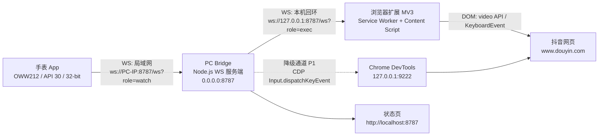
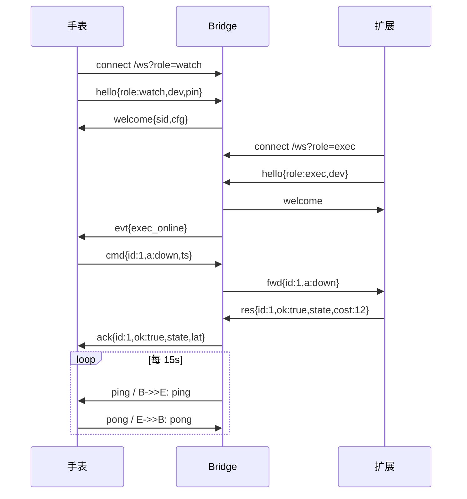

# 腕控 WristDeck —— 技术架构文档

> 配套文档：`产品设计文档.md`
> 状态：**已实现（M1–M3 + 阶段 3 手势）**，M4 稳定性项部分待办。
> 版本：v0.4 ｜ 首次日期：2026-09-07 ｜ 本次修订：2026-09-15

---

## 0. 修订摘要

### v0.4（2026-09-15）

**手表端腕部手势识别（阶段 3）：零权限 IMU 手势，协议零改动**

手表戴在腕上就能控：**前臂左 / 右旋** ↔ `left` / `right`，**手腕上抬 / 下压** ↔ `up` / `down`，**把表盘翻过去** ↔ `play` / `pause`。全部只用**加速度计 + 重力传感器 @50Hz**，零权限、零 root，**Bridge 协议与扩展一行未改**（复用既有动作名）。

为什么要绕这么大一圈：这条 ROM 上**两台表的蓝牙 HID 都被资源开关关死**（§15），系统的语义手势（抬手亮屏 / 翻转静音）**只有系统签名应用拿得到**，而 `wrist_tilt(26)` / `significant_motion(17)` 两个传感器实测**对第三方 App 完全不出事件**（注册成功、`dumpsys` 显示 `active`，猛甩 6.7g + 反复抬腕仍零命中）。所以只能自己从原始 IMU 里做识别。完整能力边界见 §5.4。

三个关键取舍：

1. **不积分，所以不漂移**：只比较"重力方向相对静止基准 `g0` 的旋转"，不做陀螺积分；也不用四元数（磁场污染，且这里不需要航向）。代价是**手臂垂下时绕前臂轴的自转重力看不见**，所以翻转只能靠幅度分层、不能靠轴区分。
2. **判轴用切空间系数，不是比 `φ` 的大小**（这是「向左没反应」的根因修复）：原先用 `φarm=atan2(ux,uz)` / `φbend=atan2(uy,uz)` 比大小，两者**共用 `uz` 做分母**（球面投影），纯旋前时 `φarm ≡ θ` 而 `φbend` 是**纯耦合项**、在 `θ≈72°` 处反超 ⇒ **72° 以上的 left 全被判成 up**（现场 25 次发送里 left 零命中）。改为取 `t = u−(u·u0)u0`，用 `coefArm = t·(ŷ×u0)/|ŷ×u0|² ≡ sin(前臂角)`、`coefBend = t·(x̂×u0)/|x̂×u0|² ≡ sin(屈伸角)` 判轴——纯单轴转动下**线性、无耦合、无分支**；幅度窗口改用**真实转角 `θ = acos(u0·u)`**。`crossAxisDeg` 随之删除。
3. **触发判据是峰值角速度，不是穿越耗时**：真人动作是"快起动 + 慢到位"（实测快段 82°/s、减速段 10°/s），量"25°→45° 整段耗时"会把干净动作整段拒掉。改为在离位期间按 70ms 窗口取 `Δpeak/Δt` 的**最大值**，阈值 60°/s（实测命中动作 118~302°/s，2× 余量）。

防误触：必须**停稳**（±8° 内满 120ms）才发方向；冷却用**固定不应期 800ms**（不附加任何姿态要求，否则连续动作会死锁）；翻转与左右**共用同一根轴**（都是前臂旋前旋后），靠**幅度分层**区分——45~130° 方向、130~140° 死区、≥140° 翻转。

**必须配前台服务**：无 FGS 时息屏 60s 内传感器断流、进程被冻结；有 FGS 时实测连跑 590s 稳定 50.1Hz。采样按"屏幕亮着的活跃窗口"开关，灭屏后再留 15s 尾巴。

验证：识别器刻意做成**零 Android 依赖**，可在 Mac 上秒级回归——`.workbuddy/tests/gesture/`（`./run.sh`，用 `kotlinc` 编译**当前源码** + Sim/Sim2 两套场景）。⚠️ **日常佩戴下的误触率尚未实测**（标定用的是旁路闸门模式），见 §17。

### v0.3.4（2026-09-14）

**Bridge 把手表操作日志打到终端**

`node server.js` 跑起来只有一行启动横幅，手表点了什么完全看不到。两个原因叠加：`pushLog()` 只往内存环形缓冲写（供 `/api/log` 与状态页消费）、**从不输出到 stdout**；而且**成功转发的指令压根不记日志**。于是终端上最多只能看见"扩展 right ×no_change"，看不见"手表按了 right"。

1. **`pushLog()` 同时实时打印**：`HH:MM:SS  来源  动作  耗时  √/×  备注 (现场)`。stdout 是 TTY 时才着色，重定向到文件时留纯文本便于 grep；`--quiet` / `WD_QUIET=1` 可关掉控制台输出（`/api/log` 与状态页不受影响）。
2. **补记"指令已收下"**：`handleCmd` 成功转发后记一条 `src:'watch', note:'sent'`。失败分支（`exec_offline` / `busy` / `exec_timeout`）本来就有自己的条目，不会重复。`src` 语义不变（仍是"事件由哪一端发出"），但一次正常按键现在稳定对应两行：`手表 … sent` → `扩展 … 结果`。
3. **失败现场透传**：扩展回包里的 `detail` 随结果行一起输出，`no_change` 的 `video=/scroll=/blocked=/host=` 直接在终端可见，不必回头翻扩展 popup。

验证：`.workbuddy/tests/bridge-log.test.mjs` —— 用独立 `HOME` 伪造 config 把实例开在 8791（完全不碰用户正在跑的 8787），脚本自当 watch + exec 走真实握手与转发，10 项断言全过。

### v0.3.3（2026-09-13）

**修复方向键在普通网页上必然 `no_change`（扩展 0.1.5）**

v0.3.2 补了原生滚动兜底，但现场仍然全数 `no_change`。日志指纹很干净：竖向 `down` 耗时 **327ms = 320ms（竖向等待）+ ~7ms**，说明兜底那一段**根本没执行**——`canScroll()` 判定"这个方向没有余量"。根因是 `scrollHost()` 只找得到 `document.scrollingElement`，而三类真实页面它都认不出来：

1. **`overflow:hidden` 的滚动容器**：它是**合法滚动容器**，`scrollTop` / `scrollBy` 照样生效，只是滚轮和键盘不驱动它、必须靠脚本滚。原来只认 `auto` / `scroll` / `overlay`，把一大批"`html`/`body` 高度 100% + 内层脚本滚动"的页面（抖音推荐流就是这一类）整类漏掉，于是退回 `<html>` → 判定无余量 → 不兜底 → `no_change`。
2. **shadow DOM 里的元素**：`parentElement` 在 shadow root 边界直接是 `null`，祖先链断掉，必须用 `getRootNode().host` 接着往上爬。
3. **只横向溢出的页面**（宽表格、横向文档）：原筛选条件只看竖向溢出，横向滚动容器永远选不出来，左右方向键必然失败。

同时收紧两处判断：候选容器改为**取面积最大的那个**（视口里通常套着若干 `overflow:hidden` 的小裁剪框，真正的滚动宿主基本铺满视口，按面积可天然跳过小框）；`scrollHost()` 改为**按方向查找**（竖向找竖向余量、横向找横向余量）。并**取消"页面里有 `<video>` 就不兜底"**这条限制——有没有视频只是场景提示，不是"站点接管了按键"的证据，新闻页里挂个内嵌视频就会让方向键整类失效；真正的接管信号是 `preventDefault`。见 §7.3。

`no_change` 现在会带现场 `detail`（`video= scroll= blocked= host=`），失败也可诊断。配套加了 `content.js` 的 DOM 桩回归测试 `.workbuddy/tests/scroll-host.test.mjs`：5 个用例覆盖普通页下滚 / SPA 内层容器 / 横向溢出 / 确实无处可滚 / 站点自己 `preventDefault`。

### v0.3.2（2026-09-13）

**方向键改为全站通用能力（扩展 0.1.4）**

1. **注入范围从 `douyin.com` 扩到 `http/https` 全站**：方向键是原生键盘事件、`play`/`pause` 走通用 HTML5 `<video>`，二者都与站点无关。此前把方向键锁在抖音白名单内是**设计错误**——手表上最常用的四个键，在其它任何网页上都被判 `wrong_tab` 直接拒掉。
2. **删掉"页面没有 `video` 就提前返回 `no_video`"**：这是同一个错误的另一面。普通网页（新闻、文档、论坛）本来就应该支持上下左右，用一个 `video` 元素的存在与否把整类页面判死，等于把站点特化逻辑当成了通用能力。
3. **补上原生滚动兜底**：合成 `KeyboardEvent` 的 `isTrusted = false`，**不会触发浏览器默认动作**，所以普通网页上"按了 ↓ 但页面没滚"是必然结果。现在：页面有监听并接管了（`defaultPrevented`）→ 算成功；没人接管且页面内无 `<video>` → `nativeScroll()` 用 `scrollBy({behavior:'instant'})` 复现方向键该有的滚动。见 §7.3。（⚠️ 这条兜底的**触发条件**是错的，v0.3.3 已修正：`scrollHost()` 认不出 `overflow:hidden` 容器 / shadow DOM / 横向溢出，且"有 `<video>` 就不兜底"会误杀内嵌视频的普通页面。）
4. **`SITE_ONLY` 白名单只留站点特化动作**：`like` / `fullscreen` 依赖抖音快捷键，非抖音域回 `unsupported_site:<host>`；方向键与 `play`/`pause`/`toggle` 一律放行。见 §7.2。

### v0.3.1（2026-09-13）

**修复手表侧重连风暴（手表 0.2.4）**

1. **同一时刻只允许一个在途连接**：引入 `generation` 世代号 + `pendingReconnect` 标志 + 单一 `reconnectTask`，并去掉 `onOpen` 里对退避计数的清零。修复前 `Denied` 分支与 `onClosed` 会各排一次重连（双定时器），叠加"TCP 一连上就清零退避"，使得每秒都在建连；服务端"新 watch 顶掉旧 watch"的策略又让两个连接互相顶替，连接数指数级发散。现场实测 Bridge 侧累计 12925 个会话、单秒 282 次连接失败。见 §4.5。
2. **`bad_pin` / `pin_locked` 不再自动重连**：这类拒绝靠重试无法恢复，停在 `DENIED` 等用户改 PIN；`updateConfig()` 检测到 host/port/pin 变化立即清零退避并重连，这就是恢复路径。退避上限同时从 15s 放宽到 60s。

**修复扩展侧投递失败不可诊断（扩展 0.1.3）**

3. **`no_content_script` 曾经是个把两种病因混在一起的兜底文案**：目标标签页不是抖音（内容脚本永不注入）和"页面在扩展安装前就打开"（内容脚本没被注入）会得到同一个字符串，实测就卡在这里。现在改为三级：URL 不匹配 → `wrong_tab:<host>`（立即失败，不再白等 1200ms）；`sendMessage` 抛异常 → `chrome.scripting` 补注入后重试；仍失败 → 等 `tabs.onUpdated` 完成再试。配套把 `content.js` 包成幂等 IIFE（补注入会重复执行同一文件，顶层 `const` 重声明会抛 `SyntaxError`）。见 §7.2、§17 #5。

### v0.3（2026-09-13）

**动作集调整：三键 → 十字方向盘**

1. **删除 `prev` / `next`**：这两个动作原先承担"上一个/下一个"，但在页面里落地方式是把 `ArrowUp` / `ArrowDown` 派发给页面——语义与方向键完全重合，等于同一件事有两个名字。删掉后不再出现"该发哪个"的歧义。
2. **新增 `up` / `down` / `left` / `right` 四个方向动作**：手表不做语义翻译，原样转发 `ArrowUp` / `ArrowDown` / `ArrowLeft` / `ArrowRight`，具体行为交给页面解释（抖音推荐流里上下翻视频、左右快进退）。见 §4.3。
3. **手表主界面改为十字方向盘，播放/暂停居中**：方向盘 4 键各占 0.26 表盘宽，播放键 0.33 居中且最大。见 `产品设计文档.md` §5.1。
4. **键位图标改用矢量图，不再用字符 `△▽◁▷`**：字符方案实测字形相对圆心偏移各不相同（`◁`/`▷` 低 4px、`▽` 高 1.5px、`△` 居中），根因是不同字形走了不同字体回退、度量不一致，`includeFontPadding` 只能缓解不能根治。改为 `ImageView` + `VectorDrawable`（包围盒在 24×24 视口内严格居中）+ `scaleType="center"`，位置与设备字体完全解耦。实心 `▶` / `❚❚` 只留给播放键，与空心方向箭头用填充方式区分。见 §5.2。
5. **结果校验按方向分流**：上一次/下一次用视频源变化校验，左/右用播放进度变化校验（等待时长 320ms / 260ms）。见 §7.3。
6. **站点规则表 `RULES` 整体移除**：`prev`/`next` 是它唯一的消费方，随动作一起删除，`scroll` 兜底模式不再存在（非抖音站点由页面自己解释方向键）。

### v0.2（2026-09-12）

本版把文档与已落地的代码逐行对齐，并补上 v0.1 未定义的两个协议行为。

**协议新增**

1. **超时不再等同失败**：指令超时后 Bridge 保留 id 关联 10s，迟到结果用新事件 `cmd_late` 补偿给手表（只纠正播放图标，不参与失败判定）。见 §4.6。
2. **显式 `play`/`pause` 取代 `toggle` 作为主按钮动作**：`toggle` 是相对动作，超时重试会把状态翻回去；`play`/`pause` 是幂等的。`toggle` 保留，仅在本地状态未知时使用。见 §4.3。
3. 新增错误码 `4006 replaced`、`4007 busy`。

**安全收敛**

4. **状态页的 PIN 只在本机可见**：`/api/status` 对非回环请求返回 `pin: null` + `pinHidden: true`。此前状态页监听 `0.0.0.0` 且无条件回传 PIN，局域网内一次 GET 即可取得配对码，使 PIN 校验形同虚设。见 §10。

**文档纠偏**

5. 修正与实现不符的描述，并明确标注"尚未实现"的项（原文把若干未实现行为写成了已设计）：compileSdk、协程、手表工程结构、PIN 传参位置、按钮实现、WifiLock 模式、manifest 权限、标签页锁定的存储位置、`RULES` 结构、事件派发目标、校验等待时长、扩展重连策略、心跳通道、延迟指标口径。见 §3、§5、§6、§7、§9 及文末 §17。

---

## 1. 总体拓扑



三条连接全部是**客户端主动外连**，Bridge 是唯一被连接方：

| 连接 | 方向 | 传输 | 鉴权 | 用途 |
|---|---|---|---|---|
| 手表 → Bridge | 外连（Wi-Fi 局域网） | WebSocket | **必须带 PIN** | 上报指令、接收状态 |
| 扩展 → Bridge | 外连（127.0.0.1） | WebSocket | 免 PIN（回环） | 接收指令、回传执行结果 |
| Bridge → Chrome（可选，P1） | 外连（127.0.0.1:9222） | HTTP + WS(CDP) | 无 | 真键降级通道 |

> **信任域**：`127.0.0.1` = 本机信任域，免 PIN；局域网来源必须验 PIN。这条边界同时决定状态页能否显示 PIN（§10）。

---

## 2. 模块划分与职责

| 模块 | 运行位置 | 职责 | 不负责 |
|---|---|---|---|
| `watch/` | OPPO Watch 3 | UI、连接管理、发指令、触觉反馈 | 不知道浏览器存在 |
| `bridge/` | PC（常驻） | 鉴权、路由、状态聚合、日志、mDNS 广播（P1） | 不碰 DOM、不理解业务 |
| `extension/` | PC 浏览器 | 把动作翻译成页面内操作，回传结果 | 不做鉴权、不做持久化 |
| `bridge/ → CDP` | PC 浏览器 | 真键注入（降级，P1 未实现） | 不作为主路径 |

**核心设计原则：Bridge 只做"动作路由"，执行器可插拔。**
未来即使换成 HID 或原生媒体键，只需替换执行器，手表端与协议不变。

---

## 3. 技术选型

### 3.1 手表端（硬约束来自 adb 实测）

实测基线：`OWW212` / `OWW212_11_A.142` / Android 11(API 30) / **`armeabi-v7a, armeabi`（仅 32 位）** / 1GB RAM / Wi-Fi 已连接 `<手表IP>/24`。

| 项 | 选择 | 理由 |
|---|---|---|
| 语言 | Kotlin | — |
| compileSdk / targetSdk / minSdk | **36 / 30 / 30** | targetSdk 与系统 API 对齐，规避 31+ 行为变更；compileSdk 由 androidx 下限决定（见 §15） |
| UI | **传统 View + AppCompat + ConstraintLayout（不用 Compose）** | 32 位 + 1GB RAM 下 Compose 冷启动与内存压力风险高；V1 界面极简，View 足够。主界面圆形键用 `ImageView` + `VectorDrawable` + 百分比约束（字符字形在不同字体回退下度量不稳）；文字类按钮用普通 `Button`，不是 `MaterialButton` |
| 网络 | OkHttp 4.12.0（纯 JVM，无 `.so`） | 满足 32 位约束；WebSocket + `pingInterval` 开箱可用 |
| JSON | `org.json`（系统自带） | 零额外依赖 |
| 线程/异步 | `android.os.Handler` + 主线程回调（现网实现） | 逻辑简单，无需协程。`build.gradle.kts` 里仍声明了 `kotlinx-coroutines-android:1.9.0`，**当前代码未使用**，属待清理依赖（§17） |
| 存储 | SharedPreferences | 只存 IP/端口/PIN/开关 |
| 打包 | 仅 `armeabi-v7a` | 无 native 库时忽略，但显式声明避免误引入 64 位依赖 |

**红线：禁止引入任何只提供 `arm64-v8a` 的库。**

### 3.2 PC Bridge

| 项 | 选择 | 理由 |
|---|---|---|
| 运行时 | Node.js 18+（本机托管版本 22.22.2） | 跨平台、单文件可跑 |
| 模块制式 | ESM（`"type": "module"`） | 单文件即可运行 |
| WebSocket | `ws` ^8.18 | 事实标准，稳定 |
| mDNS（P1，未实现） | `bonjour-service` | 让手表免输 IP |
| 配置 | `~/.wristbridge/config.json`：`{ port, pin, bindAll }` | 无需数据库。`pin` 首次启动随机生成（6 位） |
| 状态页 | 内嵌 HTML + `/api/status`、`/api/log` | 免构建 |

> **端口配置的实际边界**：`port` 只对 Bridge、手表端与联调脚本生效。浏览器扩展把 `ws://127.0.0.1:8787/ws?role=exec` 与 manifest 的 `host_permissions` 都写死在 8787 —— 改端口需同步改这两处并重载扩展，否则扩展静默连不上。见 §17。

### 3.3 浏览器扩展

| 项 | 选择 |
|---|---|
| 清单 | Manifest V3（Chrome / Edge 通用），当前 `0.1.5` |
| 后台 | Service Worker（常连 WS + 心跳保活） |
| 注入 | `content_scripts` 常驻（`document_idle`）+ `http/https` 全站，另用 `chrome.scripting.executeScript` 补注入漏掉的页面；不走"每次 `executeScript`"是为了省 20–50ms |
| 权限 | `host_permissions`：`http://*/*` + `https://*/*` + `ws://127.0.0.1:8787/*`（v0.3.2 起全站，`optional_host_permissions` 已删除）；`permissions` 另含 `scripting`（补注入用） |
| 最低浏览器版本 | 依赖 **Chrome 116+** 的"WebSocket 活动可延长 Service Worker 生命周期"行为；更低版本 SW 会被回收导致连接反复重建 |

---

## 4. 通信协议

所有消息为单行 JSON，UTF-8 文本帧。

### 4.1 通用信封

```json
{ "v": 1, "t": "<type>", "id": "<opaque>", "ts": 1757000000000 }
```

字段按需出现：`v` 恒为 1（由发送方统一补上）；`id` 只在与指令关联时出现；`ts` 只出现在 `cmd` 里（手表本地毫秒，**不可跨机相减**，见 §9）。

### 4.2 消息类型

**客户端 → Bridge**

| t | 字段 | 说明 |
|---|---|---|
| `hello` | `role`: `watch` \| `exec`，`dev`: 设备名，`pin`: 6 位 | 首个消息。**PIN 放在报文体内，不放 URL query**（query 会进访问日志）。role 合法前发其它消息会被 `4005` 拒绝 |
| `cmd` | `id`, `a`: 动作，`ts`: 手表本地毫秒 | 仅 watch 发 |
| `res` | `id`, `ok`, `cost`, `state`, `reason` | 仅 exec 发（执行结果） |
| `pong` | `id` | 应答 ping |

> `hello` 的"3 秒内不发则断开"在 v0.1 里写了但**未实现**：当前实现是"未 `hello` 前发其它消息一律拒绝"，不做定时断开。

**Bridge → 客户端**

| t | 字段 | 说明 |
|---|---|---|
| `welcome` | `sid`, `cfg{ hb, execOnline }` | 鉴权通过。`cfg.hb` 为心跳周期（秒），`execOnline` 让手表首帧就知道执行器在不在 |
| `denied` | `reason`, `code` | 鉴权/协议失败，随即关闭 |
| `ack` | `id`, `ok`, `state{ playing }`, `reason`, `lat{ net, exec, e2e }`, `unresolved` | 回给手表。`unresolved: true` 表示"超时未确认，可能有迟到结果"（§4.6） |
| `fwd` | `id`, `a`, `ts` | 转发给执行器 |
| `ping` | `id` | 应用层心跳 |
| `evt` | `e`: `exec_online` \| `exec_offline` \| `cmd_late`；`cmd_late` 时另带 `id`、`ok`、`state{playing}` | 执行器上下线通知；迟到结果补偿（§4.6） |

### 4.3 动作枚举

| a | 含义 | 优先级 | 幂等 |
|---|---|---|---|
| `toggle` | 播放/暂停（翻转当前状态） | P0 | ✗ 相对动作 |
| `play` / `pause` | 显式播放 / 暂停 | P0 | ✓ 绝对动作 |
| `up` / `down` / `left` / `right` | 方向盘：原样转发 `ArrowUp` / `ArrowDown` / `ArrowLeft` / `ArrowRight`，**任意网页可用** | P0 | ✓ |
| `volUp` / `volDown` | 音量 | P1 | ✗ |
| `like` / `fullscreen` / `seekFwd5` / `seekBack5` | 扩展动作（**仅抖音域**，见 §7.2 `SITE_ONLY`） | P1 | ✗ |

> **方向键为什么不做语义翻译**：手表只负责把"用户按了上"这件事忠实转发，`up` 在抖音推荐流里是翻上一条视频、在文档页里就是滚一屏——由页面自己解释才符合用户对方向键的直觉预期。代价是结果校验必须综合"视频换源 / 播放进度 / 页面滚动"三类迹象（§7.3）。
>
> **方向键为什么必须全站可用（v0.3.2 纠正）**：它就是一个原生键盘事件，与站点无关。曾经把注入范围限死在 `douyin.com`，导致在任何其它网页上按方向键都被 `wrong_tab` 拒掉；同时内容脚本"没有 `video` 就返回 `no_video`"让普通网页必然失败。两条一起构成"只有抖音能用"的错误假设，均已修正。
>
> `prev` / `next` 已在 v0.3 删除，见 §0 修订摘要。

**手表主按钮的默认行为**：按本地已知的播放状态发 `play`（当前是暂停）/ `pause`（当前是播放）；只有本地状态未知（首次连接、状态被清除）时才发 `toggle`。这样"失败后重试"不会把播放状态翻回去。

执行器对 `play`/`pause` 的键盘兜底也做了方向保护：`Space` 是翻转键，只有"当前状态 ≠ 目标状态"时才派发（§7.3）。

### 4.4 错误码

| code | reason | 含义 |
|---|---|---|
| 4001 | `bad_pin` / `pin_locked` | PIN 错误 / 连续失败被锁定 |
| 4002 | `unknown_role` | 未知 role |
| 4003 | `exec_offline` | 执行器离线 |
| 4004 | `exec_timeout` | 执行超时（>1.5s），`ack` 带 `unresolved: true` |
| 4005 | `bad_json` / `unknown_type` / `bad_action` / `need_hello` | 消息格式非法 |
| 4006 | `replaced` | 同一 role 的新连接把旧连接踢掉 |
| 4007 | `busy` | 在途指令已达上限（3 条），本次拒绝 |

> **PIN 锁定语义**：连续 5 次错误后锁 60s；锁定到期后失败计数**不清零**，因此再错一次会立即重新锁定，等效"持续锁定直到输入正确 PIN"。

### 4.5 连接生命周期



**心跳与重连（均为现网实现）**

- Bridge 每 15s 发 `ping`，30s 未收到任何消息判定掉线并清理会话。同时发应用层 `ping` 与 WebSocket 层 ping 帧（双通道，冗余但无害）。
- 判活依据是"最后收到消息的时间"，不依赖 WS 层 pong 回调。
- 手表侧退避重连：`1s → 2s → 4s → 8s → 15s → 30s → 60s(上限)`，**无抖动**。未就绪时点击按钮会立即触发一次重连尝试。
- ⚠️ **同一时刻只允许一个在途连接**（v0.2.4 修复，见下）。三条护栏缺一不可：
  1. `generation` 世代号：`connect()` 自增，每个 `Listener` 携带发起时的世代号，回调先比对、过期即丢弃。被顶替/被 `cancel()` 的旧 socket 仍会回调 `onFailure`（典型是 `sent ping but didn't receive pong`），不甄别就会再排一次重连。
  2. `pendingReconnect` 标志 + **单个** `reconnectTask`：同一轮只排一次，`main.removeCallbacks(reconnectTask)` 撤销旧排程，杜绝定时器叠加。
  3. `onOpen` **不重置** `attempt`：TCP + 握手成功不等于会话可用（服务端可能立刻回 `replaced` / `bad_pin`），在此清零会让退避永远停在 1s。真正的"连上了"以收到 `welcome` 为准。
- `bad_pin` / `pin_locked` 属于"不换 PIN 就永远失败"，**不自动重连**：停在 `DENIED` 态等用户在设置页改 PIN；`updateConfig()` 检测到 host/port/pin 变化会立即清零退避并重连一次。
- 历史故障（v0.2.3 及以前）：`Denied` 分支既自己调 `scheduleReconnect`，随后的 `onClosed` 又调一次；叠加 `onOpen` 清零退避 → 两路定时器并发建连，服务端"新连接顶掉旧连接"的策略让两者互相顶替，连接数指数级发散。现场实测 Bridge 侧累计收到 **12925 个会话**、单秒 282 次连接失败、6679 次 `replaced_by_new_watch`。修复后：会话数不增长、TCP 连接恒为 1、手表侧零错误日志。
- 扩展侧：Bridge 的 `ping` 天然续命 SW 活跃计时器；另设 `chrome.alarms`（`periodInMinutes: 0.4`，Chrome 会钳到最小 30s）做"掉线检查 + 重连"兜底，重连为 `1s → 2s → … → 10s` 指数退避，**无抖动**。
- 指令超时 1.5s：Bridge 立即回 `ack{ok:false, reason:'exec_timeout', code:4004, unresolved:true}`，不让手表干等（后续补偿见 §4.6）。
- 执行器离线：Bridge 直接回 `4003`，手表提示"请检查浏览器"。

### 4.6 超时与迟到补偿（v0.2 新增）

执行器的耗时**不可控**（翻页要等 320ms 校验、页面刚导航时要等重试），超时只能说明"没在 1.5s 内拿到回包"，不能说明"没执行"。若此时直接丢弃结果，就会出现**页面已经切了、手表却长震报失败**的不一致。

处理方式：

```
cmd → 转发 → 1.5s 内 res? ─ 是 → ack{ok, state, lat}
                          └ 否 → ack{ok:false, code:4004, unresolved:true}   ← 手表按"未确认"提示
                                 并将 id 移入 unresolved（宽限 10s）
               迟到 res 到达 → evt{e:'cmd_late', id, ok, state}              ← 不补发 ack，避免与后续指令抢顺序
                                 手表静默对齐播放图标，不重复震动
               10s 内仍无 res → 丢弃 id 关联
```

- `cmd_late` 只做**状态纠正**，不参与失败判定：失败反馈在超时那一刻已经给过用户了。
- 不补发 `ack` 的原因：`ack` 是"指令结果"的语义，迟到者可能晚于后续指令的 `ack`，会造成状态回退。
- 并发保护：同一时刻在途指令上限 3 条，超出直接 `4007 busy`，避免连点导致回包乱序。

---

## 5. 手表端设计

### 5.1 工程结构

```
watch/app/src/main/java/io/wristdeck/
├─ ui/
│   ├─ MainActivity.kt          # 十字方向盘主界面 + 乐观状态 + ack/cmd_late 纠正
│   ├─ SettingsActivity.kt      # IP/端口/PIN/开关 + 测试连接
│   └─ ProbeActivity.kt         # 手势标定页（调试用；activity 故意 exported=true）
├─ net/
│   ├─ BridgeClient.kt          # OkHttp WebSocket 封装 + 退避重连 + pending 表
│   ├─ BridgeHolder.kt          # 进程内单例：Service 持有连接，Activity 只挂回调
│   └─ Protocol.kt              # 消息编解码（org.json）
├─ svc/
│   ├─ BridgeService.kt         # 前台服务 + WakeLock/WifiLock
│   └─ ProbeService.kt          # 标定用前台服务（保活 accel 采样）
├─ gesture/
│   ├─ WristGestureDetector.kt  # ★ 识别器：纯逻辑、零 Android 依赖（可在 JVM 单测）
│   ├─ GestureController.kt     # 正式路径：随 BridgeService 走，识别 → 发指令
│   ├─ GestureProbe.kt          # 标定路径：跟 ProbeActivity 走，只测量、不发指令
│   └─ SigTrigger.java          # 触发器传感器的双签名兼容层（见 §5.4）
├─ model/ Config.kt             # host / port / pin / keepAlive
└─ util/ Feedback.kt, Prefs.kt  # 震动模式；SharedPreferences 读写
```

> **`BridgeHolder` 是关键设计**：连接由前台 Service 持有，Activity 退出只注销回调，不断连接。v0.1 文档里的 `net/Reconnector.kt`、`model/ConnectionState.kt`、`model/CmdAction.kt` 在实际实现中未单独拆分（退避逻辑在 `BridgeClient` 内，状态用 `BridgeClient.State` 枚举，动作常量在 `Protocol` 里）。

> **`WristGestureDetector` 同样是关键设计**：它**不 import 任何 Android 类**（连 `SensorEvent` 都不碰，只吃 `onAccel(x, y, z, ts)`），这样才能在 Mac 上用 `kotlinc` 编译、拿真机轨迹回放做秒级回归。采集与算法刻意分离，见 §5.4。

### 5.2 关键实现要点

1. **连接**：`ws://<ip>:<port>/ws?role=watch`（**URL 不带 PIN**），PIN 在 `hello` 报文体里；OkHttp `pingInterval(15, SECONDS)`、`readTimeout(0)`。
2. **线程**：OkHttp 回调在工作线程 → 用 `Handler(Looper.getMainLooper())` 回主线程更新 UI；连接状态用 `BridgeClient.State`（`DISCONNECTED / CONNECTING / READY / DENIED`）集中管理，**没有独立的 `AUTHENTICATING` 阶段**（鉴权结果由 `welcome` / `denied` 决定，直接落在 `READY` / `DENIED`）。
3. **主界面**：方向键与播放键是 5 个 `ImageView`（`layout_constraintWidth_percent` + 1:1 宽高比；方向键各 0.26 表盘宽，播放键 0.33 居中最），底部设置入口仍是普通 `Button`。图标走 `VectorDrawable` + `scaleType="center"`，不用文字字符——字符的字形度量随字体回退变化，实测会让 `◁▷` 相对圆心低 4px。点击行为：本地震动 12ms → 乐观更新图标 → 发 `cmd`。表盘尺寸核算见 `产品设计文档.md` §5.1。
4. **按钮动作**：中央播放键按本地 `playing` 发 `play` / `pause`，未知时发 `toggle`（§4.3）；乐观更新按"目标状态"赋值而非翻转，重试不会反向。四个方向键发 `up` / `down` / `left` / `right`，**不做乐观更新**（方向键不改变播放状态，图标只由 ack 里的 `state.playing` 纠正）。
5. **去重**：同一按钮 120ms 内丢弃（主按钮用固定去重键，避免 `play`/`pause` 交替时去重失效）。
6. **迟到纠正**：收到 `evt{cmd_late}` 且带 `state.playing` 时静默对齐图标，不震动、不再提示失败。
7. **反馈**：`VibrationEffect.createOneShot(12, 80)` 点击；失败 60ms；未连接波形 `[0,25,70,25]`。状态条文案区分 `已连接 / 浏览器未就绪 / 未确认（可能已执行）/ 点太快了 / PIN 错误`。
8. **后台保活（P1）**：`BridgeService` 前台服务 + `PARTIAL_WAKE_LOCK`（30 分钟超时）+ `WifiLock`。API ≥ 29 用 `WIFI_MODE_FULL_LOW_LATENCY`（**不是** `FULL_HIGH_PERF`）。`keepAlive` 开关只控制是否加锁，**没有**"后台 5 分钟无操作主动断开"的逻辑。息屏掉 Wi-Fi 的实测结论见 §16。

### 5.3 构建与安装

```bash
# 环境提醒：~/.gradle/gradle.properties 中的失效代理（127.0.0.1:7897）需先注释，否则依赖下载卡死
cd watch
export JAVA_HOME="/Applications/Android Studio.app/Contents/jbr/Contents/Home"
./gradlew assembleDebug
adb -s <设备序列号> install -r app/build/outputs/apk/debug/app-debug.apk
adb -s <设备序列号> shell am start -n io.wristdeck/.ui.MainActivity
```

> 设备序列号用 `adb devices -l` 查。**两台表会交替插**，命令务必带 `-s <serial>`。

### 5.4 手势识别（v0.4 新增）

#### 5.4.1 能力边界——先看这张表，它决定了整个方案形态

| 想要的输入 | 能不能拿到 | 依据 |
|---|---|---|
| 蓝牙 HID（手表当键盘） | ✗ | 两台表的 `Bluetooth-oppo.apk` 里 `profile_supported_hid_device / host` 都是 `false`，ROM 级关死，无 root 打不开（§15） |
| 系统语义手势（抬手亮屏 / 翻转静音 / 甩腕切歌） | ✗ | 只有系统签名应用能拿到；`service list` 里没有对应的手势 binder |
| `wrist_tilt_gesture(26)` / `significant_motion(17)` 传感器 | ✗ | 注册返回 true、`dumpsys sensorservice` 显示 `status: active`，但实测**零事件**：猛甩（aPeak 66 m/s² ≈ 6.7g）+ 反复抬腕看表之后仍是 0 命中 |
| 原始加速度计 / 重力 / 陀螺 / 旋转矢量 | ✓ | 全部 `perm: n/a`，零权限零 root；accel 最高 500Hz，手势只需 50Hz。API 30 不受 12+ 的高采样率权限门槛约束 |
| 表冠 | ✗ | `pm list features` 只有 `oplus.wear.support.singlebutton`，没有 rotary/encoder |

→ 结论：方案**只能是"自己从原始 IMU 里做识别"**，且**不得设计依赖上面那两个传感器的任何判据**。

#### 5.4.2 传感器与采样

- 只用 `TYPE_ACCELEROMETER` + `TYPE_GRAVITY`，**50Hz**（`SENSOR_DELAY_GAME`）。
- **不积分**：识别只问"重力方向相对静止基准 `g0` 转了多少"，不做陀螺积分 ⇒ **没有累积漂移**。
- **陀螺不参与判定**：本机陀螺零偏恒定 **59.5°/s**（静止在充电座上 ω 恒 58~63），且**同一块表同一姿态**在 AC 充电座上是 1.05 rad/s、仅 USB 时 0.02 rad/s——差 50 倍。只在调试日志里留 `ωraw` 做诊断。**静止判定绝不能建在陀螺上**（否则状态机会永远卡在 `NEED_BASELINE`）。
- **不用四元数**：这里只需要"重力在设备系里的方向"，磁场污染问题根本不存在；代价是没有航向——本方案也不需要。
- **必须有前台服务（FGS）**：Android 9+ 会掐后台 continuous 传感器。实测无 FGS 时**息屏 60s 内断流、进程随后被冻结**；有 FGS 时连跑 **590s、50.1Hz、gapMax 253ms、零断流**。
- **采样闸门 = 活跃窗口**：屏幕亮时持续刷新 `armedUntil = now + 5s`（语义是"**亮着就一直续期**"，不是"亮屏后 5 秒内"）；灭屏后**不立刻注销，留 15s 宽限**——翻表盘常发生在屏幕刚灭那一刻。
- ⚠️ **"App 自己续期唤醒锁"在这条 ROM 上无效**：设备入睡时唤醒锁 ACQ 后 3~4s 就被系统 REL（伴随 `ActivityManager-Sleep`），全程 `Wake Locks: size=0`。**不要设计"靠续期唤醒锁保活"**，那是一条死路，保活只能靠 FGS。

#### 5.4.3 角度表示与判轴（核心）

设静止基准单位向量 `u0`（即 `g0`）、当前重力方向 `u`：

| 量 | 定义 | 用途 |
|---|---|---|
| `θ` | `acos(u0·u)` —— **真实转角** | 幅度窗口（方向 / 死区 / 翻转的分层） |
| `t` | `u − (u·u0)u0` —— 重力运动方向，⊥ `u0` | 切空间分解的输入 |
| `coefArm` | `t·(ŷ×u0) / \|ŷ×u0\|²` ≡ `sin(前臂转角)` | 判"是不是前臂轴"；符号定 left / right |
| `coefBend` | `t·(x̂×u0) / \|x̂×u0\|²` ≡ `sin(屈伸转角)` | 判"是不是屈伸轴"；符号定 up / down |
| `φarm` / `φbend` | `atan2(ux,uz)` / `atan2(uy,uz)` 相对基准的差 | **只留作手工交叉核对，不参与任何判定** |

判轴：`|coefArm| ≥ |coefBend|` → 前臂轴；否则屈伸轴。

> ⚠️ **为什么不能用 `φ` 判轴（「向左没反应」的根因）**
>
> `φarm` 与 `φbend` **共用 `uz` 做分母**（球面投影）。纯前臂旋前（绕设备 Y 轴）有闭式解 **`φarm ≡ θ`**，而 **`φbend` 是纯耦合项**——它非线性增长，并在 **`θ≈72°` 处反超 `φarm`**。于是"谁大听谁的"从 72° 起把 left 判成 up。
>
> 现场证据：`wrist8.log` 共 25 次发送（right×11 / up×11 / down×2 / toggle×1），**left 零命中**；其中 6 次 `up` 的读数是 `φarm=+50~78 / φbend=+75~106`——全是 left 尝试。用反解出的佩戴基准 `u0=(0.295, 0.108, 0.949)`（表相对前臂轴**只斜置 6°**，正常佩戴就会这样）能逐位复现现场读数（误差 0.01°）。此前轮次 7 的 left 之所以侥幸命中，是因为 φarm 只到 63.9/69.0/71.7——**刚好在 72° 交叉点以内**。
>
> 切空间系数在纯单轴转动下**线性、无耦合、无分支**（`φ` 在 `|φ|` 越过 90° 时还会跳约 180°，这是同一件事的两种参数化，切空间那套是正确的那个）。

> ⚠️ **符号陷阱（改代码必看）**：`coefArm` 的符号与 `φarm` 相同（正 = left），但 **`coefBend` 的符号与 `φbend` 相反**——绕设备 `+x̂` 的右手旋转给 `coefBend = +sinθ`，而同一次转动 `φbend = −θ`。上下映射当初是在 `φ` 口径下校准的，所以代码里 **`coefBend > 0` 必须映射到 `down`**。实测佐证：现场深压腕 `φbend = −118.06` 时 `coefBend = +0.92`。

#### 5.4.4 动作绑定与阈值

| 动作 | 判据 | 物理含义 |
|---|---|---|
| `left` / `right` | 前臂轴，`coefArm > 0` / `< 0` | 前臂旋前 / 旋后 |
| `up` / `down` | 屈伸轴，`coefBend < 0` / `> 0` | 手腕上抬 / 下压（符号已翻，见上） |
| `play` / `pause` | `θ ≥ faceDownDeg(140)`，施密特迟滞回到 `faceUpHystDeg(70)` | "把表盘翻过去"；翻回静默复位 |

- **幅度分层**：**45~130° = 方向**、**130~140° = 死区**、**≥140° = 翻转**。翻转与左右**共用同一根轴**（都是前臂旋前旋后），只能靠幅度区分，因此死区必须存在。
- **触发判据 = 峰值角速度** ≥ `crossRateDegPerSec(60)`，在 70ms 窗口取 `Δpeak/Δt` 的**最大值**。
  ⚠️ 不能用逐帧差分——50Hz 下重力低通残余噪声会被 `1/dt` 放大成几百 °/s 的假峰。
  ⚠️ 也不能用"穿越耗时"（旧判据"25°→45° 必须 400ms 内完成"量的是整段，而真人快起动 + 慢到位，实测 25→45 合计 ~715ms ⇒ 干净动作被整段拒掉）。**`crossoverMs` 已删除，别请它回来。**
- **防误发**：必须**停稳**才发——`±8°` 内满 **120ms**（⚠️ 不能写成"从越过阈值起算的延时"：翻转时手腕匀速穿过 45°~100° 恰好也是 ~120ms，延时口径会误发方向键）。
- **冷却 = 固定不应期 `refractoryMs(800)`，到点即解禁、不看当前姿态**。⚠️ 在解禁条件里附加任何姿态要求（"回中""停住 N ms""重建基准"）都会在**连续动作**下死锁——真人节奏是连续的、两下之间不停在中位，这个坑连踩两版（首轮 10 个动作只命中 2 个）。
- **灵敏度三档**：`triggerDeg` = 55 / 45 / 35。
- **基准 `g0` 重建**：只在静止且贴基准时重建（一级：静止 800ms 且贴基准；二级：静止 3s 不管角度，用于救"表在腕上转位"），二级后加 1.5s 静默期；**`FACE_DOWN` 期间一律不重建**。`driftHoldMs(8s)` 且**只在 IDLE 生效**——太短会在连续动作的间隙误触发，把基准搬到动作中间的姿态上，之后角度全乱。
- **判向要处理左右手**：`settings system hand_left_right` 决定前臂轴的正负；本机实测为左手佩戴。

#### 5.4.5 两条链路互斥

| 链路 | 入口 | 职责 |
|---|---|---|
| **正式** | `GestureController`（object 单例，随 `BridgeService`） | 识别 → 经 `BridgeClient` 发 `up/down/left/right/play/pause` |
| **标定** | `GestureProbe`（随 `ProbeActivity` / `ProbeService`） | 只测量、打日志，**不发指令** |

两者**共用同一份 `WristGestureDetector`**，所以标定页调的阈值直接对正式路径生效。`GestureController.deliver()` 里检查 `GestureProbe.isDetectMode()`——**SensorManager 允许多个监听者，不拦就是一个动作变两次按键**。

**协议零改动**：手势产出的就是既有动作名，`Protocol` / Bridge / 扩展**一行未改**。`play`/`pause` 沿用主界面同一策略——按 `BridgeClient.playing`（真相源是浏览器 ack 里的 `state.playing`）解析成**幂等**动作，本地未知才退化成 `toggle`；**每次断开连接都要把 `playing` 清回 `null`**（重连后 `welcome` 不带播放状态，留旧值就是凭猜测发指令）。

**开关隔离**：手势开关在 Prefs 里是**独立键 `gesture_on`**，**不放进 `model/Config`**——Config 会被设置页 `save()` 整体覆盖，混进去就会"改一次 IP 顺带重置开关"。

#### 5.4.6 标定与离线回归

```bash
# 标定页（调试模式默认旁路"屏幕亮"闸门，否则离座后屏幕一灭就掐死自己，没法标定）
adb shell am start -n io.wristdeck/.ui.ProbeActivity --ez detect true --ez fgs true
# 测误触率时才启用闸门
adb shell am start -n io.wristdeck/.ui.ProbeActivity --ez detect true --ez fgs true --ez gate true
adb logcat -s WristDeck:I          # 手势日志前缀 GEST ，投递探针前缀 PROBE
```

**标定必须记录"没触发的动作"**：每次摆动结束都打一行
`GEST 摆动 <时长>ms θ峰= 轴系数 臂= 屈= 轴判= 峰值速率= 结果=`（`onSwing` 回调，**无论是否 fire**）。
只看命中日志会漏掉最需要的"为什么没发"——这正是定位 left 误判的依据。

**离线回归（免真机、秒级）**：识别器刻意做成**零 Android 依赖**就是为了这个：
```bash
cd .workbuddy/tests/gesture
./run.sh                  # Sim（14 个状态机场景）+ Sim2（边界套件）一起跑
./run.sh <logcat日志文件>  # 回放真机轨迹（-v 逐帧打印）
```
`Sim2` 里的**守门测试**（改动判据时先看它们）：

| 测试 | 复刻什么 | 谁改坏了它会挂 |
|---|---|---|
| **A10** | 斜置 6° 基准下纯旋前 74° → 必须 `left` | **把判轴改回比 `φ` 大小**（旧判据判 `up`） |
| **A11** | 同基准纯旋前 85° → `left` | 用 `φ` 当幅度上限（会把整段合法动作拒掉） |
| **A12** | 同基准纯旋后 74° → `right` | 修 left 时把 right 弄反 |
| **A8** | 真机"快起动 + 慢到位"逐段复刻 | **把触发判据改回耗时型** |

> ⚠️ 回放的已知坑：轨迹表头的 `基准=ax,ay,az` **必须注入**（`seedBaseline()`），否则用户连续做动作的窗口里"静止 800ms"到不了，整段停在 `NEED_BASELINE`、回放成"无动作 / 峰值 0"，**极易误判成阈值调错**。看到回放"无动作"时，**先查这段的静止时长够不够 800ms、基准注入成不成功**，再怀疑阈值。

#### 5.4.7 已验证的现场表现

| 项目 | 结果 |
|---|---|
| 手势采样稳定性（带 FGS） | 连续 **590s**、accel 50.1/s、gapMax 253ms、零断流 |
| 刻意动作命中（标定轮次 7） | **7/7 全中**：left×3（φarm +69.5/+69.0/+72.0）、up、down、toggle×2 |
| 同轮"无触发"4 次 | 全是**戴表就位期乱动**（200ms 内 φarm +54°→−27°→−80°），拒掉正确 |
| 命中动作峰值角速度 | **118~302°/s**（阈值 60 有 2× 余量） |
| 方向↔动作映射 | **三次独立校准一致**：left=+前臂轴、right=−前臂轴、up=+屈伸轴、down=−屈伸轴 |
| 离线回归 | `Sim` 14 场景 + `Sim2` 边界套件 **全绿** |
| 日常佩戴误触率 | ⚠️ **未测**（标定用旁路闸门）——见 §17 |

---

## 6. PC Bridge 设计

### 6.1 文件

```
bridge/
├─ package.json         # type: module；deps: ws ^8.18（bonjour-service 为 P1，未引入）
├─ server.js            # HTTP 状态页 + WS 中枢 + 路由 + PIN + 日志 + 迟到补偿
├─ public/index.html    # 状态页（原生 JS，2s 轮询 /api/status 与 /api/log）
└─ scripts/sim.js       # 模拟 watch/exec 的联调脚本（无需手表即可自测）
```

> `cdp.js`（CDP 真键客户端）为 P1，**尚未实现**。

### 6.2 职责细节

- **监听**：`0.0.0.0:8787`（`bindAll` 默认 true）。`/ws` 升级为 WebSocket；其余路径走状态页。
- **鉴权**：`hello` 校验 6 位 PIN，**仅对非回环来源**；回环来源免 PIN。PIN 首次启动随机生成并写入 `~/.wristbridge/config.json`，终端与状态页展示。连续 5 次错误 → 锁定 60s（计数不清零，见 §4.4）。
- **路由表**：`watch`（最多 1 个）、`exec`（最多 1 个，后到者踢掉前者并回 `4006 replaced`，同时记日志）。
- **转发**：`cmd → fwd`，带 `id` 关联；`res → ack`，附带耗时 `lat.net`（手表→Bridge）、`lat.exec`（执行器自报 `cost`）、`lat.e2e`（Bridge 内"转发→回包"）。
- **超时**：1.5s 未收 `res` → `ack{ok:false, reason:'exec_timeout', code:4004, unresolved:true}`，id 保留 10s 等待迟到结果（§4.6）。
- **背压**：在途指令上限 3 条，超出回 `4007 busy`。
- **日志**：内存环形缓冲 100 条（时间/来源/动作/耗时/结果/备注），`/api/log` 输出最近 50 条；**同时实时打到 stdout**（v0.3.4）。`--quiet` / `WD_QUIET=1` 可关掉控制台输出（`/api/log` 与状态页不受影响）；stdout 是 TTY 时才着 ANSI 色，重定向到文件时留纯文本便于 grep。落盘 `~/.wristbridge/bridge.log` 仍未实现。
  - `src` 表示**事件由哪一端发出**，不是"用户在哪按的"：`watch` = 手表发来的指令与握手/断连，`exec` = 执行结果与扩展侧事件。因此**一次正常按键是两行**：`手表 up 0ms √ sent`（Bridge 收下，成功转发也记）紧跟 `扩展 up 267ms √ ok`（执行结果）。此前成功转发不记日志，导致终端/状态页只看得到 `扩展 … × no_change`、看不到"手表按了什么"，与"为什么不显示手表操作日志"直接相关。
  - 失败现场（扩展 `detail`，如 `no_change` 的 `video=/scroll=/blocked=/host=`）随结果行一起输出，不必再回头翻扩展 popup。
- **mDNS（P1，未实现）**：广播 `_wristbridge._tcp`，TXT 记录带 `port`、`ver`、`name`；手表用 `NsdManager` 发现。
- **优雅退出**：`SIGINT` / `SIGTERM` 调 `wss.close()` + `server.close()`，1s 内未退出则强制 `process.exit`（不做逐个 `terminate`）。

### 6.3 启动

```bash
cd bridge && npm i && npm start
# → WristDeck Bridge 已启动
#   状态页      http://localhost:8787
#   局域网地址  ws://192.168.1.x:8787/ws
#   配对 PIN    483920
#              （仅在 http://localhost 打开的状态页显示，局域网内其它设备取不到）
```

---

## 7. 执行器 A：浏览器扩展

### 7.1 manifest.json（要点）

```json
{
  "manifest_version": 3,
  "name": "WristDeck Receiver",
  "version": "0.1.5",
  "permissions": ["storage", "alarms", "tabs", "scripting"],
  "host_permissions": [
    "http://*/*",
    "https://*/*",
    "ws://127.0.0.1:8787/*"
  ],
  "background": { "service_worker": "sw.js" },
  "content_scripts": [{
    "matches": ["http://*/*", "https://*/*"],
    "js": ["content.js"],
    "run_at": "document_idle",
    "all_frames": false
  }],
  "action": { "default_popup": "popup.html" }
}
```

> `all_frames` 必须保持 `false`：`chrome.tabs.sendMessage(tabId, msg)` 不带 `frameId` 时会投给**该标签页内所有框架**，若各子框架都装了内容脚本，一次按键会在多个 frame 里各执行一遍，互相抢焦点又互相覆盖结果。代价是内容全部放在跨域 `<iframe>` 里的页面（部分老后台系统）方向键仍然无效 —— 这属于被明确接受的边界，见 §17。
>
> `scripting` 权限只为"补注入"存在：页面在扩展安装/重载之前就打开时，声明式 `content_scripts` 不会补注入，需要 `chrome.scripting.executeScript` 手动补一次。

### 7.2 Service Worker（`sw.js`）

- 连 `ws://127.0.0.1:8787/ws?role=exec`（**端口写死**），断线指数退避重连 `1s → 2s → … → 10s`（无抖动，不是固定 3s 间隔）。
- 收到 `fwd` → 优先投给锁定的标签页，否则 `chrome.tabs.query({active:true, lastFocusedWindow:true})` → 校验 URL → `chrome.tabs.sendMessage(tabId, {type:'wrist', a})`。
- **注入范围 = `http://*/*` + `https://*/*` 全站**（v0.3.2 起，不再限定抖音）。方向键是原生键盘事件、播放/暂停走通用 HTML5 `<video>`，两者都与站点无关，锁在站点白名单里是设计错误。
- **两道 URL 关卡**（v0.3.1+）：
  1. `PAGE_RE = /^https?:\/\//` —— 不是 http/https 页面（`chrome://`、扩展商店、空白页）→ 回 `res{ok:false, reason:'wrong_tab:<host>'}`，**不再白等 1200ms**。
  2. `SITE_ONLY` 白名单 —— `like` / `fullscreen` 依赖抖音自己的快捷键，非抖音域回 `unsupported_site:<host>`。**方向键与 `play`/`pause`/`toggle` 不在白名单里**，任何网页都放行。
- **投递失败分三档兜底**（v0.3.1，`extension` 0.1.3）：
  1. `sendMessage` 抛异常（内容脚本不在）→ 用 `chrome.scripting.executeScript({files:['content.js']})` **补注入**后重试一次。这一档解决"页面在扩展安装/重载之前就打开"的典型情况 —— 声明式 `content_scripts` 只对之后加载的页面生效。
  2. 补注入仍失败 → 监听 `tabs.onUpdated` 到 `status === 'complete'` 再试一次，最多等 1200ms。
  3. 仍失败 → 回 `res{ok:false, reason:'no_content_script'}`。
  > 为什么补注入必须配套改 `content.js`：补注入会**重复执行同一份文件**，顶层 `const` 重复声明直接抛 `SyntaxError`，补注入这条路等于白写。因此 `content.js` 整文件包了一层 IIFE + `globalThis.__wristdeckContent` 幂等守卫（`globalThis` 在隔离世界内，不污染页面）。
- 保活：Bridge 的 `ping` 天然续命（需 Chrome 116+）；另设 `chrome.alarms` 每 `periodInMinutes: 0.4` 做健康检查与重连（Chrome 会钳到最小 30s）。
- popup 顶部会显示**当前即将投递的标签页**（host + 是否可控制）：`no_content_script` 这类问题的第一步排查就是确认扩展到底在盯哪个标签页，不暴露出来只能靠猜。
- popup 可"锁定标签页"：**当前实现只把 `lockedTabId` 存在 SW 的内存变量里**（v0.1 文档写的 `chrome.storage.session` 未落地），因此 SW 被回收后锁定会丢失。待办见 §17。

### 7.3 Content Script 执行策略（**本项目成败关键**）

**方向键表**（v0.3 起取代原来的"站点规则表 + `scroll` 默认模式"）

```js
const ARROWS = {
  up:    { key: 'ArrowUp',    code: 'ArrowUp',    keyCode: 38 },
  down:  { key: 'ArrowDown',  code: 'ArrowDown',  keyCode: 40 },
  left:  { key: 'ArrowLeft',  code: 'ArrowLeft',  keyCode: 37 },
  right: { key: 'ArrowRight', code: 'ArrowRight', keyCode: 39 },
};
```

> 原来的 `RULES` / `DEFAULT_RULE` 会按 hostname 把"上一个/下一个"翻译成站点特定的按键（`douyin.com` 用 `ArrowUp`/`ArrowDown`，其它站点用 `PageUp`/`PageDown` 滚一屏）。方向键原样转发后这层映射不再需要——而且 `douyin.com` 那条规则的落地结果本来就等同于方向键。
>
> ⚠️ **v0.3.2 纠正**：原以为"非抖音站点靠浏览器对方向键的默认行为兜底"是错的。合成 `KeyboardEvent` 的 `isTrusted = false`，**不会触发浏览器默认动作**，所以在普通网页上按 ↓ 页面根本不会滚。现在补了滚动兜底：没人接管（`ev.defaultPrevented === false`）且这个方向还有余量时，用 `scrollBy({behavior:'instant'})` 复现方向键该有的滚动效果。
>
> ⚠️ **v0.3.3 纠正上一版的兜底条件**（扩展 0.1.5）：上一版把"页面内无 `<video>`"写成了兜底的前置条件，并且只从 `document.scrollingElement` 取滚动宿主。两条都是错的，现场表现为**普通网页上按方向键恒定 `no_change`**（日志指纹：竖向耗时 327ms = 320ms 等待 + 7ms，缩短说明兜底段没跑）。现在：
>
> | 场景 | 上一版 | 现在 |
> |---|---|---|
> | `<html>`/`<body>` 高度 100% + 内层容器滚动（抖音、YouTube、多数后台） | 内层容器 `overflow:hidden` → 被 `scrollable()` 排除 → 退回 `<html>` → 判无余量 → **不兜底** | `overflow:hidden` 也算滚动容器（脚本滚得动，只是滚轮/键盘不驱动它），按面积取最大候选 → 命中真正的宿主 |
> | 内容在 shadow DOM 里 | `parentElement` 在 shadow root 边界为 `null`，祖先链断 → 找不到 | 用 `getRootNode().host` 跨过 shadow 边界继续向上 |
> | 只横向溢出（宽表格、横向文档） | 筛选只看竖向溢出 → 横向宿主永远选不出 → ←→ 必然失败 | `scrollHost(dir)` 按方向查该方向的余量 |
> | 页面里有内嵌视频的普通文章页 | `hasVideo` → 不兜底 → 方向键整类失效 | 取消该条件；接管与否唯一可信的信号是 `preventDefault` |
>
> ```js
> function scrollHost(dir) {           // 按方向找真正的滚动宿主
>   const vertical = dir === 'up' || dir === 'down';
>   const room = (el) => vertical
>     ? el.scrollHeight - el.clientHeight > 2
>     : el.scrollWidth  - el.clientWidth  > 2;
>   // 1) 视口中心沿祖先链找（跨 shadow DOM），取面积最大者
>   // 2) <html> 整页滚动（它的 overflow 通常是 visible，不能用 scrollable 卡）
>   // 3) 兜底扫描 div/main/section/article，取面积最大且有溢出者
> }
> function scrollable(el, vertical) {  // overflow:hidden 也算；overflow:clip 才是真滚不动
>   const v = getComputedStyle(el)[vertical ? 'overflowY' : 'overflowX'];
>   return v === 'auto' || v === 'scroll' || v === 'overlay' || v === 'hidden';
> }
> ```
>
> `no_change` 同时会带上现场 `detail`：`video=0/1 scroll=0/1 blocked=0/1 host=doc|inner`，用于远程分辨失败原因（无需用户口述）。回归测试见 `.workbuddy/tests/scroll-host.test.mjs`。

**1) 定位"当前视频"**

```js
function pickVideo() {
  const vids = [...document.querySelectorAll('video')];
  if (!vids.length) return null;
  const cx = innerWidth / 2, cy = innerHeight / 2;
  let best = null, bestScore = Infinity;
  for (const v of vids) {
    const r = v.getBoundingClientRect();
    const visible = r.width > 40 && r.height > 40 &&
                    r.bottom > 0 && r.top < innerHeight &&
                    r.right  > 0 && r.left < innerWidth;
    if (!visible) continue;
    const d = Math.hypot(r.left + r.width / 2 - cx, r.top + r.height / 2 - cy);
    const score = (v.paused ? 1e9 : 0) + d * 1000 - r.width * r.height * 0.01;
    if (score < bestScore) { bestScore = score; best = v; }
  }
  return best || vids[0];
}
```

**2) `toggle` / `play` / `pause`（video API 优先，键盘兜底）**

```js
// toggle：翻转，video API 优先
const v = pickVideo();
if (v) {
  try { if (v.paused) await v.play(); else v.pause();
        return { ok: true, state: { playing: !v.paused } }; }
  catch (e) { /* 落到键盘分支 */ }
}
fireKey(' ', 'Space', 32);
```

`play` / `pause` 是**绝对动作**，键盘兜底必须带方向保护：

```js
const cur = pickVideo();
if (!cur) return { ok: false, reason: 'no_video' };
if (!cur.paused === forcePlay) {          // 已是目标状态，什么都不做
  return { ok: true, state: { playing: forcePlay } };
}
fireKey(' ', 'Space', 32);                // Space 是翻转键，只在方向不一致时才发
```

> `play()` 返回 Promise，可能被自动播放策略 reject（页面已有用户交互通常不会），必须 catch 并降级。

**3) `up` / `down` / `left` / `right`（合成键盘事件 + 结果校验）**

```js
function fireKey(key, code, keyCode) {
  const target = keyTarget();   // 优先当前 video 元素
  const ev = new KeyboardEvent('keydown', {
    key, code, keyCode, which: keyCode, bubbles: true, cancelable: true, composed: true
  });
  if (ev.keyCode !== keyCode) {
    Object.defineProperty(ev, 'keyCode', { get: () => keyCode });
    Object.defineProperty(ev, 'which',   { get: () => keyCode });
  }
  target.dispatchEvent(ev);
  return ev;
}
```

**派发目标选当前 `video` 元素**（不是 `document.body`，也不是 `document.activeElement`）：video 一定位于页面 React 根容器内，事件冒泡会依次经过根容器、document、window，覆盖绝大多数前端监听写法。

校验：**改成"页面快照对比"**（v0.3.2）。原来按方向分流、只认视频状态，导致**普通网页上方向键必然失败**（没有 `video` 直接返回 `no_video`）。现在一次性采三类迹象，任一成立即算"页面真的动了"。

`snapshot()` 采集：

| 字段 | 来源 | 说明 |
|---|---|---|
| `src` | `videoSrc(pickVideo())` | 换源 = 翻页（抖音 / YouTube 式纵向流） |
| `time` | `video.currentTime` | 位移 > 0.05s = 快进退 |
| `top` / `left` | `scrollHost(dir).scrollTop/scrollLeft` | 位移 > 2px = 页面滚动（普通网页）。**必须取按方向找到的滚动宿主**，不是 `document.scrollingElement`（v0.3.3 纠正） |
| `hasVideo` / `playing` | `pickVideo()` / `!v.paused` | 回传状态 + 失败现场诊断 |

等待时长仍按方向给：竖向 320ms（等新视频挂上 `src`），横向 260ms。

判定顺序：
1. `pageMoved(before, after)` → `{ok:true, method:'key'}`。
2. 否则若 **页面没 `preventDefault`**（唯一可信的"站点接管了"信号）且 `canScroll(scrollHost(dir), dir)` 为真 → `applyScroll(host, dir)` 复现原生滚动，再取一次快照核实，动了则 `{ok:true, method:'scroll'}`。
3. 都不成立 → `ok:false, reason:'no_change'`，并带 `detail`（`video= scroll= blocked= host=`）说明卡在哪一步。

> **为什么 `no_video` 这个早退必须删掉**：方向键与视频无关。普通网页（新闻、文档、论坛）本来就该支持上下左右，用一个 `video` 元素的存在与否来把整类页面判死，是把站点特化逻辑错当成了通用能力。
>
> **为什么要"没人接管才滚"**：合成事件也会进入页面的 JS 监听器（`isTrusted=false` 只影响浏览器默认动作，不影响监听器），所以页面若有自己的键盘处理，第 1 步就已经算成功了。走到第 2 步说明确实没人管这个键，这时补滚动才是符合直觉的。
>
> **为什么"接管了"只认 `preventDefault`**：v0.3.2 曾用"页面里有没有 `<video>`"当闸门，那是把场景提示误当成控制权证据——新闻文章页挂一个内嵌视频、视频在视口外、站点换了播放器实现，都会让 `hasVideo` 为真却跟"该不该滚页面"毫无关系，结果是整类页面方向键失效（v0.3.3 已删除该条件）。网站要自己吃掉箭头键，一定会 `preventDefault` —— 这才是可信信号。
>
> **为什么用 `scrollBy({behavior:'instant'})` 而不是赋值 `scrollTop`**：页面若设了 CSS `scroll-behavior: smooth`，赋值会变成动画，当场读回 `scrollTop` 拿到的是旧值，会被误判成 `no_change`。
>
> **为什么左右不能用 src 校验**：快进退只改 `currentTime`，`src` 完全不变，用 src 判定会永远报失败。反过来，用 `currentTime` 校验上下翻页也不可靠——新视频的 `currentTime` 通常从小值重新开始，可能与旧值恰好接近。
>
> **失败即真实失败**：抖音若不响应 `ArrowLeft`（比如未实现快进退），手表会收到 `no_change` 并震失败。这是有意的——"按了没反应"应该被如实告知，而不是静默成功。代价是"已经滚到顶了再按上"也会震失败，这是准确语义，不做特殊宽容。

**已知限制**：合成事件 `isTrusted === false`。绝大多数站点（含抖音）不校验该标志；若抖音后续改为只信任真实按键，则 `toggle` / `play` / `pause` 仍可用（走 video API），`up` / `down` / `left` / `right` 必须走 CDP。另一条边界是内容放在跨域 `<iframe>` 里的页面（见 §17 #11）。

**4) 非抖音站点**：方向键原样转发，页面自己处理就生效；没人处理时由扩展补一次滚动，滚的是**按方向找到的真正滚动宿主**（v0.3.3 起，见 §0 / §7.3）。

### 7.4 降级链

```
指令 → content script 尝试执行 → 成功? → res{ok:true}
                                   ↓ 失败
                        CDP 真键（P1，未实现）→ res{ok:true/false}
                                   ↓ 不可用
                        res{ok:false, reason} → 手表失败震动
```

---

## 8. 执行器 B：CDP 真键（P1，**未实现**）

- Chrome 以 `chrome --remote-debugging-port=9222` 启动（macOS 示例：`open -a "Google Chrome" --args --remote-debugging-port=9222`）。
- Bridge `cdp.js`：`GET http://127.0.0.1:9222/json` 列出 target，按 URL 匹配 `douyin.com` 选目标（可在 popup 里锁定）。
- 连 `target.webSocketDebuggerUrl`，发：

```json
{ "id": 1, "method": "Input.dispatchKeyEvent",
  "params": { "type": "keyDown", "key": "ArrowDown", "code": "ArrowDown",
              "windowsVirtualKeyCode": 40, "nativeVirtualKeyCode": 40 } }
```

随后发 `type: "keyUp"` 同名消息。

**优点**：`isTrusted === true`，且可对非激活标签页操作。
**代价**：需带调试端口启动浏览器；企业策略/安全软件可能拦截。

---

## 9. 性能预算与指标口径

| 阶段 | 预算 | 实测口径 |
|---|---|---|
| 手表点击 → 发出 WS 帧 | ≤ 10ms | 未单独打点 |
| Wi-Fi 单程 RTT | 1–15ms | 未单独打点（2.4GHz 取上限） |
| Bridge 转发 | ≤ 1ms | 内存路由 |
| SW → content script | 5–20ms | 常驻 content script，非 executeScript |
| DOM 执行 | ≤ 16ms | 一帧（翻页类还包含 320ms 校验等待，见下） |
| 回程 | 同上 | — |
| **合计 P50 / P95** | **~60ms / ~150ms** | 对应产品验收指标 |

**指标口径（v0.2 澄清）**

- 状态页显示的 `P50 / P95` 取自 **Bridge 内部耗时**（`e2e = 收到 res − 转发时刻`），**不含** Wi-Fi RTT 与手表端处理时间。状态页标签已从"端到端延迟"改为"指令延迟 · Bridge 内部"。
- `lat.net`（手表 `ts` 与 PC 时间相减）**跨机时钟未同步，数值不可用**，仅作占位；如需真实分段耗时，应在手表侧测 RTT（发 `cmd` 记 t0、收 `ack` 记 t1）。见 §17。
- 翻页类指令的执行耗时有 **320ms 的校验等待**（§7.3），这是设计使然，不是延迟抖动。
- **产品 §7 的验收指标（P50 < 80ms）必须用真实链路测量**：手表 → Wi-Fi → Bridge → 扩展 → DOM → 回程，取 Bridge 日志与手表侧 `ack` 时间戳双侧对照，不能用回环 + 模拟执行器的数据代替。

---

## 10. 安全与隐私

- **信任域**：`127.0.0.1` = 本机信任域，`hello` 免 PIN；局域网来源必须验 PIN + 失败锁定。这意味着**任何本机进程都可以扮演 watch / exec**——这是刻意的取舍（否则扩展要额外配置 PIN），前提是"本机可信"。
- **PIN 暴露面**：`/api/status` 对非回环请求返回 `pin: null` + `pinHidden: true`，状态页只在 `http://localhost:8787` 显示 PIN。**该收敛是必需的**：Bridge 监听 `0.0.0.0`，若状态页无条件回传 PIN，局域网内任意设备一次 GET 即得配对码，PIN 校验会完全失效。终端启动横幅仍会打印 PIN，属本机可见范围。
- **监听面**：`0.0.0.0:8787` 仅限可信家庭/办公局域网。
- **数据最小化**：Bridge 只处理动作名与布尔状态，**不采集页面内容、Cookie、标题、URL**（CDP 模式下会读 target 列表用于选择，仍不上报）。
  补充：**扩展侧**为了定位标签页会读取 `tab.title`（最近 20 条执行记录，仅留在 SW 内存）与当前 `tab.url` 的 hostname（popup 展示当前生效模式），这些不经过 Bridge，也不落盘。
- **传输**：V1 用 `ws://` 明文（局域网内）。若需 `wss://`，需自签证书并让手表信任，复杂度高，列为 P2。
- **明文放行（v0.3 补）**：Android 9（API 28）起**默认禁止明文流量**，本项目 `targetSdk = 30`，因此必须在 `AndroidManifest.xml` 声明 `android:networkSecurityConfig="@xml/network_security_config"`，并在 `res/xml/network_security_config.xml` 里 `cleartextTrafficPermitted="true"`。**漏了这一步的后果不是降级、而是直接连不上**，异常为
  `CLEARTEXT communication to <ip> not permitted by network security policy`。
  只能放 `base-config` 不能只放 `domain`：目标 IP 由用户在设置页手填（任意网段），无法枚举，而 `network-security-config` 的 `domain` 不支持 CIDR 网段（只接受主机名或字面 IP）。代价是局域网内该 App 流量不加密，鉴权仍靠 `hello` 里的 PIN；日后若 Bridge 支持 `wss://`，应改回 `cleartextTrafficPermitted="false"`。
- **错误文案**：连接失败的 `detail` 会拼进手表状态条，因此 **不能直接把 `t.message` 抛给 UI**（那是 `CLEARTEXT communication to ...` 这类英文堆栈片段）。`net/NetError.kt` 统一把底层异常翻译成短中文（明文拦截 / 端口未监听 / 网络不可达 / 连接超时 / IP 无法解析 / 连接中断），认不出的返回 `null` 只显示"未连接"；原始 message 由 `BridgeClient` 写进 logcat（TAG = `WristDeck`）。
- **扩展权限**：默认只给 `douyin.com` + 本机 Bridge 的 WS 地址，"全站点"需用户在 popup 主动授权。
- **明确告知**：Bridge 终端与状态页首屏提示"仅在可信局域网使用"及"PIN 只在本机状态页显示"。

---

## 11. 测试方案

**M1 Bridge 自测（无需手表）**

```bash
node scripts/sim.js --as exec
node scripts/sim.js --as watch --pin <PIN> --cmd down --times 50 --interval 300
node scripts/sim.js --as watch --pin <PIN> --cmd mixed --times 20 --interval 250   # 含左右方向键
node scripts/sim.js --as watch --pin <PIN> --cmd down --times 8 --interval 1   # 连点背压
curl -s http://127.0.0.1:8787/api/status    # 应含 pin
curl -s http://<局域网IP>:8787/api/status   # 应为 pin:null + pinHidden:true
```

断言：转发成功率 100%、超时路径正确、迟到结果走 `cmd_late`、连点超限回 `4007 busy`、PIN 错误被拒、非回环请求取不到 PIN、重连生效。

**M2 扩展验证清单（人工）**

- [ ] 抖音推荐流：点 ▽ → 切下一条视频；点 △ → 回上一条
- [ ] 点 ◁ / ▷ → 快退 / 快进；若抖音不响应，手表应震失败（`no_change`），不得静默成功
- [ ] 点主按钮 → 暂停/恢复，且手表图标同步
- [ ] 当前已暂停时再点主按钮（发的是 `play`）→ 恢复播放，而不是二次暂停
- [ ] 未登录/已登录两种状态都试一遍
- [ ] 标签页在后台（用"锁定标签"）也能控制
- [ ] 关闭 Bridge → 扩展自动重连（Bridge 恢复后 5s 内恢复）

**M3 手表联调**

- [ ] `adb install -r` 成功（32 位 APK）
- [ ] 输入 IP + PIN 后状态条转绿
- [ ] 连续 200 次点击统计成功率与 P95 延迟（取 Bridge 日志）
- [ ] 人为把执行器拖到 >1.5s：手表显示"未确认"，随后图标被 `cmd_late` 静默纠正
- [ ] 息屏 5min 后首次点击成功（**前置条件：已把 App 加入系统电池白名单**，见 §16）
- [ ] 关 PC Wi-Fi 30s 再开 → 5s 内自动恢复

---

## 12. 目录结构（实施后）

仓库根目录 —— **目录名与构建、运行、文档均无耦合，改叫什么都行**。文档早期出现过的 `Bluetooth_HID_OPPOWatch3` 是立项时的探索代号（当时打算走蓝牙 HID），该方案已在 §15 否决，现在的链路是局域网 WebSocket；对外仓库名建议直接用项目本名 `wristdeck`。

```
.
├─ README.md              # 快速上手
├─ 产品设计文档.md
├─ 技术架构文档.md
├─ .gitignore
├─ bridge/                # M1  PC 指令中枢（Node.js，唯一依赖 ws）
│  ├─ server.js           #    HTTP 状态页 + WS 中枢 + 路由 + PIN + 日志
│  ├─ public/index.html   #    状态页（2s 轮询 /api/status、/api/log）
│  └─ scripts/sim.js      #    联调模拟器（--as watch / --as exec）
├─ extension/             # M2  MV3 扩展（免构建，直接"加载已解压的扩展程序"）
└─ watch/                 # M3  手表 App（Kotlin + Gradle，产物在 app/build/，已被忽略）
   └─ app/src/main/java/io/wristdeck/
      ├─ ui/  net/  svc/  model/  util/     # 方向盘主界面、WS 客户端、前台服务、配置、反馈
      └─ gesture/                           # ★ 腕部手势识别（v0.4，见 §5.4）
         ├─ WristGestureDetector.kt         #   纯逻辑识别器（零 Android 依赖）
         ├─ GestureController.kt            #   正式路径
         ├─ GestureProbe.kt                 #   标定路径
         └─ SigTrigger.java                 #   触发器传感器兼容层
```

> `.workbuddy/tests/` 下是三个**可复跑的回归测试**，都不需要第三方依赖：
> `scroll-host.test.mjs`、`bridge-log.test.mjs`（纯 Node），以及 `gesture/`（JVM 手势识别套件，
> 用 Android Studio 自带的 `kotlinc` 编译**当前源码**后跑 `Sim`/`Sim2`，见 §5.4.6）。
> 同目录下的 `.workbuddy/memory/` 是本地工作记忆（含 Wi-Fi、内网 IP、设备序列号等），已在 `.gitignore` 中排除。

---

## 13. 实施顺序

1. **M1 Bridge**：`server.js`（HTTP + WS + 路由 + PIN + 日志 + 状态页）、`scripts/sim.js`。产出：协议跑通。✅
2. **M2 扩展**：`manifest.json`、`sw.js`、`content.js`、`popup.*`。产出：抖音页面真实可控。✅ 代码完成，待真实浏览器验收。
3. **M3 手表**：Android 工程 + 十字方向盘 UI + 连接/重连 + 反馈。产出：端到端可用。✅ 构建安装通过，待同网段联调。
4. **M4 稳定性**：mDNS 发现、息屏保活、延迟口径修正、CDP 降级。⏳

---

## 14. 待确认事项

| # | 问题 | 影响 | 默认值（若你不指定） |
|---|---|---|---|
| 1 | PC 操作系统 | 自启动方式、CDP 启动命令 | 先按 macOS 写，代码跨平台 |
| 2 | 浏览器 Chrome 还是 Edge | 扩展 API 一致，仅加载方式不同 | Chrome（需 116+） |
| 3 | 抖音用法：推荐流 / 搜索结果页 / 直播间 | 翻页键与 DOM 结构不同 | 推荐流 `www.douyin.com/?recommend=1` |
| 4 | 手表是否要后台常驻（不在前台也能点） | 耗电 vs 便利 | V1 前台可用，P1 再做常驻 |
| 5 | 手表上网方式：独立 Wi-Fi 还是手机蓝牙共享 | 连通性与延迟 | 独立 Wi-Fi（真机已实测可用，见 §16） |
| 6 | Bridge 是否开机自启 | 多一步系统配置 | 否，手动 `npm start` |
| 7 | 是否接受加载未打包扩展（开发者模式） | 上架商店成本高 | 接受 |

---

## 15. 关键决策记录

| 决策 | 结论 | 依据 |
|---|---|---|
| 蓝牙 HID | 否决 | adb 实测 `HidDeviceService` 未运行，Profile 未启用，第三方无法开启 |
| 必须有 Bridge | 是 | MV3 扩展不能对外监听；手表需要稳定被连接方 |
| 主执行器 | 浏览器扩展 + DOM | 安装负担最低，覆盖抖音网页 |
| 播放/暂停实现 | `video` 元素 API 优先 | 不依赖合成事件可信度 |
| **主按钮发 `play`/`pause` 而非 `toggle`** | v0.2 采纳 | `toggle` 是相对动作，超时重试会翻转错；`play`/`pause` 幂等（§4.3） |
| **超时结果不丢弃** | v0.2 采纳 | 超时 ≠ 未执行；用 `cmd_late` 补偿状态，既不错报失败也不错报成功（§4.6） |
| **状态页 PIN 仅本机可见** | v0.2 采纳 | 监听 `0.0.0.0` 时无条件回传 PIN 会让鉴权形同虚设（§10） |
| 翻页实现 | 合成 `ArrowUp`/`ArrowDown` + 结果校验 | 抖音前端快捷键（二手来源，M2 实测复核） |
| 兜底 | CDP 真键 | 解决 `isTrusted=false` 风险（P1 未实现） |
| 手表 UI 框架 | 传统 View，非 Compose | 32 位 + 1GB RAM |
| targetSdk | 30 | 与设备 API 对齐 |
| compileSdk | 36 | androidx.core 1.15+ 硬性要求 ≥35 |
| **HID 之后的第二条路：自制 IMU 手势** | v0.4 采纳 | HID 被 ROM 关死、系统语义手势拿不到、`wrist_tilt`/`significant_motion` 对三方 App **零事件**；只剩原始 IMU 可用（§5.4.1） |
| **判轴用切空间系数，不像素比 `φ` 大小** | v0.4 采纳 | `φarm`/`φbend` 共用 `uz` 做分母，纯旋前时 `φbend` 在 `θ≈72°` 处反超 ⇒ left 被判成 up（§5.4.3） |
| **幅度窗口用真实转角 `θ=acos(u0·u)`** | v0.4 采纳 | `max(\|φarm\|,\|φbend\|)` 受同一耦合污染，会把整段合法动作拒掉 |
| **触发判据 = 峰值角速度，不用穿越耗时** | v0.4 采纳 | 真人"快起动 + 慢到位"，整段耗时口径会拒掉干净动作（§5.4.4） |
| **手势必须走前台服务 + 活跃窗口采样** | v0.4 采纳 | 无 FGS 息屏 60s 内断流；在该 ROM 上续期唤醒锁无效（§5.4.2） |
| **手势复用既有动作名（协议零改动）** | v0.4 采纳 | 手势只产出 `up/down/left/right/play/pause`，Bridge 与扩展无需感知手势存在（§5.4.5） |

---

## 16. 实现状态与实测记录

### 已交付

| 模块 | 文件 | 状态 |
|---|---|---|
| Bridge | `bridge/server.js`、`bridge/public/index.html`、`bridge/scripts/sim.js` | 已跑通并验证 |
| 扩展 | `extension/manifest.json`、`sw.js`、`content.js`、`popup.*`、`icons/` | 已在真实 Chrome 实测（0.1.5）；注入、补注入、全站方向键均已验证 |
| 手表 | `watch/`（Kotlin，compileSdk 36 / targetSdk 30 / armeabi-v7a） | 构建通过，已 adb 安装启动；重连风暴修复后连接数恒定（0.2.4） |
| 手表·手势 | `watch/.../gesture/`（v0.4） | 识别器 + 正式路径 + 标定页已入库并接上 Bridge；离线回归全绿，真机标定 7/7；**日常误触率待测**（§5.4） |

### Bridge 实测数据（本机回环 + 模拟执行器，2026-09-12）

| 项目 | 结果 |
|---|---|
| 转发成功率（mixed 20 次） | 20/20 |
| 延迟（Bridge 内部口径） | P50 16ms / P95 29ms / max 31ms |
| 连点背压（间隔 1ms 连发 8 条） | 3 条通过、5 条 `4007 busy`（在途上限 3 生效） |
| 超时 + 迟到补偿 | 1500ms 回 `ack{4004, unresolved:true}`；2003ms 执行器回包后手表收到 `evt cmd_late{ok:true}`，日志记 `late:ok`，`stats.late=1` |
| 错误 PIN（走局域网 IP） | 拒绝，返回 `bad_pin` |
| 执行器离线 | 20/20 正确返回 `exec_offline` |
| `/api/status` 本机请求 | 返回 PIN（`pinHidden:false`） |
| `/api/status` 局域网 IP 请求 | `pin:null`、`pinHidden:true` |

### 端到端实测记录（2026-09-13，真机手表 + 真机 Chrome）

| 项目 | 结果 |
|---|---|
| 手表重连风暴（0.2.4 前） | Bridge 侧 `watch.id` 累计到 **12925**，单秒最多 282 次建连失败 |
| 手表重连风暴（0.2.4 后） | `watch.id` 稳定不再增长；`lsof -nP -iTCP:8787` 恒为 **1 条 ESTABLISHED**；logcat 无 socket 报错 |
| 手表 Wi-Fi 间歇断线 | **不是** 2.4G/5G 混合模式导致：`dumpsys wifi` 显示 27 次断连，`DhcpClient` 收到 OFFER 后无 ACK、`ip -o -4 addr show wlan0` 为空 → Android 判 `NETWORK_SELECTION_DISABLED_NO_INTERNET` 后主动断开。属路由器 DHCP 问题 |
| 热点链路质量 | 手表 ping `<PC-IP>` 0% 丢包，NAT 至 `<网关IP>` → 链路健康，反证重连风暴是纯客户端 bug |
| 扩展投递（0.1.3 前） | 恒定 `no_content_script`，耗时固定 1204ms（= `retryAfterLoad` 1200ms 超时） |
| 扩展投递（0.1.3 后） | `no_content_script` 消失，改为 `no_change`，耗时 264–327ms → 说明补注入已生效，卡在结果校验 |
| 方向键失败指纹 | 竖向 `no_change` 耗时 **327ms = 320ms 等待 + 7ms** → 兜底段未执行，即"判定无滚动余量" |
| 方向键回归测试（0.1.5） | `.workbuddy/tests/scroll-host.test.mjs` **5/5 通过**：普通页下滚、SPA 内层 `overflow:hidden` 容器、横向溢出、无处可滚如实失败、站点 `preventDefault` 不被抢 |
| Bridge 控制台日志（v0.3.4，09-14） | 独立实例开在 8791、脚本自当 watch + exec 走真实握手与转发：终端依次打出握手 2 条、`手表 right 0ms √ sent`、`扩展 right 1ms × no_change (video=0 scroll=0 blocked=0 host=doc)`、`exec_offline`、断连。**10/10 断言通过**（`.workbuddy/tests/bridge-log.test.mjs`）。验证全程未触碰用户正在跑的 8787 实例 |

### 手势实测记录（2026-09-15，真机 OWW212）

细节与原理见 §5.4；这里只记可复查的数字。

| 项目 | 结果 |
|---|---|
| 系统语义手势传感器可用性 | `wrist_tilt(26)` / `significant_motion(17)` 对第三方 App **零事件**：注册返回 true、`dumpsys sensorservice` 显示 `active`，**猛甩 6.7g + 反复抬腕后仍 0 命中** → 排除"权限/注册姿势不对" |
| 采样保活（无 FGS） | 息屏 **60s 内**断流，进程随后被冻结 |
| 采样保活（有 FGS） | 连续 **590s**、50.1Hz、gapMax 253ms、**零断流**（另一次 8.5 分钟测：50.1/s、gapMax 116ms） |
| 唤醒锁自续期 | **无效**：ACQ 后 3~4s 被系统 REL，全程 `Wake Locks: size=0` |
| 陀螺零偏 | 恒定 **59.5°/s**（静止在充电座上 58~63）→ 不进判定 |
| 运动判据基线 | 静止 `aPeak≈0.05~0.07`；抬手持握 `aPeak≈10 / gPeak≈11~12`；猛甩 `aPeak≈60~66 / gPeak≈25~37` |
| 标定轮次 7（02:03） | 刻意动作 **7/7 全中**（left×3 / up / down / toggle×2），命中峰值 **118~302°/s**（阈 60，2× 余量） |
| 「向左没反应」故障 | `wrist8.log`：25 次发送中 **left 零命中**，6 次 `up`（`φarm=+50~78 / φbend=+75~106`）实为 left 尝试 → 根因 = `φ` 共用 `uz` 分母，`φbend` 在 `θ≈72°` 反超 §5.4.3 |
| 离线回归（修复后） | `Sim` 14 场景 + `Sim2` 边界套件 **失败项 0**；含 A10/A11/A12 守门测试 |

### 实现与设计的差异（保留 v0.1 记录）

1. **回环来源免 PIN**：扩展运行在本机（127.0.0.1），强制它验 PIN 只会增加配置负担，因此只对局域网来源校验。
2. **键盘事件派发目标选 `video` 元素而非 `body`**：video 一定位于页面的 React 根容器内，事件冒泡会依次经过根容器、document、window，覆盖绝大多数前端监听写法。
3. **compileSdk 提到 36**：androidx.core 1.15+ 强制要求 ≥35，targetSdk 仍保持 30 不变。

### 实测环境发现（影响联调，需先处理）

1. **手表与 PC 不在同一网段**：手表 `<手表IP>/24`，PC `<PC-IP>/24`，`adb shell ping` 100% 丢包。端到端联调前必须让两者处于同一网段（连同一 SSID，或由路由器桥接）。
2. **ColorOS Watch 会拒绝息屏时的 wakelock**，日志原文：
   `BmManager: [BmPowerManager] forbin io.wristdeck acquire partial wakelock when balance and screen off!`
   结论：P1 的"后台常连"必须在系统电池/省电设置里把 WristDeck 加入白名单，否则息屏即断；未加白名单时按"抬腕亮屏自动重连"工作。
3. **Gradle 失效代理**：`~/.gradle/gradle.properties` 中 `127.0.0.1:7897` 会导致依赖下载卡死，构建前已注释（原文件备份为 `gradle.properties.bak`）。

### 常用命令

```bash
cd bridge && npm start                                   # 启动中枢
node scripts/sim.js --as exec                            # 模拟执行器
node scripts/sim.js --as watch --pin <PIN> --cmd mixed --times 20 --interval 250

cd watch && export JAVA_HOME="/Applications/Android Studio.app/Contents/jbr/Contents/Home"
./gradlew assembleDebug
adb -s <设备序列号> install -r app/build/outputs/apk/debug/app-debug.apk
```

---

## 17. 已知问题与待办（按优先级）

| # | 问题 | 影响 | 建议 |
|---|---|---|---|
| 1 | `lat.net` 跨机时钟相减，数值无意义 | 分段耗时不准确，状态页的"手表→Bridge"一格是假的 | 改为手表侧测 RTT：发 `cmd` 记 t0、收 `ack` 记 t1，`ack` 里回报 |
| 2 | 扩展端口硬编码 8787（`sw.js` + manifest `host_permissions`） | 改 Bridge 端口后扩展静默失效 | 端口做成扩展配置项（读 `chrome.storage`），或明确"端口固定 8787"并写进 README |
| 3 | 标签页锁定只存 SW 内存 | SW 被回收后锁定丢失 | 改存 `chrome.storage.session` |
| 4 | ~~`BridgeClient.connect()` 不关旧 socket；`Denied`/`onFailure` 操作共享字段 `socket` 而非回调参数 `webSocket`~~ | 未就绪时连点会建多条连接，旧连接的消息会关掉新连接并误触发重连 | **v0.2.4 已修**：`generation` 世代号 + 单 `reconnectTask` + `pendingReconnect`，并把 `onOpen` 的清零去掉。现场实测 12925 个会话 → 修复后恒为 1 条连接。见 §4.5 |
| 5 | ~~content script 重试前不校验 `tab.url`~~ | 非抖音标签页白等 1200ms 才失败 | **v0.3.1 已修**：先校验 URL 回 `wrong_tab:<host>`，再走 `scripting` 补注入 → `onUpdated` 重试三级兜底。见 §7.2 |
| 6 | `session.alive` + `ws.on('pong')` 为死代码；心跳有应用层 + WS 层 + OkHttp 三通道 | 可读性、冗余流量 | 移除死代码，统一为一套心跳 |
| 7 | `kotlinx-coroutines-android:1.9.0` 声明了但未使用 | 冗余依赖 | 移除 |
| 8 | 手表 `pending` 表在超时/重连后不清空 | 轻微内存增长 | v0.2 已加 30s 过期清理，观察即可 |
| 9 | ~~工程不是 git 仓库、无 `.gitignore`；`watch/local.properties` 含本机 sdk 绝对路径~~ | 无法追溯改动，机器相关文件容易被带出去 | **已完成**：仓库 `github.com/thinkingstill/wristdeck`；`.gitignore` 覆盖 `local.properties` / `build/` / `.gradle/` / `node_modules/` / `.workbuddy/memory/`（单独放行 `.workbuddy/tests/`）。见 §12 |
| 10 | mDNS 自动发现、CDP 真键降级、表冠翻页、开机自启、多 PC 切换 | P1/P2 功能缺失 | 按 §13 的 M4 排期 |
| 11 | 内容脚本 `all_frames: false`，**跨域 `<iframe>` 里的内容控制不到** | 少数老后台系统把正文放在 iframe 内，方向键在那类页面仍会 `no_change` | 要支持必须**定向投递**：`chrome.webNavigation.getAllFrames` 选帧后带 `frameId` 发消息。**不能简单把 `all_frames` 打开** —— 不带 `frameId` 的 `tabs.sendMessage` 会投给所有 frame，一次按键会在每个 frame 各执行一遍，互相抢焦点又互相覆盖结果 |
| 12 | **手势的日常佩戴误触率未测** | 正式路径用 `bypassArm=false`（只在"屏幕亮着的活跃窗口"内识别），但标定全程是**旁路闸门 + 充电座上**做的——那"590 秒零误触"不能当证据 | **着表走 10 分钟**统计误触。验收线：刻意动作 ≥8/10 命中、日常 10 分钟误触 ≤1 次（§5.4.7） |
| 13 | 手势映射只在**左手佩戴**上校准过（`hand_left_right=1`） | 换右手佩戴时前臂轴符号可能整体相反，left/right 会反 | 加"基准姿态校准"入口；或按 `hand_left_right` 自动翻转映射（§5.4.4） |
| 14 | 翻转（`play`/`pause`）在**前臂竖直时判断不了** | 该轴与重力方向接近平行，重力看不见旋转；本方案不积分，没有旁证通道 | 提示用户做翻转时前臂别竖直；若要彻底解决需引入受限的陀螺旁证 |
| 15 | 手势常开采样**依赖前台服务常驻** | 无 FGS 时息屏 60s 内断流、进程被冻结 | 与第 2 条（电池/省电白名单）一起在 M4 处理 |
| 16 | 阈值/灵敏度三档**只有一套现场校准数据**（一块表、左手、一名用户） | 换人或换表（如 OPWW234）可能偏 | 换设备时先用 `ProbeActivity` 重跑一轮标定再定稿 |

> **本轮（2026-09-12）实际改动范围**：只落地了第 1 项（状态页 PIN 收敛）与第 3 项（超时迟到补偿 + 幂等动作），以及本文档的纠偏。§17 中第 1、2、3、4、5、6、7、9 条**尚未改动代码**。
>
> **本轮（2026-09-13）实际改动**：第 4 条（手表重连风暴，0.2.4）、第 5 条（扩展投递失败不可诊断，0.1.3）已修；方向键"全站可用"按两次纠偏落地（0.1.4 扩注入范围 → 0.1.5 修内层滚动宿主），新增第 11 条 iframe 边界。仍未动的：第 1、2、3、6、7、9 条。
>
> **本轮（2026-09-14）实际改动**：Bridge 可观测性落地（日志实时打到终端，v0.3.4）。
>
> **本轮（2026-09-15）实际改动**：新增**阶段 3 腕部手势识别**（v0.4，见 §5.4）——识别器、正式路径、标定页与离线回归台全部入库，并修掉「向左没反应」（判轴改用切空间系数）。第 9 条已完成（仓库与 `.gitignore` 已就位），新增第 12~16 条（手势相关）。仍未动的：第 1、3、6、7 条，以及第 2 条的电池白名单部分。
