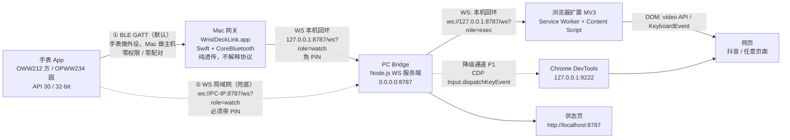
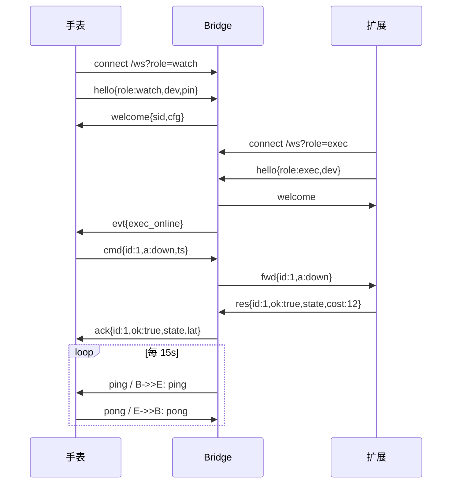

# 腕控 WristDeck —— 技术架构文档

> 配套文档：`产品设计文档.md`、`BLE链路方案设计.md`
> 状态：**核心链路已实现**（Bridge / 扩展 / 手表 / 手势 / 蓝牙 BLE / 圆表适配）；稳定性项（mDNS、电池白名单、CDP 降级、开机自启）待办。
> 版本：v0.5 ｜ 首次日期：2026-09-07 ｜ 本次修订：2026-10-01

---

## 0. 修订摘要

### v0.5（2026-10-01）

**BLE 成为默认链路（M1–M5 结项）+ 手势闸门改挂"连接状态" + 圆表适配**

三件事都是"原假设被真机推翻"的类型。

**① 传输层换成 BLE GATT（默认），Wi-Fi 降为兜底。**
手表做 **Peripheral**（GATT Server + 广播），Mac 上一个 `gateway/WristDeckLink.app`（Swift + CoreBluetooth）做 **Central**，
把 BLE 上的字节原样桥进本机 Bridge 的 WebSocket（回环来源免 PIN）。收益：**免填 IP、免同网段、免 PIN、免配对**。
`net/Transport.kt` 把传输细节下沉，`BridgeClient` 只剩"协议 + 状态机 + 退避"，**协议与扩展一行未改**。
设计全文、实测数据、踩坑记录见 `BLE链路方案设计.md`。三个挂错就**永久卡 CONNECTING** 的点：
1. **CCCD 必须手动 `addDescriptor`**（不加则 macOS 订阅报 `CBATTErrorDomain Code=10`）；
2. **`onOpen` 挂在"CCCD 被写 `01 00`"，不挂在连接建立** —— `hello` 是手表→Mac 的 notify 方向，没订阅就发不出去，而 BLE 没有 TCP 那种失败可兜底；
3. **`onCharacteristicWriteRequest` 必须先 `sendResponse` 再处理**，否则网关侧 `.withResponse` 的写永远挂着。

另外"连接时系统会自动停广播"**在这台 Qualcomm 栈上不成立**（断连后重开播收到 `ALREADY_STARTED`），
所以 `advActive` 要"连接时置假 + 收到该状态码时纠回真"两边都留。

**② 手势的活跃闸门从"屏幕亮"改成"连接状态"。**
原设计（屏幕亮 + 灭屏留 15s）动机是**省电**，结果把功能卡死：用户熄屏后 App"看着像断了"——
实测链路全程没断（网关 `ping/pong` 15s 一轮从未落空），真正的原因是 `GestureController` 在灭屏 15s 后注销了加速度计。
现在 `Prefs.linkEnabled`（主页「连接 / 断开」）是**唯一真相**：连上就一直识别（**含灭屏**），断开就全停。
识别器侧新增 `alwaysArmed`（与标定专用的 `bypassArm` 分开命名；两者默认 `false` ⇒ 离线台行为不变），
`GestureController` 里**已无任何 `SCREEN_ON/OFF` 代码**，唯一停止路径是 `GestureController.stop()`。

⚠️ 代价与连带影响：**采样必须常开 50Hz、不许降速省电**（触发判据量的是峰值角速度，窗口只有 70ms ≈ 3.5 帧，
降到 10Hz 只剩 0.7 帧，判据直接废）；省电只能靠「断开」。⇒ **验收 #2 的 28/28 需要重跑**（窗口机制换了），
**验收 #3 的日常误触率现在就是本形态的直接指标**。

**③ 圆表适配（OPWW234，466×466 @320dpi）。**
两块表的差别**不是分辨率而是圆/方**，判据只有 `Configuration.isScreenRound`（真机确认好用）。
坏掉有两层原因：`layout_constraintWidth_percent` 按**屏宽**算（圆表屏更宽 ⇒ 播放键从 57dp 涨到 73dp，
纵向链条 243dp > 可用 221dp 直接顶爆），以及圆屏两端是弧、贴边的行**物理点不到**。
新增 `ui/DisplayGeometry.kt`（纯逻辑、零 Android 依赖）：主页按**每行所在纵向带的弦宽**逐行收窄 +
整条链纵向居中 + 二分求收窄比例；设置页（滚动页）改用**内接正方形**内缩
（滚动页任何一行都可能滑到视口任意 y，逐行收窄会变成边滚边变形）。
**方表恒返回 `null` ⇒ 一个像素都不动**，由新增离线台 `.workbuddy/tests/display/`（100 项断言）守着。详见 §5.5。

**本文档本轮的结构变化**：新增 §3.4（网关选型）、§6.4 / §6.5（网关落地、两条链路的分工与互斥）、§5.5（圆表版面）；
§11 重排为「离线回归台 → Bridge → 扩展 → 手表 → 圆表核对」五段；§14 由"待你拍板"翻成"现状"；
§15 补 12 条新决策；§16 补三段实测记录（蓝牙 / 熄屏与总闸 / 圆表）；§17 新增第 17~24 条。
**章节号一律不变**（只在 §6 内部追加 6.4/6.5），以免历史条目里的 `§7.2`、`§7.3` 这类引用失真。

### v0.4（2026-09-15）

**手表端腕部手势识别（阶段 3）：零权限 IMU 手势，协议零改动**

手表戴在腕上就能控：**前臂左 / 右旋** ↔ `left` / `right`，**手腕上抬 / 下压** ↔ `up` / `down`，**把表盘翻过去** ↔ `play` / `pause`。全部只用**原始加速度计 @50Hz**（重力方向由软件低通自估，系统的旋转矢量 / 重力 / 线性加速度等融合接口一概不用），零权限、零 root，**Bridge 协议与扩展一行未改**（复用既有动作名）。

为什么要绕这么大一圈：这条 ROM 上**两台表的蓝牙 HID 都被资源开关关死**（§15），系统的语义手势（抬手亮屏 / 翻转静音）**只有系统签名应用拿得到**，而 `wrist_tilt(26)` / `significant_motion(17)` 两个传感器实测**对第三方 App 完全不出事件**（注册成功、`dumpsys` 显示 `active`，猛甩 6.7g + 反复抬腕仍零命中）。所以只能自己从原始 IMU 里做识别。完整能力边界见 §5.4。

三个关键取舍：

1. **不积分，所以不漂移**：只比较"重力方向相对静止基准 `g0` 的旋转"，不做陀螺积分；也不用四元数（磁场污染，且这里不需要航向）。代价是**手臂垂下时绕前臂轴的自转重力看不见**，所以翻转只能靠幅度分层、不能靠轴区分。
2. **判轴用切空间系数，不是比 `φ` 的大小**（这是「向左没反应」的根因修复）：原先用 `φarm=atan2(ux,uz)` / `φbend=atan2(uy,uz)` 比大小，两者**共用 `uz` 做分母**（球面投影），纯旋前时 `φarm ≡ θ` 而 `φbend` 是**纯耦合项**、在 `θ≈72°` 处反超 ⇒ **72° 以上的 left 全被判成 up**（现场 25 次发送里 left 零命中）。改为取 `t = u−(u·u0)u0`，用 `coefArm = t·(ŷ×u0)/|ŷ×u0|² ≡ sin(前臂角)`、`coefBend = t·(x̂×u0)/|x̂×u0|² ≡ sin(屈伸角)` 判轴——纯单轴转动下**线性、无耦合、无分支**；幅度窗口改用**真实转角 `θ = acos(u0·u)`**。`crossAxisDeg` 随之删除。
3. **触发判据是峰值角速度，不是穿越耗时**：真人动作是"快起动 + 慢到位"（实测快段 82°/s、减速段 10°/s），量"25°→45° 整段耗时"会把干净动作整段拒掉。改为在离位期间按 70ms 窗口取 `Δpeak/Δt` 的**最大值**，阈值 60°/s（实测命中动作 118~302°/s，2× 余量）。

防误触：必须**停稳**（±8° 内满 120ms）才发方向；冷却用**固定不应期 800ms**（不附加任何姿态要求，否则连续动作会死锁）；翻转与左右**共用同一根轴**（都是前臂旋前旋后），靠**幅度分层**区分——45~130° 方向、130~140° 死区、≥140° 翻转。

**必须配前台服务**：无 FGS 时息屏 60s 内传感器断流、进程被冻结；有 FGS 时实测连跑 590s 稳定 50.1Hz。采样按"屏幕亮着的活跃窗口"开关，灭屏后再留 15s 尾巴。

验证：识别器刻意做成**零 Android 依赖**，可在 Mac 上秒级回归——`.workbuddy/tests/gesture/`（`./run.sh`，用 `kotlinc` 编译**当前源码** + Sim/Sim2 两套场景）。⚠️ **日常佩戴下的误触率尚未实测**（标定用的是旁路闸门模式），见 §17。

### v0.3.4（2026-09-14）

**Bridge 把手表操作日志打到终端**

`node server.js` 跑起来只有一行启动横幅，手表点了什么完全看不到。两个原因叠加：`pushLog()` 只往内存环形缓冲写（供 `/api/log` 与状态页消费）、**从不输出到 stdout**；而且**成功转发的指令压根不记日志**。于是终端上最多只能看见"扩展 right ×no_change"，看不见"手表按了 right"。

1. **`pushLog()` 同时实时打印**：`HH:MM:SS  来源  动作  耗时  √/×  备注 (现场)`。stdout 是 TTY 时才着色，重定向到文件时留纯文本便于 grep；`--quiet` / `WD_QUIET=1` 可关掉控制台输出（`/api/log` 与状态页不受影响）。
2. **补记"指令已收下"**：`handleCmd` 成功转发后记一条 `src:'watch', note:'sent'`。失败分支（`exec_offline` / `busy` / `exec_timeout`）本来就有自己的条目，不会重复。`src` 语义不变（仍是"事件由哪一端发出"），但一次正常按键现在稳定对应两行：`手表 … sent` → `扩展 … 结果`。
3. **失败现场透传**：扩展回包里的 `detail` 随结果行一起输出，`no_change` 的 `video=/scroll=/blocked=/host=` 直接在终端可见，不必回头翻扩展 popup。

验证：`.workbuddy/tests/bridge-log.test.mjs` —— 用独立 `HOME` 伪造 config 把实例开在 8791（完全不碰用户正在跑的 8787），脚本自当 watch + exec 走真实握手与转发，10 项断言全过。

### v0.3.3（2026-09-13）

**修复方向键在普通网页上必然 `no_change`（扩展 0.1.5）**

v0.3.2 补了原生滚动兜底，但现场仍然全数 `no_change`。日志指纹很干净：竖向 `down` 耗时 **327ms = 320ms（竖向等待）+ ~7ms**，说明兜底那一段**根本没执行**——`canScroll()` 判定"这个方向没有余量"。根因是 `scrollHost()` 只找得到 `document.scrollingElement`，而三类真实页面它都认不出来：

1. **`overflow:hidden` 的滚动容器**：它是**合法滚动容器**，`scrollTop` / `scrollBy` 照样生效，只是滚轮和键盘不驱动它、必须靠脚本滚。原来只认 `auto` / `scroll` / `overlay`，把一大批"`html`/`body` 高度 100% + 内层脚本滚动"的页面（抖音推荐流就是这一类）整类漏掉，于是退回 `<html>` → 判定无余量 → 不兜底 → `no_change`。
2. **shadow DOM 里的元素**：`parentElement` 在 shadow root 边界直接是 `null`，祖先链断掉，必须用 `getRootNode().host` 接着往上爬。
3. **只横向溢出的页面**（宽表格、横向文档）：原筛选条件只看竖向溢出，横向滚动容器永远选不出来，左右方向键必然失败。

同时收紧两处判断：候选容器改为**取面积最大的那个**（视口里通常套着若干 `overflow:hidden` 的小裁剪框，真正的滚动宿主基本铺满视口，按面积可天然跳过小框）；`scrollHost()` 改为**按方向查找**（竖向找竖向余量、横向找横向余量）。并**取消"页面里有 `<video>` 就不兜底"**这条限制——有没有视频只是场景提示，不是"站点接管了按键"的证据，新闻页里挂个内嵌视频就会让方向键整类失效；真正的接管信号是 `preventDefault`。见 §7.3。

`no_change` 现在会带现场 `detail`（`video= scroll= blocked= host=`），失败也可诊断。配套加了 `content.js` 的 DOM 桩回归测试 `.workbuddy/tests/scroll-host.test.mjs`：5 个用例覆盖普通页下滚 / SPA 内层容器 / 横向溢出 / 确实无处可滚 / 站点自己 `preventDefault`。

### v0.3.2（2026-09-13）

**方向键改为全站通用能力（扩展 0.1.4）**

1. **注入范围从 `douyin.com` 扩到 `http/https` 全站**：方向键是原生键盘事件、`play`/`pause` 走通用 HTML5 `<video>`，二者都与站点无关。此前把方向键锁在抖音白名单内是**设计错误**——手表上最常用的四个键，在其它任何网页上都被判 `wrong_tab` 直接拒掉。
2. **删掉"页面没有 `video` 就提前返回 `no_video`"**：这是同一个错误的另一面。普通网页（新闻、文档、论坛）本来就应该支持上下左右，用一个 `video` 元素的存在与否把整类页面判死，等于把站点特化逻辑当成了通用能力。
3. **补上原生滚动兜底**：合成 `KeyboardEvent` 的 `isTrusted = false`，**不会触发浏览器默认动作**，所以普通网页上"按了 ↓ 但页面没滚"是必然结果。现在：页面有监听并接管了（`defaultPrevented`）→ 算成功；没人接管且页面内无 `<video>` → `nativeScroll()` 用 `scrollBy({behavior:'instant'})` 复现方向键该有的滚动。见 §7.3。（⚠️ 这条兜底的**触发条件**是错的，v0.3.3 已修正：`scrollHost()` 认不出 `overflow:hidden` 容器 / shadow DOM / 横向溢出，且"有 `<video>` 就不兜底"会误杀内嵌视频的普通页面。）
4. **`SITE_ONLY` 白名单只留站点特化动作**：`like` / `fullscreen` 依赖抖音快捷键，非抖音域回 `unsupported_site:<host>`；方向键与 `play`/`pause`/`toggle` 一律放行。见 §7.2。

### v0.3.1（2026-09-13）

**修复手表侧重连风暴（手表 0.2.4）**

1. **同一时刻只允许一个在途连接**：引入 `generation` 世代号 + `pendingReconnect` 标志 + 单一 `reconnectTask`，并去掉 `onOpen` 里对退避计数的清零。修复前 `Denied` 分支与 `onClosed` 会各排一次重连（双定时器），叠加"TCP 一连上就清零退避"，使得每秒都在建连；服务端"新 watch 顶掉旧 watch"的策略又让两个连接互相顶替，连接数指数级发散。现场实测 Bridge 侧累计 12925 个会话、单秒 282 次连接失败。见 §4.5。
2. **`bad_pin` / `pin_locked` 不再自动重连**：这类拒绝靠重试无法恢复，停在 `DENIED` 等用户改 PIN；`updateConfig()` 检测到 host/port/pin 变化立即清零退避并重连，这就是恢复路径。退避上限同时从 15s 放宽到 60s。

**修复扩展侧投递失败不可诊断（扩展 0.1.3）**

3. **`no_content_script` 曾经是个把两种病因混在一起的兜底文案**：目标标签页不是抖音（内容脚本永不注入）和"页面在扩展安装前就打开"（内容脚本没被注入）会得到同一个字符串，实测就卡在这里。现在改为三级：URL 不匹配 → `wrong_tab:<host>`（立即失败，不再白等 1200ms）；`sendMessage` 抛异常 → `chrome.scripting` 补注入后重试；仍失败 → 等 `tabs.onUpdated` 完成再试。配套把 `content.js` 包成幂等 IIFE（补注入会重复执行同一文件，顶层 `const` 重声明会抛 `SyntaxError`）。见 §7.2、§17 #5。

### v0.3（2026-09-13）

**动作集调整：三键 → 十字方向盘**

1. **删除 `prev` / `next`**：这两个动作原先承担"上一个/下一个"，但在页面里落地方式是把 `ArrowUp` / `ArrowDown` 派发给页面——语义与方向键完全重合，等于同一件事有两个名字。删掉后不再出现"该发哪个"的歧义。
2. **新增 `up` / `down` / `left` / `right` 四个方向动作**：手表不做语义翻译，原样转发 `ArrowUp` / `ArrowDown` / `ArrowLeft` / `ArrowRight`，具体行为交给页面解释（抖音推荐流里上下翻视频、左右快进退）。见 §4.3。
3. **手表主界面改为十字方向盘，播放/暂停居中**：方向盘 4 键各占 0.26 表盘宽，播放键 0.33 居中且最大。见 `产品设计文档.md` §5.1。
4. **键位图标改用矢量图，不再用字符 `△▽◁▷`**：字符方案实测字形相对圆心偏移各不相同（`◁`/`▷` 低 4px、`▽` 高 1.5px、`△` 居中），根因是不同字形走了不同字体回退、度量不一致，`includeFontPadding` 只能缓解不能根治。改为 `ImageView` + `VectorDrawable`（包围盒在 24×24 视口内严格居中）+ `scaleType="center"`，位置与设备字体完全解耦。实心 `▶` / `❚❚` 只留给播放键，与空心方向箭头用填充方式区分。见 §5.2。
5. **结果校验按方向分流**：上一次/下一次用视频源变化校验，左/右用播放进度变化校验（等待时长 320ms / 260ms）。见 §7.3。
6. **站点规则表 `RULES` 整体移除**：`prev`/`next` 是它唯一的消费方，随动作一起删除，`scroll` 兜底模式不再存在（非抖音站点由页面自己解释方向键）。

### v0.2（2026-09-12）

本版把文档与已落地的代码逐行对齐，并补上 v0.1 未定义的两个协议行为。

**协议新增**

1. **超时不再等同失败**：指令超时后 Bridge 保留 id 关联 10s，迟到结果用新事件 `cmd_late` 补偿给手表（只纠正播放图标，不参与失败判定）。见 §4.6。
2. **显式 `play`/`pause` 取代 `toggle` 作为主按钮动作**：`toggle` 是相对动作，超时重试会把状态翻回去；`play`/`pause` 是幂等的。`toggle` 保留，仅在本地状态未知时使用。见 §4.3。
3. 新增错误码 `4006 replaced`、`4007 busy`。

**安全收敛**

4. **状态页的 PIN 只在本机可见**：`/api/status` 对非回环请求返回 `pin: null` + `pinHidden: true`。此前状态页监听 `0.0.0.0` 且无条件回传 PIN，局域网内一次 GET 即可取得配对码，使 PIN 校验形同虚设。见 §10。

**文档纠偏**

5. 修正与实现不符的描述，并明确标注"尚未实现"的项（原文把若干未实现行为写成了已设计）：compileSdk、协程、手表工程结构、PIN 传参位置、按钮实现、WifiLock 模式、manifest 权限、标签页锁定的存储位置、`RULES` 结构、事件派发目标、校验等待时长、扩展重连策略、心跳通道、延迟指标口径。见 §3、§5、§6、§7、§9 及文末 §17。

---

## 1. 总体拓扑


```mermaid
flowchart LR
    W["手表 App<br/>OWW212 方 / OPWW234 圆<br/>API 30 / 32-bit"] -- "① BLE GATT（默认）<br/>手表做外设，Mac 做主机<br/>零权限 / 零配对" --> G
    G["Mac 网关<br/>WristDeckLink.app<br/>Swift + CoreBluetooth<br/>纯透传，不解释协议"] -- "WS 本机回环<br/>127.0.0.1:8787/ws?role=watch<br/>免 PIN" --> B
    W -. "② WS 局域网（兜底）<br/>ws://PC-IP:8787/ws?role=watch<br/>必须带 PIN" .-> B
    B["PC Bridge<br/>Node.js WS 服务端<br/>0.0.0.0:8787"] -- "WS: 本机回环<br/>ws://127.0.0.1:8787/ws?role=exec" --> E["浏览器扩展 MV3<br/>Service Worker + Content Script"]
    E -- "DOM: video API / KeyboardEvent" --> D["网页<br/>抖音 / 任意页面"]
    B -. "降级通道 P1<br/>CDP Input.dispatchKeyEvent" .-> C["Chrome DevTools<br/>127.0.0.1:9222"]
    C --> D
    B --> S["状态页<br/>http://localhost:8787"]
```

**两条链路二选一（互斥）**：BLE（默认）与 Wi-Fi 直连不能同时用 —— Bridge 的 `state.watch` 是单实例，
两条链路的 watch 身份会互相顶替。切换在手表设置页「用蓝牙连接」，落点是 `model/Config.link`。

| 连接 | 方向 | 传输 | 鉴权 | 用途 |
|---|---|---|---|---|
| 手表 → Mac 网关 | 外连（BLE GATT，手表做外设） | BLE GATT（write / notify） | **无**（不配对、不鉴权） | 指令上行、状态下行（**默认链路**） |
| Mac 网关 → Bridge | 外连（127.0.0.1） | WebSocket | 免 PIN（回环） | 把 BLE 字节原样桥进城里的 Bridge |
| 手表 → Bridge（兜底） | 外连（Wi-Fi 局域网） | WebSocket | **必须带 PIN** | 不开网关时的替代路径 |
| 扩展 → Bridge | 外连（127.0.0.1） | WebSocket | 免 PIN（回环） | 接收指令、回传执行结果 |
| Bridge → Chrome（可选，P1） | 外连（127.0.0.1:9222） | HTTP + WS(CDP) | 无 | 真键降级通道 |

> **信任域**：`127.0.0.1` = 本机信任域，免 PIN；局域网来源必须验 PIN。这条边界同时决定状态页能否显示 PIN（§10）。
> **BLE 链路刻意不设鉴权**：它是"零权限、零交互"的来源（选型见 §3.4，落地见 §6.4），代价是**短距离内非机密**
> —— 能扫到这个 service UUID 并连上的人就能写同样的动作名。它只传动作名与布尔状态，不传任何页面内容。

---

## 2. 模块划分与职责

| 模块 | 运行位置 | 职责 | 不负责 |
|---|---|---|---|
| `watch/` | OPPO Watch 3 | UI、连接管理、发指令、触觉反馈、腕部手势识别、圆表版面规划 | 不知道浏览器存在 |
| `gateway/` | Mac（BLE 模式常驻） | BLE Central ↔ WS 的双向透传 | **不解释协议**（纯搬运工）、不碰 DOM |
| `bridge/` | Mac/PC（常驻） | 鉴权、路由、状态聚合、日志、mDNS 广播（P1） | 不碰 DOM、不理解业务 |
| `extension/` | PC 浏览器 | 把动作翻译成页面内操作，回传结果 | 不做鉴权、不做持久化 |
| `bridge/ → CDP` | PC 浏览器 | 真键注入（降级，P1 未实现） | 不作为主路径 |

**核心设计原则：Bridge 只做"动作路由"，执行器可插拔。**
未来即使换成 HID 或原生媒体键，只需替换执行器，手表端与协议不变。

**次一级原则：传输也可插拔。** 手表侧 `net/Transport.kt` 之上是同一套 `BridgeClient`（协议 + 状态机 + 退避），
下面挂 `WsTransport` 或 `BleTransport`，由 `Config.link` 选择 —— 这就是"换传输不动上层逻辑"的落点。

---

## 3. 技术选型

### 3.1 手表端（硬约束来自 adb 实测）

实测基线：**方表 `OWW212`** / `OWW212_11_A.142` / 372×430 @320dpi；
**圆表 `OPWW234`** / Android 11 / 466×466 @320dpi（`dumpsys display` 三个 DisplayInfo 均带 `FLAG_ROUND`）。
两台均 Android 11(API 30) / **`armeabi-v7a, armeabi`（仅 32 位）** / 1GB RAM。

| 项 | 选择 | 理由 |
|---|---|---|
| 语言 | Kotlin | — |
| compileSdk / targetSdk / minSdk | **36 / 30 / 30** | targetSdk 与系统 API 对齐，规避 31+ 行为变更；compileSdk 由 androidx 下限决定（见 §15） |
| UI | **传统 View + AppCompat + ConstraintLayout（不用 Compose）** | 32 位 + 1GB RAM 下 Compose 冷启动与内存压力风险高；View 足够。主界面圆形键用 `ImageView` + `VectorDrawable`（字符字形在不同字体回退下度量不稳）；文字类按钮用普通 `Button`，不是 `MaterialButton` |
| 手表适配 | **不按分辨率分支，按 `Configuration.isScreenRound`** | 另一块表是圆的：`layout_constraintWidth_percent` 按屏宽算，圆表屏更宽 ⇒ 绝对尺寸更大、纵向顶爆，且两端落在圆外点不到。版面在代码里按圆收窄，见 §5.5 |
| 传输 | **`net/Transport.kt` 抽象 + `WsTransport` / `BleTransport`，默认 BLE** | 换传输不动上层（`BridgeClient` 只管协议 + 状态机 + 退避）。BLE 侧用 `BluetoothManager.openGattServer()`（`BluetoothAdapter.` 那个是 `@SystemApi`） |
| 蓝牙权限 | `BLUETOOTH` / `BLUETOOTH_ADMIN`（API 30 是 normal 级，装上即得）+ `<uses-feature bluetooth_le required="true">` | **不要 `ACCESS_FINE_LOCATION`**：手表做 Peripheral 不需要它；做 Central 才需要（定位开关是死穴），这正是"角色对调"的原因 |
| 网络 | OkHttp 4.12.0（纯 JVM，无 `.so`） | 满足 32 位约束；WebSocket + `pingInterval` 开箱可用（Wi-Fi 兜底路径用） |
| JSON | `org.json`（系统自带） | 零额外依赖 |
| 线程/异步 | `android.os.Handler` + 主线程回调（现网实现） | 逻辑简单，无需协程。`build.gradle.kts` 里仍声明了 `kotlinx-coroutines-android:1.9.0`，**当前代码未使用**，属待清理依赖（§17） |
| 存储 | SharedPreferences | IP/端口/PIN + 开关（`keep_alive` / `gesture_on` / **`link_enabled`**）。`link_enabled` 是"连接总闸"，**不进 `model/Config`**（那是"连接参数"，这是"用户意图"） |
| 打包 | 仅 `armeabi-v7a` | 无 native 库时忽略，但显式声明避免误引入 64 位依赖 |

**红线：禁止引入任何只提供 `arm64-v8a` 的库。**

### 3.2 PC Bridge

| 项 | 选择 | 理由 |
|---|---|---|
| 运行时 | Node.js 18+（本机托管版本 22.22.2） | 跨平台、单文件可跑 |
| 模块制式 | ESM（`"type": "module"`） | 单文件即可运行 |
| WebSocket | `ws` ^8.18 | 事实标准，稳定 |
| mDNS（P1，未实现） | `bonjour-service` | 让手表免输 IP |
| 配置 | `~/.wristbridge/config.json`：`{ port, pin, bindAll }` | 无需数据库。`pin` 首次启动随机生成（6 位） |
| 状态页 | 内嵌 HTML + `/api/status`、`/api/log` | 免构建 |

> **端口配置的实际边界**：`port` 只对 Bridge、手表端与联调脚本生效。浏览器扩展把 `ws://127.0.0.1:8787/ws?role=exec` 与 manifest 的 `host_permissions` 都写死在 8787 —— 改端口需同步改这两处并重载扩展，否则扩展静默连不上。见 §17。

### 3.3 浏览器扩展

| 项 | 选择 |
|---|---|
| 清单 | Manifest V3（Chrome / Edge 通用），当前 `0.1.5` |
| 后台 | Service Worker（常连 WS + 心跳保活） |
| 注入 | `content_scripts` 常驻（`document_idle`）+ `http/https` 全站，另用 `chrome.scripting.executeScript` 补注入漏掉的页面；不走"每次 `executeScript`"是为了省 20–50ms |
| 权限 | `host_permissions`：`http://*/*` + `https://*/*` + `ws://127.0.0.1:8787/*`（v0.3.2 起全站，`optional_host_permissions` 已删除）；`permissions` 另含 `scripting`（补注入用） |
| 最低浏览器版本 | 依赖 **Chrome 116+** 的"WebSocket 活动可延长 Service Worker 生命周期"行为；更低版本 SW 会被回收导致连接反复重建 |

### 3.4 Mac 网关（只有 BLE 模式需要）

| 项 | 选择 | 理由 |
|---|---|---|
| 语言/框架 | **Swift + CoreBluetooth**（`swiftc` 直接编译，零第三方依赖） | 探针阶段已跑通全流程；原生、bundle 天然。Python + pyobjc 也可行但要手工组 bundle；`noble-mac` 对新 Node ABI 支持差 |
| 打包形态 | **`.app`（`Info.plist` + `codesign --sign -`）** | **硬约束不是建议**：macOS 的 TCC 按"进程所属 bundle 的 Info.plist"判断资格，缺 `NSBluetoothAlwaysUsageDescription` 时**不弹框直接 `SIGABRT`**。裸脚本 / 从 Terminal 跑 / 从别的 GUI App 派生**三条路全崩**，只有 `open Xxx.app`（LaunchServices）可行 |
| 线程模型 | **全程主队列**（`CBCentralManager(queue:.main)` + `URLSession(delegateQueue:.main)`） | 状态天然串行、无需锁。BLE 回调 + WS 回调都在主队列上排队，等于免费拿到一个串行执行器 |
| 职责 | 扫描目标 service UUID（**靠 UUID 匹配，不依赖设备名** —— legacy 广播的 scan response 里才有名字，实测常拿不到）→ 连接 → 发现服务/特征 → 订阅通知 → **双向透传** | 纯搬运工：不解析协议，Bridge 与扩展零改动 |
| 进程形态 | `LSUIElement=true`（不占 Dock）；`./build.sh run` 构建并启动；`pkill -f WristDeckLink` 停；日志 `~/Library/Logs/WristDeckLink.log` | `open` 启动时拿不到 stdout，日志文件是唯一出口 |
| 未做 | **登录项自启** | 目前需手动起（§17） |

**网关的两个非对称策略（都是踩坑换来的）：**
- **上行 BLE→WS 未就绪要暂存**（32 条 / 5s 保鲜）—— 绝不能丢手表的 `hello`；
  **下行 WS→BLE 未就绪就丢弃** —— 补发过期的 `ack` 只会造成状态错乱。
- **网关自己发 `hello`（`role=watch`、`dev=ble-gateway`）**，且必须在 WS `didOpen` 之后、补发暂存消息之前：
  ① Bridge 对无角色会话把非 `hello` 消息一律打回 `need_hello(4005)`；
  ② **会话重新对齐** —— Bridge 重启后 WS 是全新会话，网关补一次 `hello` 换回 `welcome`，
  手表无须重发也能回到 READY。实测印证：Bridge 重启后控制台只有 `hello √ ble-gateway`，链路照样恢复。

---

## 4. 通信协议

所有消息为单行 JSON，UTF-8 文本帧。

### 4.1 通用信封

```json
{ "v": 1, "t": "<type>", "id": "<opaque>", "ts": 1757000000000 }
```

字段按需出现：`v` 恒为 1（由发送方统一补上）；`id` 只在与指令关联时出现；`ts` 只出现在 `cmd` 里（手表本地毫秒，**不可跨机相减**，见 §9）。

### 4.2 消息类型

**客户端 → Bridge**

| t | 字段 | 说明 |
|---|---|---|
| `hello` | `role`: `watch` \| `exec`，`dev`: 设备名，`pin`: 6 位 | 首个消息。**PIN 放在报文体内，不放 URL query**（query 会进访问日志）。role 合法前发其它消息会被 `4005` 拒绝 |
| `cmd` | `id`, `a`: 动作，`ts`: 手表本地毫秒 | 仅 watch 发 |
| `res` | `id`, `ok`, `cost`, `state`, `reason` | 仅 exec 发（执行结果） |
| `pong` | `id` | 应答 ping |

> `hello` 的"3 秒内不发则断开"在 v0.1 里写了但**未实现**：当前实现是"未 `hello` 前发其它消息一律拒绝"，不做定时断开。

**Bridge → 客户端**

| t | 字段 | 说明 |
|---|---|---|
| `welcome` | `sid`, `cfg{ hb, execOnline }` | 鉴权通过。`cfg.hb` 为心跳周期（秒），`execOnline` 让手表首帧就知道执行器在不在 |
| `denied` | `reason`, `code` | 鉴权/协议失败，随即关闭 |
| `ack` | `id`, `ok`, `state{ playing }`, `reason`, `lat{ net, exec, e2e }`, `unresolved` | 回给手表。`unresolved: true` 表示"超时未确认，可能有迟到结果"（§4.6） |
| `fwd` | `id`, `a`, `ts` | 转发给执行器 |
| `ping` | `id` | 应用层心跳 |
| `evt` | `e`: `exec_online` \| `exec_offline` \| `cmd_late`；`cmd_late` 时另带 `id`、`ok`、`state{playing}` | 执行器上下线通知；迟到结果补偿（§4.6） |

### 4.3 动作枚举

| a | 含义 | 优先级 | 幂等 |
|---|---|---|---|
| `toggle` | 播放/暂停（翻转当前状态） | P0 | ✗ 相对动作 |
| `play` / `pause` | 显式播放 / 暂停 | P0 | ✓ 绝对动作 |
| `up` / `down` / `left` / `right` | 方向盘：原样转发 `ArrowUp` / `ArrowDown` / `ArrowLeft` / `ArrowRight`，**任意网页可用** | P0 | ✓ |
| `volUp` / `volDown` | 音量 | P1 | ✗ |
| `like` / `fullscreen` / `seekFwd5` / `seekBack5` | 扩展动作（**仅抖音域**，见 §7.2 `SITE_ONLY`） | P1 | ✗ |

> **方向键为什么不做语义翻译**：手表只负责把"用户按了上"这件事忠实转发，`up` 在抖音推荐流里是翻上一条视频、在文档页里就是滚一屏——由页面自己解释才符合用户对方向键的直觉预期。代价是结果校验必须综合"视频换源 / 播放进度 / 页面滚动"三类迹象（§7.3）。
>
> **方向键为什么必须全站可用（v0.3.2 纠正）**：它就是一个原生键盘事件，与站点无关。曾经把注入范围限死在 `douyin.com`，导致在任何其它网页上按方向键都被 `wrong_tab` 拒掉；同时内容脚本"没有 `video` 就返回 `no_video`"让普通网页必然失败。两条一起构成"只有抖音能用"的错误假设，均已修正。
>
> `prev` / `next` 已在 v0.3 删除，见 §0 修订摘要。

**手表主按钮的默认行为**：按本地已知的播放状态发 `play`（当前是暂停）/ `pause`（当前是播放）；只有本地状态未知（首次连接、状态被清除）时才发 `toggle`。这样"失败后重试"不会把播放状态翻回去。

执行器对 `play`/`pause` 的键盘兜底也做了方向保护：`Space` 是翻转键，只有"当前状态 ≠ 目标状态"时才派发（§7.3）。

### 4.4 错误码

| code | reason | 含义 |
|---|---|---|
| 4001 | `bad_pin` / `pin_locked` | PIN 错误 / 连续失败被锁定 |
| 4002 | `unknown_role` | 未知 role |
| 4003 | `exec_offline` | 执行器离线 |
| 4004 | `exec_timeout` | 执行超时（>1.5s），`ack` 带 `unresolved: true` |
| 4005 | `bad_json` / `unknown_type` / `bad_action` / `need_hello` | 消息格式非法 |
| 4006 | `replaced` | 同一 role 的新连接把旧连接踢掉 |
| 4007 | `busy` | 在途指令已达上限（3 条），本次拒绝 |

> **PIN 锁定语义**：连续 5 次错误后锁 60s；锁定到期后失败计数**不清零**，因此再错一次会立即重新锁定，等效"持续锁定直到输入正确 PIN"。

### 4.5 连接生命周期


```mermaid
sequenceDiagram
    participant W as 手表
    participant B as Bridge
    participant E as 扩展
    W->>B: connect /ws?role=watch
    W->>B: hello{role:watch,dev,pin}
    B->>W: welcome{sid,cfg}
    E->>B: connect /ws?role=exec
    E->>B: hello{role:exec,dev}
    B->>E: welcome
    B->>W: evt{exec_online}
    W->>B: cmd{id:1,a:down,ts}
    B->>E: fwd{id:1,a:down}
    E->>B: res{id:1,ok:true,state,cost:12}
    B->>W: ack{id:1,ok:true,state,lat}
    loop 每 15s
        B->>W: ping / B->>E: ping
        W->>B: pong / E->>B: pong
    end
```

**心跳与重连（均为现网实现）**

- Bridge 每 15s 发 `ping`，30s 未收到任何消息判定掉线并清理会话。同时发应用层 `ping` 与 WebSocket 层 ping 帧（双通道，冗余但无害）。
- 判活依据是"最后收到消息的时间"，不依赖 WS 层 pong 回调。
- 手表侧退避重连：`1s → 2s → 4s → 8s → 15s → 30s → 60s(上限)`，**无抖动**。未就绪时点击按钮会立即触发一次重连尝试。
- ⚠️ **同一时刻只允许一个在途连接**（v0.2.4 修复，见下）。三条护栏缺一不可：
  1. `generation` 世代号：`connect()` 自增，每个 `Listener` 携带发起时的世代号，回调先比对、过期即丢弃。被顶替/被 `cancel()` 的旧 socket 仍会回调 `onFailure`（典型是 `sent ping but didn't receive pong`），不甄别就会再排一次重连。
  2. `pendingReconnect` 标志 + **单个** `reconnectTask`：同一轮只排一次，`main.removeCallbacks(reconnectTask)` 撤销旧排程，杜绝定时器叠加。
  3. `onOpen` **不重置** `attempt`：TCP + 握手成功不等于会话可用（服务端可能立刻回 `replaced` / `bad_pin`），在此清零会让退避永远停在 1s。真正的"连上了"以收到 `welcome` 为准。
- `bad_pin` / `pin_locked` 属于"不换 PIN 就永远失败"，**不自动重连**：停在 `DENIED` 态等用户在设置页改 PIN；`updateConfig()` 检测到 host/port/pin 变化会立即清零退避并重连一次。
- 历史故障（v0.2.3 及以前）：`Denied` 分支既自己调 `scheduleReconnect`，随后的 `onClosed` 又调一次；叠加 `onOpen` 清零退避 → 两路定时器并发建连，服务端"新连接顶掉旧连接"的策略让两者互相顶替，连接数指数级发散。现场实测 Bridge 侧累计收到 **12925 个会话**、单秒 282 次连接失败、6679 次 `replaced_by_new_watch`。修复后：会话数不增长、TCP 连接恒为 1、手表侧零错误日志。
- 扩展侧：Bridge 的 `ping` 天然续命 SW 活跃计时器；另设 `chrome.alarms`（`periodInMinutes: 0.4`，Chrome 会钳到最小 30s）做"掉线检查 + 重连"兜底，重连为 `1s → 2s → … → 10s` 指数退避，**无抖动**。
- **BLE 链路的连接生命周期不同（v0.5）**：手表是 Peripheral，**自己不发起连接**，链路建立由 Mac 网关驱动（扫描 → 连接 → **订阅通知才算"打开"**，见 §6.4）。网关连 Bridge 走回环，Bridge 看到的是一个 `role=watch`、`dev=ble-gateway` 的普通会话 —— **对 Bridge 来说两条链路没有任何区别**，这也是协议零改动的前提。
- **连接总闸（v0.5）**：`Prefs.link_enabled` 是"该不该连"的唯一真相。关掉时 `BridgeService` 停止（`onDestroy` 里**必须** `BridgeHolder.stop(this)`，否则 BLE 的 GATT Server 与广播会留在进程里，表现为"点了断开、Mac 还连着"），手势采样一并停。重进 App 由 `BridgeService.startIfEnabled()` 决定要不要起来，所以**断开之后退出再进来不会自动回连**；界面上的「已断开」与「未连接」是两种状态，前者是用户意图、后者是还没连上。
- 指令超时 1.5s：Bridge 立即回 `ack{ok:false, reason:'exec_timeout', code:4004, unresolved:true}`，不让手表干等（后续补偿见 §4.6）。
- 执行器离线：Bridge 直接回 `4003`，手表提示"请检查浏览器"。

### 4.6 超时与迟到补偿（v0.2 新增）

执行器的耗时**不可控**（翻页要等 320ms 校验、页面刚导航时要等重试），超时只能说明"没在 1.5s 内拿到回包"，不能说明"没执行"。若此时直接丢弃结果，就会出现**页面已经切了、手表却长震报失败**的不一致。

处理方式：

```
cmd → 转发 → 1.5s 内 res? ─ 是 → ack{ok, state, lat}
                          └ 否 → ack{ok:false, code:4004, unresolved:true}   ← 手表按"未确认"提示
                                 并将 id 移入 unresolved（宽限 10s）
               迟到 res 到达 → evt{e:'cmd_late', id, ok, state}              ← 不补发 ack，避免与后续指令抢顺序
                                 手表静默对齐播放图标，不重复震动
               10s 内仍无 res → 丢弃 id 关联
```

- `cmd_late` 只做**状态纠正**，不参与失败判定：失败反馈在超时那一刻已经给过用户了。
- 不补发 `ack` 的原因：`ack` 是"指令结果"的语义，迟到者可能晚于后续指令的 `ack`，会造成状态回退。
- 并发保护：同一时刻在途指令上限 3 条，超出直接 `4007 busy`，避免连点导致回包乱序。

---

## 5. 手表端设计

### 5.1 工程结构

```
watch/app/src/main/java/io/wristdeck/          （共 21 个文件 / 约 4600 行）
├─ ui/
│   ├─ MainActivity.kt          # 十字方向盘主界面 + 乐观状态 + ack/cmd_late 纠正 + 连接总闸 + 圆表版面覆写
│   ├─ DisplayGeometry.kt       # ★ 圆表版面规划：纯逻辑、零 Android 依赖（可在 JVM 单测，见 §5.5）
│   ├─ SettingsActivity.kt      # 连接方式/IP/端口/PIN/开关 + 返回按钮 + 圆表滚动页内缩
│   └─ ProbeActivity.kt         # 手势标定页（调试用；activity 故意 exported=true）
├─ net/
│   ├─ BridgeClient.kt          # 协议 + 状态机 + 退避重连 + pending 表（**不含任何传输细节**）
│   ├─ Transport.kt             # ★ 传输抽象：start/stop/send/ready/updateTarget + Sink 回调
│   ├─ WsTransport.kt           # OkHttp WebSocket 实现（Wi-Fi 兜底路径）
│   ├─ BleTransport.kt          # GATT Server + 广播 + CCCD + 通知（默认路径）
│   ├─ NetError.kt              # 底层异常翻中文（两条传输共用的文案口径）
│   ├─ BridgeHolder.kt          # 进程内单例：Service 持有连接，Activity 只挂回调
│   └─ Protocol.kt              # 消息编解码（org.json）
├─ svc/
│   ├─ BridgeService.kt         # 前台服务 + WakeLock/WifiLock；startIfEnabled() 是"顺手启动"的唯一入口
│   └─ ProbeService.kt          # 标定用前台服务（保活 accel 采样）
├─ gesture/
│   ├─ WristGestureDetector.kt  # ★ 识别器：纯逻辑、零 Android 依赖（可在 JVM 单测）
│   ├─ GestureController.kt     # 正式路径：随 BridgeService 走，识别 → 发指令（闸门挂在连接状态，见 §5.4.6）
│   ├─ GestureProbe.kt          # 标定路径：跟 ProbeActivity 走，只测量、不发指令（自带屏幕闸门）
│   └─ SigTrigger.java          # 触发器传感器的双签名兼容层（见 §5.4）
├─ model/ Config.kt, Link.kt    # host/port/pin/keepAlive + link(WIFI|BLE，默认 BLE)
└─ util/ Feedback.kt, Prefs.kt  # 震动模式；SharedPreferences 读写（含连接总闸 link_enabled）
```

> **`BridgeHolder` 是关键设计**：连接由前台 Service 持有，Activity 退出只注销回调，不断连接。v0.1 文档里的 `net/Reconnector.kt`、`model/ConnectionState.kt`、`model/CmdAction.kt` 在实际实现中未单独拆分（退避逻辑在 `BridgeClient` 内，状态用 `BridgeClient.State` 枚举，动作常量在 `Protocol` 里）。

> **`WristGestureDetector` 同样是关键设计**：它**不 import 任何 Android 类**（连 `SensorEvent` 都不碰，只吃 `onAccel(x, y, z, ts)`），这样才能在 Mac 上用 `kotlinc` 编译、拿真机轨迹回放做秒级回归。采集与算法刻意分离，见 §5.4。

### 5.2 关键实现要点

1. **连接**：用哪条传输由 `model/Config.link` 决定（**默认 `Link.BLE`**），两条都挂在同一个 `BridgeClient` 下。
   **Wi-Fi 路径**：`ws://<ip>:<port>/ws?role=watch`（**URL 不带 PIN**），PIN 在 `hello` 报文体里；OkHttp `pingInterval(15, SECONDS)`、`readTimeout(0)`。
   **BLE 路径**：手表做外设，先 `ensureServer()`（幂等 —— `start()` 会被 `onCreate` + `onStartCommand` **连调两次**）再开播；
   `hello` 走 **notify**、命令走 **write**，**没有 URL、没有 PIN**。`NetError` 负责把两条传输的底层异常翻成同一套中文文案。
2. **线程**：OkHttp 回调在工作线程 → 用 `Handler(Looper.getMainLooper())` 回主线程更新 UI；连接状态用 `BridgeClient.State`（`DISCONNECTED / CONNECTING / READY / DENIED`）集中管理，**没有独立的 `AUTHENTICATING` 阶段**（鉴权结果由 `welcome` / `denied` 决定，直接落在 `READY` / `DENIED`）。
3. **主界面**：方向键与播放键是 5 个 `ImageView`（`layout_constraintWidth_percent` + 1:1 宽高比；方向键各 0.26 表盘宽，播放键 0.33 居中最），底部一行是「断开 / 连接」总闸 + 「设置」两个并排 `Button`。图标走 `VectorDrawable` + `scaleType="center"`，不用文字字符——字符的字形度量随字体回退变化，实测会让 `◁▷` 相对圆心低 4px。点击行为：本地震动 12ms → 乐观更新图标 → 发 `cmd`。
   **圆表上这几行的宽高由 `DisplayGeometry` 在布局完成后覆写**（§5.5）；方表一个像素都不动。表盘尺寸核算见 `产品设计文档.md` §5.1。
4. **按钮动作**：中央播放键按本地 `playing` 发 `play` / `pause`，未知时发 `toggle`（§4.3）；乐观更新按"目标状态"赋值而非翻转，重试不会反向。四个方向键发 `up` / `down` / `left` / `right`，**不做乐观更新**（方向键不改变播放状态，图标只由 ack 里的 `state.playing` 纠正）。
5. **去重**：同一按钮 120ms 内丢弃（主按钮用固定去重键，避免 `play`/`pause` 交替时去重失效）。
6. **迟到纠正**：收到 `evt{cmd_late}` 且带 `state.playing` 时静默对齐图标，不震动、不再提示失败。
7. **反馈**：`VibrationEffect.createOneShot(12, 80)` 点击；失败 60ms；未连接波形 `[0,25,70,25]`。状态条文案区分 `已连接 / 浏览器未就绪 / 未确认（可能已执行）/ 点太快了 / PIN 错误`。
8. **后台保活（P1）**：`BridgeService` 前台服务 + `PARTIAL_WAKE_LOCK`（30 分钟超时）+ `WifiLock`。API ≥ 29 用 `WIFI_MODE_FULL_LOW_LATENCY`（**不是** `FULL_HIGH_PERF`）。`keepAlive` 开关只控制是否加锁，**没有**"后台 5 分钟无操作主动断开"的逻辑。息屏掉 Wi-Fi 的实测结论见 §16。
   **BLE 模式下 `WifiLock` 无意义**（不依赖 Wi-Fi），但 **FGS + WakeLock 仍然必需**——手势改成常开采样后更是如此。
9. **连接总闸 `Prefs.linkEnabled`（v0.5 新增）**：主页一个按钮两个方向，语义是"我现在要不要用这快表控电脑"。
   - **断开（全停）**：写开关 → `stopService(BridgeService)` → `GestureController.stop()` → `BridgeHolder.stop()`。
     **四件都要做，少一件就漏**：`stopService` 只触发 `onDestroy`；不显式停客户端的话，BLE 的 GATT Server / 广播会留在进程里（现象：**点了断开，Mac 还连着**）；不等 `onDestroy` 就停手势，是因为"用户点一下就该立刻停"。
   - **连接**：写开关 → `renderLink()` → `BridgeService.start(this)`。
   - **唯一真相是这把开关，服务和手势都只是它的执行者。** 所有"顺手"的启动路径（主页、设置页的保存/测试/手势开关）**必须走 `BridgeService.startIfEnabled()`**，只有主页「连接」按钮可以直接 `start()`——否则"断开"形同虚设（用户退出去再进来就又连上了）。
   - `BridgeService.onDestroy` 里也必须 `BridgeHolder.stop(this)`，兜住"除了 `stopService` 还有别的销毁路径"。
   - `renderStatus` 开头有"已断开"短路：不写的话，断开后紧跟的 `DISCONNECTED` 回调会把它刷成"未连接"，用户会以为断开没生效。
   - 开关是**独立键 `link_enabled`，不进 `model/Config`**：`Config` 是"连接参数"，这是"用户意图"；混在一起会让"改个参数"顺带改变连接意图。
10. **设置页顶部钉一条「返回」（v0.5 新增）**：主题是 `NoActionBar` 且本页没有 Toolbar，原先**零返回控件**，只能靠系统边缘手势退出（实测用户当场卡死在设置页）。现在根容器是 `LinearLayout`（返回按钮 + `layout_weight=1` 的 `ScrollView`），返回按钮**钉在滚动区之外**——进页面第一眼就看得见出口，不用先滚到底。代价是常驻占掉约 34dp，但本页本来就要滚动，换"永远有出口"是划算的。

### 5.3 构建与安装

```bash
# 环境提醒：~/.gradle/gradle.properties 中的失效代理（127.0.0.1:7897）需先注释，否则依赖下载卡死
cd watch
export JAVA_HOME="/Applications/Android Studio.app/Contents/jbr/Contents/Home"
./gradlew assembleDebug
adb -s <设备序列号> install -r app/build/outputs/apk/debug/app-debug.apk
adb -s <设备序列号> shell am start -n io.wristdeck/.ui.MainActivity
```

> 设备序列号用 `adb devices -l` 查。**两台表会交替插**，命令务必带 `-s <serial>`。

### 5.4 手势识别（v0.4 新增）

#### 5.4.1 能力边界——先看这张表，它决定了整个方案形态

| 想要的输入 | 能不能拿到 | 依据 |
|---|---|---|
| 蓝牙 HID（手表当键盘） | ✗ | 两台表的 `Bluetooth-oppo.apk` 里 `profile_supported_hid_device / host` 都是 `false`，ROM 级关死，无 root 打不开（§15） |
| 系统语义手势（抬手亮屏 / 翻转静音 / 甩腕切歌） | ✗ | 只有系统签名应用能拿到；`service list` 里没有对应的手势 binder |
| `wrist_tilt_gesture(26)` / `significant_motion(17)` 传感器 | ✗ | 注册返回 true、`dumpsys sensorservice` 显示 `status: active`，但实测**零事件**：猛甩（aPeak 66 m/s² ≈ 6.7g）+ 反复抬腕看表之后仍是 0 命中 |
| 原始加速度计 / 重力 / 陀螺 / 旋转矢量 | ✓ | 全部 `perm: n/a`，零权限零 root；accel 最高 500Hz，手势只需 50Hz。API 30 不受 12+ 的高采样率权限门槛约束 |
| 表冠 | ✗ | `pm list features` 只有 `oplus.wear.support.singlebutton`，没有 rotary/encoder |

→ 结论：方案**只能是"自己从原始 IMU 里做识别"**，且**不得设计依赖上面那两个传感器的任何判据**。

> ⚠️ 上表列的是「**哪些输入可用**」，不是「实际用了哪些」。**真正进判定链路的只有"原始加速度计"这一个输入**：重力方向是软件低通自估的（§5.4.2），陀螺仪只存诊断值、旋转矢量 / 线性加速度 / 磁力计完全没碰。

#### 5.4.2 传感器与采样

- **只注册一个传感器：`TYPE_ACCELEROMETER`，50Hz**（`SENSOR_DELAY_GAME`）。
- **"重力"不是读系统的 `TYPE_GRAVITY`，是自己低通估出来的**：一阶低通（时间常数 `gravityTauSec = 0.06s`，`α = 1 − e^(−dt/τ)`）分离出慢变的重力分量，再归一化成重力单位向量 `u`。原始加速度 = 重力 + 手的线性加速度，线性加速度不参与角度计算。
- **系统的一切"封装接口"都不用**：`TYPE_ROTATION_VECTOR`（旋转矢量）、`TYPE_GRAVITY`、`TYPE_LINEAR_ACCELERATION`、`getRotationMatrix()`、四元数——全仓 **0 处引用**。从"原始三轴加速度"到"转了哪根轴、转了多少度"整条链路都是本项目自己的算法（§5.4.3）。
  为什么不用现成的融合结果：① 旋转矢量是系统按自己的手势语义调的，抬手看表这类姿态变化会被它优先当作"姿态/航向变化"吃掉或平滑掉，而我们要的恰恰是这类缓慢倾转；② 系统融合输出依赖磁力计，腕上磁场环境不可控；③ 全自研才可能做到"零 Android 依赖"，从而在 Mac 上秒级回归（§5.4.6）。
- **不积分**：识别只问"重力方向相对静止基准 `g0` 转了多少"，不做陀螺积分 ⇒ **没有累积漂移**。
- **陀螺仪也不参与判定**：`onGyro()` 只把模长存进 `gyroRaw` 供日志诊断，识别器里没有任何判据读它；正式路径干脆**不注册陀螺**（只有标定页会喂进来）。实测陀螺零偏恒定 59.5°/s，且同一姿态下 AC 供电与 USB 供电差 50 倍。
- **陀螺不参与判定**：本机陀螺零偏恒定 **59.5°/s**（静止在充电座上 ω 恒 58~63），且**同一块表同一姿态**在 AC 充电座上是 1.05 rad/s、仅 USB 时 0.02 rad/s——差 50 倍。只在调试日志里留 `ωraw` 做诊断。**静止判定绝不能建在陀螺上**（否则状态机会永远卡在 `NEED_BASELINE`）。
- **不用四元数**：这里只需要"重力在设备系里的方向"，磁场污染问题根本不存在；代价是没有航向——本方案也不需要。
- **必须有前台服务（FGS）**：Android 9+ 会掐后台 continuous 传感器。实测无 FGS 时**息屏 60s 内断流、进程随后被冻结**；有 FGS 时连跑 **590s、50.1Hz、gapMax 253ms、零断流**。
- **采样闸门 = 活跃窗口**：屏幕亮时持续刷新 `armedUntil = now + 5s`（语义是"**亮着就一直续期**"，不是"亮屏后 5 秒内"）；灭屏后**不立刻注销，留 15s 宽限**——翻表盘常发生在屏幕刚灭那一刻。
- ⚠️ **"App 自己续期唤醒锁"在这条 ROM 上无效**：设备入睡时唤醒锁 ACQ 后 3~4s 就被系统 REL（伴随 `ActivityManager-Sleep`），全程 `Wake Locks: size=0`。**不要设计"靠续期唤醒锁保活"**，那是一条死路，保活只能靠 FGS。
- **采样闸门 = 连接状态（v0.5 改，原为"屏幕亮 + 灭屏留 15s"）**：
  原先的活跃窗口（亮屏续期 5s / 灭屏宽限 15s）**动机是省电**，但把功能卡死了 —— 用户熄屏后 App"看着像断了"，
  实测链路全程没断（网关 `ping/pong` 15s 一轮从未落空），真正的原因是灭屏 15s 后注册被注销、手势不再识别。
  现在闸门挂在 **`Prefs.linkEnabled`（主页「连接 / 断开」）**上：`GestureController.start()` 置 `detector.alwaysArmed = true`、
  注册加速度计；`stop()` 释放采样并置回 `false`。**`GestureController` 里已无任何 `SCREEN_ON/OFF` 代码**，
  `WristGestureDetector.arm()/ARM_HOLD_MS` 保留但**只有标定页还在用**。
  - 识别器侧用**两个互不相同的标志**表达闸门：`alwaysArmed`（正式路径的产品语义："连上就一直识别"）与
    `bypassArm`（标定专用："这次测量旁路闸门"）。`isArmed = alwaysArmed || bypassArm || now < armedUntil`，
    **两者默认都是 `false`**，所以离线台（`Sim`/`Sim2`）的行为不受影响 —— 这条让"改闸门"没动到判据回归。
  - ⚠️ 代价：**采样必须常开 50Hz，不许降速省电**。触发判据量的是**峰值角速度**（窗 70ms ≈ 3.5 帧），
    降到 10Hz 只剩 0.7 帧，速率估计直接废。要省电只能用「断开」这把总闸。
  - ⚠️ 连带影响：**"零误触"的旧数据全部来自"屏幕钉亮"的人工条件，不代表日常**；验收 #2 的 28/28 也需要重跑（§16）。

#### 5.4.3 角度表示与判轴（核心）

设静止基准单位向量 `u0`（即 `g0`）、当前重力方向 `u`：

| 量 | 定义 | 用途 |
|---|---|---|
| `θ` | `acos(u0·u)` —— **真实转角** | 幅度窗口（方向 / 死区 / 翻转的分层） |
| `t` | `u − (u·u0)u0` —— 重力运动方向，⊥ `u0` | 切空间分解的输入 |
| `coefArm` | `t·(ŷ×u0) / \|ŷ×u0\|²` ≡ `sin(前臂转角)` | 判"是不是前臂轴"；符号定 left / right |
| `coefBend` | `t·(x̂×u0) / \|x̂×u0\|²` ≡ `sin(屈伸转角)` | 判"是不是屈伸轴"；符号定 up / down |
| `φarm` / `φbend` | `atan2(ux,uz)` / `atan2(uy,uz)` 相对基准的差 | **只留作手工交叉核对，不参与任何判定** |

判轴：`|coefArm| ≥ |coefBend|` → 前臂轴；否则屈伸轴。

> ⚠️ **为什么不能用 `φ` 判轴（「向左没反应」的根因）**
>
> `φarm` 与 `φbend` **共用 `uz` 做分母**（球面投影）。纯前臂旋前（绕设备 Y 轴）有闭式解 **`φarm ≡ θ`**，而 **`φbend` 是纯耦合项**——它非线性增长，并在 **`θ≈72°` 处反超 `φarm`**。于是"谁大听谁的"从 72° 起把 left 判成 up。
>
> 现场证据：`wrist8.log` 共 25 次发送（right×11 / up×11 / down×2 / toggle×1），**left 零命中**；其中 6 次 `up` 的读数是 `φarm=+50~78 / φbend=+75~106`——全是 left 尝试。用反解出的佩戴基准 `u0=(0.295, 0.108, 0.949)`（表相对前臂轴**只斜置 6°**，正常佩戴就会这样）能逐位复现现场读数（误差 0.01°）。此前轮次 7 的 left 之所以侥幸命中，是因为 φarm 只到 63.9/69.0/71.7——**刚好在 72° 交叉点以内**。
>
> 切空间系数在纯单轴转动下**线性、无耦合、无分支**（`φ` 在 `|φ|` 越过 90° 时还会跳约 180°，这是同一件事的两种参数化，切空间那套是正确的那个）。

> ⚠️ **符号陷阱（改代码必看）**：`coefArm` 的符号与 `φarm` 相同（正 = left），但 **`coefBend` 的符号与 `φbend` 相反**——绕设备 `+x̂` 的右手旋转给 `coefBend = +sinθ`，而同一次转动 `φbend = −θ`。上下映射当初是在 `φ` 口径下校准的，所以代码里 **`coefBend > 0` 必须映射到 `down`**。实测佐证：现场深压腕 `φbend = −118.06` 时 `coefBend = +0.92`。

#### 5.4.4 动作绑定与阈值

| 动作 | 判据 | 物理含义 |
|---|---|---|
| `left` / `right` | 前臂轴，`coefArm > 0` / `< 0` | 前臂旋前 / 旋后 |
| `up` / `down` | 屈伸轴，`coefBend < 0` / `> 0` | 手腕上抬 / 下压（符号已翻，见上） |
| `play` / `pause` | `θ ≥ faceDownDeg(140)`，施密特迟滞回到 `faceUpHystDeg(70)` | "把表盘翻过去"；翻回静默复位 |

- **幅度分层**：**45~130° = 方向**、**130~140° = 死区**、**≥140° = 翻转**。翻转与左右**共用同一根轴**（都是前臂旋前旋后），只能靠幅度区分，因此死区必须存在。
- **触发判据 = 峰值角速度** ≥ `crossRateDegPerSec(60)`，在 70ms 窗口取 `Δpeak/Δt` 的**最大值**。
  ⚠️ 不能用逐帧差分——50Hz 下重力低通残余噪声会被 `1/dt` 放大成几百 °/s 的假峰。
  ⚠️ 也不能用"穿越耗时"（旧判据"25°→45° 必须 400ms 内完成"量的是整段，而真人快起动 + 慢到位，实测 25→45 合计 ~715ms ⇒ 干净动作被整段拒掉）。**`crossoverMs` 已删除，别请它回来。**
- **防误发**：必须**停稳**才发——`±8°` 内满 **120ms**（⚠️ 不能写成"从越过阈值起算的延时"：翻转时手腕匀速穿过 45°~100° 恰好也是 ~120ms，延时口径会误发方向键）。
- **冷却 = 固定不应期 `refractoryMs(800)`，到点即解禁、不看当前姿态**。⚠️ 在解禁条件里附加任何姿态要求（"回中""停住 N ms""重建基准"）都会在**连续动作**下死锁——真人节奏是连续的、两下之间不停在中位，这个坑连踩两版（首轮 10 个动作只命中 2 个）。
- **灵敏度三档**：`triggerDeg` = 55 / 45 / 35。
- **基准 `g0` 重建**：只在静止且贴基准时重建（一级：静止 800ms 且贴基准；二级：静止 3s 不管角度，用于救"表在腕上转位"），二级后加 1.5s 静默期；**`FACE_DOWN` 期间一律不重建**。`driftHoldMs(8s)` 且**只在 IDLE 生效**——太短会在连续动作的间隙误触发，把基准搬到动作中间的姿态上，之后角度全乱。
- **判向要处理左右手**：`settings system hand_left_right` 决定前臂轴的正负；本机实测为左手佩戴。

#### 5.4.5 两条链路互斥

| 链路 | 入口 | 职责 |
|---|---|---|
| **正式** | `GestureController`（object 单例，随 `BridgeService`） | 识别 → 经 `BridgeClient` 发 `up/down/left/right/play/pause` |
| **标定** | `GestureProbe`（随 `ProbeActivity` / `ProbeService`） | 只测量、打日志，**不发指令** |

两者**共用同一份 `WristGestureDetector`**，所以标定页调的阈值直接对正式路径生效。`GestureController.deliver()` 里检查 `GestureProbe.isDetectMode()`——**SensorManager 允许多个监听者，不拦就是一个动作变两次按键**。

**协议零改动**：手势产出的就是既有动作名，`Protocol` / Bridge / 扩展**一行未改**。`play`/`pause` 沿用主界面同一策略——按 `BridgeClient.playing`（真相源是浏览器 ack 里的 `state.playing`）解析成**幂等**动作，本地未知才退化成 `toggle`；**每次断开连接都要把 `playing` 清回 `null`**（重连后 `welcome` 不带播放状态，留旧值就是凭猜测发指令）。

**开关隔离**：手势开关在 Prefs 里是**独立键 `gesture_on`**，**不放进 `model/Config`**——Config 会被设置页 `save()` 整体覆盖，混进去就会"改一次 IP 顺带重置开关"。

#### 5.4.6 标定与离线回归

```bash
# 标定页自带"屏幕亮"闸门（默认旁路，否则离座后屏幕一灭就掐死自己，没法标定）
# 注意：v0.5 起正式路径已不用屏幕闸门（改挂连接状态），屏幕闸门只剩标定页在用
adb shell am start -n io.wristdeck/.ui.ProbeActivity --ez detect true --ez fgs true
# 想复现"屏幕亮才识别"的旧行为（测日常误触率）时才启用闸门
adb shell am start -n io.wristdeck/.ui.ProbeActivity --ez detect true --ez fgs true --ez gate true
adb logcat -s WristDeck:I          # 手势日志前缀 GEST ，投递探针前缀 PROBE
```

**标定必须记录"没触发的动作"**：每次摆动结束都打一行
`GEST 摆动 <时长>ms θ峰= 轴系数 臂= 屈= 轴判= 峰值速率= 结果=`（`onSwing` 回调，**无论是否 fire**）。
只看命中日志会漏掉最需要的"为什么没发"——这正是定位 left 误判的依据。

**离线回归（免真机、秒级）**：识别器刻意做成**零 Android 依赖**就是为了这个：
```bash
cd .workbuddy/tests/gesture
./run.sh                  # Sim（14 个状态机场景）+ Sim2（边界套件）一起跑
./run.sh <logcat日志文件>  # 回放真机轨迹（-v 逐帧打印）
```
`Sim2` 里的**守门测试**（改动判据时先看它们）：

| 测试 | 复刻什么 | 谁改坏了它会挂 |
|---|---|---|
| **A10** | 斜置 6° 基准下纯旋前 74° → 必须 `left` | **把判轴改回比 `φ` 大小**（旧判据判 `up`） |
| **A11** | 同基准纯旋前 85° → `left` | 用 `φ` 当幅度上限（会把整段合法动作拒掉） |
| **A12** | 同基准纯旋后 74° → `right` | 修 left 时把 right 弄反 |
| **A8** | 真机"快起动 + 慢到位"逐段复刻 | **把触发判据改回耗时型** |

> ⚠️ 回放的已知坑：轨迹表头的 `基准=ax,ay,az` **必须注入**（`seedBaseline()`），否则用户连续做动作的窗口里"静止 800ms"到不了，整段停在 `NEED_BASELINE`、回放成"无动作 / 峰值 0"，**极易误判成阈值调错**。看到回放"无动作"时，**先查这段的静止时长够不够 800ms、基准注入成不成功**，再怀疑阈值。

#### 5.4.7 已验证的现场表现

| 项目 | 结果 |
|---|---|
| 手势采样稳定性（带 FGS） | 连续 **590s**、accel 50.1/s、gapMax 253ms、零断流 |
| 刻意动作命中（标定轮次 7） | **7/7 全中**：left×3（φarm +69.5/+69.0/+72.0）、up、down、toggle×2 |
| 同轮"无触发"4 次 | 全是**戴表就位期乱动**（200ms 内 φarm +54°→−27°→−80°），拒掉正确 |
| 命中动作峰值角速度 | **118~302°/s**（阈值 60 有 2× 余量） |
| 方向↔动作映射 | **三次独立校准一致**：left=+前臂轴、right=−前臂轴、up=+屈伸轴、down=−屈伸轴 |
| 离线回归 | `Sim` 14 场景 + `Sim2` 边界套件 **全绿** |
| 日常佩戴误触率 | ⚠️ **未测**（标定用旁路闸门）——见 §17 |

### 5.5 圆表版面（v0.5 新增）

#### 5.5.1 为什么不能"一套 XML 走两块表"

方表（372×430 @320dpi ≈ 186×215dp）的版面是**手算完钉死在 XML** 里的。圆表（466×466 @320dpi ≈ 233×233dp）
直接套用会坏，两层原因：

| # | 原因 | 数字 |
|---|---|---|
| 1 | **`layout_constraintWidth_percent` 按"屏宽百分比"算** | 屏幕上更宽 ⇒ 百分比对应的绝对值更大：播放键 `0.33 × 221dp = 73dp`（方表 `0.33 × 174dp = 57dp`）⇒ 纵向链条 `55 + 57.5 + 73 + 57.5 = 243dp > 可用 221dp`，**直接顶爆** |
| 2 | **圆屏两端是弧** | 贴边的行两端落在圆外，**物理点不到**。例如设置页的返回按钮实测占 `x∈[20,446]、y∈[12,68]`，而 `y=12` 处圆的弦只有 `[159,307]` |

判据只有 **`Configuration.isScreenRound`**（真机确认好用；`dumpsys display` 的 DisplayInfo 带 `FLAG_ROUND`）。
**不要用分辨率或型号名判**。

#### 5.5.2 主页：逐行收窄 + 整链居中

`ui/DisplayGeometry.kt`（纯逻辑、零 Android 依赖，可在 JVM 上单测）：

```
屏幕 = 半径 R = min(W,H)/2、圆心 (W/2, H/2) 的圆
行占纵向带 [t, b]，可用宽度 = 2 × (√(R² − dy²) − safe)，  dy = max(|t−cy|, |b−cy|)
```

`dy` **必须取离圆心更远的那条边**（跨过圆心的行取近端会算出过宽的可用宽度）。

- **整条链纵向居中**：链越短 ⇒ 两端离圆心越近 ⇒ 弦越宽。居中能让最窄的两行（状态行、底部行）自动挪到圆更宽的位置。
  只收窄不居中，底部两个按钮会被压到约 30dp 一个，两个字都放不下。
- **收窄比例 `k` 用二分求**：`k` 同时缩"上 / 播放 / 下"三个键，取**所有行都仍满足最小可读 / 可点宽度的最大 `k`**
  （"能不缩就不缩"），最后每行再各自取 `min(自身尺寸, 该带弦宽)`。找不到满足最小宽度的 `k` 时退化为"几何上放得下的最大 `k`"，
  并把缺口写进 `Plan.warnings`。
- 圆表上状态文字降到 **11sp**（12sp 时"浏览器未就绪"这类 6 字文案在顶部弧内放不下）。
- **起点是"百分比在本屏宽度下的取值"**，再由规划器收窄 —— 语义是"收窄"，不是"另做一套尺寸"。
  方表上这个基准值就是 XML 里那几个数，本来就不用动。

真机实测（OPWW234，R=233，`adb logcat -s WristDeck:I` 抓 `UI 圆表版面` / `UI 实测` 两行）：

```
UI 圆表版面 466x466 状态行高=30px k=0.875 链=438px 上/下=101 播放=128 左右=101 状态=146 底=146 点下移=9 警告=0
UI 实测 状态行=(186,14,306,44) 上=(183,52,284,153) 播放=(169,163,297,291)
        左=(58,177,159,278) 右=(307,177,408,278) 下=(183,301,284,402) 底部行=(160,412,306,452)
        最差越界=-2.2px     ← 负值 = 在圆内；状态行 160..306，中心正好 233
```

⇒ 方向键 **51dp**、播放键 **64dp**、状态行 **73dp**、底部行 **73dp（两键各 34dp）**。

**三个踩过的坑（都已修，且都写进了离线台）：**

1. ⚠️ **`marginStart` / `marginTop` 是叠加在父 padding 之内的**（子左边界 = `paddingStart + marginStart`）。
   横向漏减 `contentPad` ⇒ 实测整行右偏 **12px**（正好一个 6dp padding）、探出圆外 1.9px。
   **离线台原先按"以屏幕中心左右对称"推矩形，所以跑了 80 项也没抓到** —— 已改成按引擎语义（`pad + margin`）推。
2. ⚠️ **改字号要放在第一次布局之前**：规划器要实测状态行高，而字号直接决定它（12sp → 34px、11sp → 30px）。
   放在 `applyPlan` 里会导致"规划 → 字号变 → 指纹变 → 再规划"，白算一帧。
3. ⚠️ **规划次数必须封顶**（`MAX_ROUND_PLANS=3`）：真机上出现过 `statusRowH` **29↔30px 抖动**
   （同字号、不同测量时机的舍入差），而每次重规划都会 `requestLayout` —— 抖起来就是**无限布局循环**（开着页一直烧电）。

#### 5.5.3 设置页：整页收进内接正方形

设置页是**滚动列表**，不能逐行收窄：任何一行都可能滑到视口的任意 y，逐行收窄会变成**滚动时宽度忽宽忽窄**。
所以只有一种稳的做法 —— **让视口本身内接于圆**：视口是正方形，那么视口内任何矩形都在圆内，**与滚动位置无关**，一次性内缩之后不用再管。

```
内接正方形边长 = √2 × (R − margin)          margin = 8dp（正方形四角正好落在圆上，不留余量会被圆框切着看）
↳ OPWW234：水平/垂直各内缩 80px，视口 306×306px（153dp 见方），四角距圆心 216.4px、余量 16.6px
```

入口是 `DisplayGeometry.pageInset(w, h, margin, isRound)`：`isRound=false` 返回 `Inset.ZERO` ⇒ 调用方不设任何 padding，
方表逐像素不变。**副作用要有心理准备**：设置页可见高度从 233dp 降到 153dp，滚动变多，这是"任何一行都在圆内"的代价。

#### 5.5.4 方表不变是**硬保证**，不是口头承诺

`DisplayGeometry.planFor(spec, isRound=false)` **恒返回 `null`**，调用方约定"`null` ⇒ 一个像素都不动"。
离线台 `.workbuddy/tests/display/`（**100 项断言**）守着这条，并对多种圆表尺寸独立反推每行矩形、
逐块核对四角是否在圆内（**不复用规划器内部函数** —— 否则等于自己证明自己）。

```bash
cd .workbuddy/tests/display && ./run.sh
```

> ⚠️ **改这页的 dp 常量要改两处**：`res/layout/activity_main.xml` 里的数值是"事实"，
> `MainActivity.roundSpec()` 里的常量是它的镜像（6dp padding / 8dp 点 / 5dp 间距 / 4dp 上键间距 / 20dp 底行 / 0.26 / 0.33）。
> 两边不一致时离线台不会报错，但真机上的尺寸会偏 —— 所以那次真机实测（上面 `UI 实测` 行）是必须跑的。

---

## 6. Mac 端设计：Bridge 与 BLE 网关

Mac 侧常驻两个进程：**Bridge**（两条链路都要，指令中枢）与 **BLE 网关**（只有蓝牙模式要，纯透传）。
6.1–6.3 讲 Bridge，6.4–6.5 讲网关与两者的分工。**网关的选型理由（为什么必须是 Swift `.app`、为什么全程主队列）在 §3.4**，这里只讲它怎么落地。

### 6.1 文件

```
bridge/
├─ package.json         # type: module；deps: ws ^8.18（bonjour-service 为 P1，未引入）
├─ server.js            # HTTP 状态页 + WS 中枢 + 路由 + PIN + 日志 + 迟到补偿
├─ public/index.html    # 状态页（原生 JS，2s 轮询 /api/status 与 /api/log）
└─ scripts/sim.js       # 模拟 watch/exec 的联调脚本（无需手表即可自测）
```

> `cdp.js`（CDP 真键客户端）为 P1，**尚未实现**。

### 6.2 职责细节

- **监听**：`0.0.0.0:8787`（`bindAll` 默认 true）。`/ws` 升级为 WebSocket；其余路径走状态页。
- **鉴权**：`hello` 校验 6 位 PIN，**仅对非回环来源**；回环来源免 PIN。PIN 首次启动随机生成并写入 `~/.wristbridge/config.json`，终端与状态页展示。连续 5 次错误 → 锁定 60s（计数不清零，见 §4.4）。
- **路由表**：`watch`（最多 1 个）、`exec`（最多 1 个，后到者踢掉前者并回 `4006 replaced`，同时记日志）。
- **转发**：`cmd → fwd`，带 `id` 关联；`res → ack`，附带耗时 `lat.net`（手表→Bridge）、`lat.exec`（执行器自报 `cost`）、`lat.e2e`（Bridge 内"转发→回包"）。
- **超时**：1.5s 未收 `res` → `ack{ok:false, reason:'exec_timeout', code:4004, unresolved:true}`，id 保留 10s 等待迟到结果（§4.6）。
- **背压**：在途指令上限 3 条，超出回 `4007 busy`。
- **日志**：内存环形缓冲 100 条（时间/来源/动作/耗时/结果/备注），`/api/log` 输出最近 50 条；**同时实时打到 stdout**（v0.3.4）。`--quiet` / `WD_QUIET=1` 可关掉控制台输出（`/api/log` 与状态页不受影响）；stdout 是 TTY 时才着 ANSI 色，重定向到文件时留纯文本便于 grep。落盘 `~/.wristbridge/bridge.log` 仍未实现。
  - `src` 表示**事件由哪一端发出**，不是"用户在哪按的"：`watch` = 手表发来的指令与握手/断连，`exec` = 执行结果与扩展侧事件。因此**一次正常按键是两行**：`手表 up 0ms √ sent`（Bridge 收下，成功转发也记）紧跟 `扩展 up 267ms √ ok`（执行结果）。此前成功转发不记日志，导致终端/状态页只看得到 `扩展 … × no_change`、看不到"手表按了什么"，与"为什么不显示手表操作日志"直接相关。
  - 失败现场（扩展 `detail`，如 `no_change` 的 `video=/scroll=/blocked=/host=`）随结果行一起输出，不必再回头翻扩展 popup。
- **mDNS（P1，未实现）**：广播 `_wristbridge._tcp`，TXT 记录带 `port`、`ver`、`name`；手表用 `NsdManager` 发现。
- **优雅退出**：`SIGINT` / `SIGTERM` 调 `wss.close()` + `server.close()`，1s 内未退出则强制 `process.exit`（不做逐个 `terminate`）。

### 6.3 启动

```bash
cd bridge && npm i && npm start
# → WristDeck Bridge 已启动
#   状态页      http://localhost:8787
#   局域网地址  ws://192.168.1.x:8787/ws
#   配对 PIN    483920
#              （仅在 http://localhost 打开的状态页显示，局域网内其它设备取不到）
```

### 6.4 Mac BLE 网关（只有蓝牙模式需要）

**文件**

```
gateway/
├─ WristDeckLink.swift    # 全部逻辑（约 400 行）：扫描/连接/订阅 + WS 客户端 + 双向缓冲 + 日志
├─ Info.plist             # 含 NSBluetoothAlwaysUsageDescription（缺它不弹框直接 SIGABRT）+ LSUIElement
├─ build.sh               # swiftc 编译 → 组 .app → ad-hoc 签名；`./build.sh run` 顺带启动
└─ WristDeckLink.app      # 产物（已被 .gitignore 忽略）
```

**透传链路**

```
手表（GATT Server / Peripheral，广播）  ⇄  Mac 网关（Central）  ⇄  ws://127.0.0.1:8787/ws?role=watch  ⇄  Bridge
```

- 固定 UUID：service `7a1b0001-6f3c-4b2e-9a55-1d0e2f3a4b5c`、char `7a1b0002-…`（属性 `0x1c` = WRITE | WRITE_NO_RESPONSE | NOTIFY），CCCD 是标准的 `0x2902`（手表侧**必须手动 `addDescriptor`**，否则 macOS 订阅直接 `CBATTErrorDomain Code=10`）。
- 扫描**按 service UUID 过滤**（`scanForPeripherals(withServices:)`），不是全扫再自己挑：省电，更重要的是**不依赖设备名** —— legacy 广播只有 31B，adv 已经被 18B 的 service UUID 占满，设备名只能在 scan response 里，实测 macOS 侧经常拿不到。
- **"就绪"的定义是"通知已订阅"**（`didUpdateNotificationStateFor` 里 `isNotifying == true`），**不是** `didConnect`。手表一订阅就会立刻发 `hello`，订阅之前一个字节也出不去。
- MTU 实测 **527** ⇒ ATT 单包上限 524B。网关把阈值定在 500B，超了只记一条警告（正常不会命中）。现有 JSON 单包直发，**不需要分片**。

**三层重连各自独立**

| 层 | 触发 | 策略 |
|---|---|---|
| BLE 发现 | 连接失败 / 断开 / 找服务或特征失败 | **固定 1s** 后重新扫描（BLE 是短距离链路，退避没意义） |
| 蓝牙开关或授权 | `centralManagerDidUpdateState` 非 `poweredOn` | 不主动退避：清状态，等状态回调再进 |
| WS 到 Bridge | `receive` 中断 / `didCloseWith` | 指数 **1→2→4→8→15→30s**，在 `didOpen` 时归零 |

**设备仲裁：两块表同时在播时挑对哪一块（v0.5 补）**

两块表播的是**同一个 service UUID**，而广播里**没有任何能区分机型的字段**（实测：`ManufacturerData` / `ServiceData` 都是空，`p.name` 区分不了 —— 都是"OPPO Watch 3 xxxx"，有一块连名字都没有）。网关只维护一条连接，所以先天只能"谁先被扫到就连谁"。**后果不是"随机连接"，而是用户手里那块表永久卡在"连接中"、界面上毫无提示**（2026-10-01 真机报障，见 §16）。

- **仲裁点在 `hello`**：只有拿到手表发来的 `hello` 才知道对面是哪一块（`dev` 字段）。
- **记住上次握手成功的那块**，存 `~/.wristbridge/wristdecklink.json` 的 `lastDevice`；启动时优先找它。
- 先扫到的是另一块 ⇒ **断开重扫**，最多 8 次（1/2⁸ ≈ 0.4% 失败率）。⚠️ **两种情况的耗时不是一个量级，别混着引用**：期望那块**在场**时 **2–5 秒**就收敛（第 1 次重扫即命中）；**不在附近**时要**连试 8 次、实测约 24 秒**才回落（2026-10-01 实测：18:28:43 打出第 1/8 次 → 18:29:07 `连试 8 次都没等到 OPWW234`）。
- 期望的那块**一直没出现**（没开机 / 不在附近）⇒ 接受眼前这块，**但不覆盖记忆**；下次它回来会自动切回去。手工写的 `device` 字段优先级最高，且永不被记忆覆盖。
- ⚠️ **"不覆盖记忆"曾经是假的（2026-10-01 已修）**：`preferenceExhausted` 一旦置真就**整个会话不复位**，于是"不再挑"之后**每一次重连**都会走 `reject()` 的 else 支、以默认的 `persist: true` 调 `remember()` ⇒ 一次重连就把 `lastDevice` 覆盖掉（实测：回落约 30 秒后 `OPWW234` 被写成 `OWW212`，下次启动反而优先方表 —— 与设计意图正好相反）。修法一行：`remember(dev, persist: !preferenceExhausted)`。
- ⚠️ **被拒的 `hello` 必须整个丢掉、绝不能透传给 Bridge**：Bridge 对同一个 WS 会话只认一次 `hello`，同一会话再发一次会被当异常消息，握手直接坏掉；而网关到 Bridge 的 WS 是**全程复用的那一条**。所以"先决定、再转发"是唯一安全的顺序（`reject(_:)`）。
- 不用那块表时，在它上面点「断开」也能达到同样效果 —— 总闸一关，GATT Server 与广播一起停。

**链路超时：每一步都必须有闹钟（v0.5 补，防僵死）**

**踩到的坑**：`didConnect → discoverServices` 之后，如果 CoreBluetooth **不给回调**，`bleReady` 就永远是 false。而这条链路上**所有**现成的自救入口 —— `didFailToConnect` / `didDisconnectPeripheral` / 发现服务报错 / 发现特征报错 —— **都要求"对方或系统先给消息"**，回调本身不来时一个都走不到；更糟的是 `startScan()` 里那句 `guard peripheral == nil`：`peripheral` 早在 `didDiscover` 就赋了值，于是连"重扫"都被自己拦住。**结果是进程活着、却既不连也不扫，永久僵死**（2026-10-01 18:35 实测卡死 4 分钟以上，只能手动重启；同代码同设备**间歇性复现** —— 另一次 8 轮重试全部正常）。

| 位置 | 上闹钟 | 解除 |
|---|---|---|
| `didDiscover` → `connect()` | `armLinkTimeout("连接")` | — |
| `didConnect` → `discoverServices` | `armLinkTimeout("发现服务")` | — |
| `didDiscoverServices` → `discoverCharacteristics` | `armLinkTimeout("发现特征")` | — |
| `didDiscoverCharacteristicsFor` → `setNotifyValue` | `armLinkTimeout("订阅通知")` | — |
| `didUpdateNotificationStateFor`（`isNotifying == true`） | — | **`disarmLinkTimeout()`** |

- **每个阶段各给 8 秒**（正常一轮「连接 + 发现服务 + 发现特征 + 订阅」合计约 3 秒，宽裕）。超时 ⇒ `dropBle()`（顺带 disarm）+ 1s 后重扫，日志 `⚠️ <阶段>超过 8s 无进展 ⇒ 丢弃重扫`。
- `dropBle()` 里**统一 disarm** ⇒ 任何拆链路径（断开 / 连接失败 / 仲裁拒绝 / 超时自身）都不会留下一个已上膛的闹钟。
- ⚠️ **必须同时挡住"迟到回调"**：超时丢连之后，系统仍可能把 `didConnect` 交过来。若不拦，服务发现会给 `txChar` / `bleReady` 建在一条**已放弃**的链路上，而 `peripheral` 早已是 `nil` ⇒ **状态显示"链路就绪"却一条都发不出去**（`flushToBle()` 的 `let p = peripheral` 守卫会静默 return），且此后**没有任何东西会来纠正** —— 比直接卡死更隐蔽。所以 `didConnect` 里加了 `guard peripheral === p`，不等就主动 `cancelPeripheralConnection`。
- 这一条**不影响 8 次仲裁重试**：单轮重试约 3 秒 < 8 秒，且订阅完成（`bleReady`）时就已 disarm，`reject()` 随后的取消不会和闹钟打架。

**两个方向的缓冲刻意不对称**

- **上行 `toWs`**：`(text, at)` 带时间戳，上限 32 条；`flushToWs()` 只补发 5s 以内的，更老的丢掉并记一行日志（宁可丢，也不能让"20 秒前按的手势"在链路恢复后突然执行）。
- **下行 `toBle`**：BLE 未就绪**直接丢弃并记日志**，不入队 —— 补发过期的 `ack` 只会造成状态错乱。

**两处"没有锁但必须有护栏"**

- **`writeInFlight`**：`.withResponse` 同一时刻只允许一个写在空中，所以 `toBle` 是一条严格串行队列，靠 `didWriteValueFor` 出队。（这也是手表侧 `onCharacteristicWriteRequest` 必须**先 `sendResponse` 再处理**的原因 —— 否则网关这边一直挂着。）
- **`t === self.task` 世代号**：与手表侧 `WsTransport` 同一个病 —— 旧 task 的 `receive` 回调会晚到，不校验身份就会把新连接关掉并误触发重连。

**启动与停止**

```bash
cd gateway && ./build.sh run           # 编译 → 组 .app → ad-hoc 签名 → open -n 启动
tail -f ~/Library/Logs/WristDeckLink.log
pkill -f WristDeckLink                 # 停
```

- **必须用 `open -n`**。直接跑 `WristDeckLink.app/Contents/MacOS/WristDeckLink` 会 `SIGABRT`（exit=134），连一行日志都来不及打。
- 日志同时写 stdout 与 `~/Library/Logs/WristDeckLink.log`（`open` 起的进程拿不到 stdout）；文件超 2MB 在下次启动时轮转成 `.1`。
- 首次运行 macOS 会弹蓝牙授权框。拒绝后 `CBCentralManager.authorization` 停在 `2`，日志第一行（`蓝牙授权 2`）就能看出来。
- `SIGINT` / `SIGTERM` 被转成 `DispatchSourceSignal`，只打一条"收到信号，退出"再 `exit(0)` —— 目的是把"正常退出"和"崩溃"在日志里区分开。

### 6.5 两条链路的分工、互斥与启动顺序

| | 蓝牙（默认） | Wi-Fi 直连 |
|---|---|---|
| 手表角色 | GATT Server（Peripheral，广播） | WebSocket 客户端 |
| 谁先发起 | 网关扫描 → 主动连接 | 手表主动连 Bridge |
| 手表侧要填 | **什么都不用填**（把网关跑起来即可） | IP + 端口 + PIN |
| 权限成本 | 零权限、零配对、零交互 | 需与 PC 同网段 |

- **互斥是硬约束**：Bridge 的 `state.watch` 是单实例，谁后连谁把前一个顶掉（`4006 replaced_by_new_watch`）。所以 **网关在跑的时候手表必须选"蓝牙"；手表走 Wi-Fi 时就不要开网关**，否则会互相踢、表现为"连上又断"。
- **启动顺序无所谓**：两边都是"谁先到谁等" —— 网关先起会指数退避重连 Bridge，手表先起会一直广播等网关来连。

---

## 7. 执行器 A：浏览器扩展

### 7.1 manifest.json（要点）

```json
{
  "manifest_version": 3,
  "name": "WristDeck Receiver",
  "version": "0.1.5",
  "permissions": ["storage", "alarms", "tabs", "scripting"],
  "host_permissions": [
    "http://*/*",
    "https://*/*",
    "ws://127.0.0.1:8787/*"
  ],
  "background": { "service_worker": "sw.js" },
  "content_scripts": [{
    "matches": ["http://*/*", "https://*/*"],
    "js": ["content.js"],
    "run_at": "document_idle",
    "all_frames": false
  }],
  "action": { "default_popup": "popup.html" }
}
```

> `all_frames` 必须保持 `false`：`chrome.tabs.sendMessage(tabId, msg)` 不带 `frameId` 时会投给**该标签页内所有框架**，若各子框架都装了内容脚本，一次按键会在多个 frame 里各执行一遍，互相抢焦点又互相覆盖结果。代价是内容全部放在跨域 `<iframe>` 里的页面（部分老后台系统）方向键仍然无效 —— 这属于被明确接受的边界，见 §17。
>
> `scripting` 权限只为"补注入"存在：页面在扩展安装/重载之前就打开时，声明式 `content_scripts` 不会补注入，需要 `chrome.scripting.executeScript` 手动补一次。

### 7.2 Service Worker（`sw.js`）

- 连 `ws://127.0.0.1:8787/ws?role=exec`（**端口写死**），断线指数退避重连 `1s → 2s → … → 10s`（无抖动，不是固定 3s 间隔）。
- 收到 `fwd` → 优先投给锁定的标签页，否则 `chrome.tabs.query({active:true, lastFocusedWindow:true})` → 校验 URL → `chrome.tabs.sendMessage(tabId, {type:'wrist', a})`。
- **注入范围 = `http://*/*` + `https://*/*` 全站**（v0.3.2 起，不再限定抖音）。方向键是原生键盘事件、播放/暂停走通用 HTML5 `<video>`，两者都与站点无关，锁在站点白名单里是设计错误。
- **两道 URL 关卡**（v0.3.1+）：
  1. `PAGE_RE = /^https?:\/\//` —— 不是 http/https 页面（`chrome://`、扩展商店、空白页）→ 回 `res{ok:false, reason:'wrong_tab:<host>'}`，**不再白等 1200ms**。
  2. `SITE_ONLY` 白名单 —— `like` / `fullscreen` 依赖抖音自己的快捷键，非抖音域回 `unsupported_site:<host>`。**方向键与 `play`/`pause`/`toggle` 不在白名单里**，任何网页都放行。
- **投递失败分三档兜底**（v0.3.1，`extension` 0.1.3）：
  1. `sendMessage` 抛异常（内容脚本不在）→ 用 `chrome.scripting.executeScript({files:['content.js']})` **补注入**后重试一次。这一档解决"页面在扩展安装/重载之前就打开"的典型情况 —— 声明式 `content_scripts` 只对之后加载的页面生效。
  2. 补注入仍失败 → 监听 `tabs.onUpdated` 到 `status === 'complete'` 再试一次，最多等 1200ms。
  3. 仍失败 → 回 `res{ok:false, reason:'no_content_script'}`。
  > 为什么补注入必须配套改 `content.js`：补注入会**重复执行同一份文件**，顶层 `const` 重复声明直接抛 `SyntaxError`，补注入这条路等于白写。因此 `content.js` 整文件包了一层 IIFE + `globalThis.__wristdeckContent` 幂等守卫（`globalThis` 在隔离世界内，不污染页面）。
- 保活：Bridge 的 `ping` 天然续命（需 Chrome 116+）；另设 `chrome.alarms` 每 `periodInMinutes: 0.4` 做健康检查与重连（Chrome 会钳到最小 30s）。
- popup 顶部会显示**当前即将投递的标签页**（host + 是否可控制）：`no_content_script` 这类问题的第一步排查就是确认扩展到底在盯哪个标签页，不暴露出来只能靠猜。
- popup 可"锁定标签页"：**当前实现只把 `lockedTabId` 存在 SW 的内存变量里**（v0.1 文档写的 `chrome.storage.session` 未落地），因此 SW 被回收后锁定会丢失。待办见 §17。

### 7.3 Content Script 执行策略（**本项目成败关键**）

**方向键表**（v0.3 起取代原来的"站点规则表 + `scroll` 默认模式"）

```js
const ARROWS = {
  up:    { key: 'ArrowUp',    code: 'ArrowUp',    keyCode: 38 },
  down:  { key: 'ArrowDown',  code: 'ArrowDown',  keyCode: 40 },
  left:  { key: 'ArrowLeft',  code: 'ArrowLeft',  keyCode: 37 },
  right: { key: 'ArrowRight', code: 'ArrowRight', keyCode: 39 },
};
```

> 原来的 `RULES` / `DEFAULT_RULE` 会按 hostname 把"上一个/下一个"翻译成站点特定的按键（`douyin.com` 用 `ArrowUp`/`ArrowDown`，其它站点用 `PageUp`/`PageDown` 滚一屏）。方向键原样转发后这层映射不再需要——而且 `douyin.com` 那条规则的落地结果本来就等同于方向键。
>
> ⚠️ **v0.3.2 纠正**：原以为"非抖音站点靠浏览器对方向键的默认行为兜底"是错的。合成 `KeyboardEvent` 的 `isTrusted = false`，**不会触发浏览器默认动作**，所以在普通网页上按 ↓ 页面根本不会滚。现在补了滚动兜底：没人接管（`ev.defaultPrevented === false`）且这个方向还有余量时，用 `scrollBy({behavior:'instant'})` 复现方向键该有的滚动效果。
>
> ⚠️ **v0.3.3 纠正上一版的兜底条件**（扩展 0.1.5）：上一版把"页面内无 `<video>`"写成了兜底的前置条件，并且只从 `document.scrollingElement` 取滚动宿主。两条都是错的，现场表现为**普通网页上按方向键恒定 `no_change`**（日志指纹：竖向耗时 327ms = 320ms 等待 + 7ms，缩短说明兜底段没跑）。现在：
>
> | 场景 | 上一版 | 现在 |
> |---|---|---|
> | `<html>`/`<body>` 高度 100% + 内层容器滚动（抖音、YouTube、多数后台） | 内层容器 `overflow:hidden` → 被 `scrollable()` 排除 → 退回 `<html>` → 判无余量 → **不兜底** | `overflow:hidden` 也算滚动容器（脚本滚得动，只是滚轮/键盘不驱动它），按面积取最大候选 → 命中真正的宿主 |
> | 内容在 shadow DOM 里 | `parentElement` 在 shadow root 边界为 `null`，祖先链断 → 找不到 | 用 `getRootNode().host` 跨过 shadow 边界继续向上 |
> | 只横向溢出（宽表格、横向文档） | 筛选只看竖向溢出 → 横向宿主永远选不出 → ←→ 必然失败 | `scrollHost(dir)` 按方向查该方向的余量 |
> | 页面里有内嵌视频的普通文章页 | `hasVideo` → 不兜底 → 方向键整类失效 | 取消该条件；接管与否唯一可信的信号是 `preventDefault` |
>
> ```js
> function scrollHost(dir) {           // 按方向找真正的滚动宿主
>   const vertical = dir === 'up' || dir === 'down';
>   const room = (el) => vertical
>     ? el.scrollHeight - el.clientHeight > 2
>     : el.scrollWidth  - el.clientWidth  > 2;
>   // 1) 视口中心沿祖先链找（跨 shadow DOM），取面积最大者
>   // 2) <html> 整页滚动（它的 overflow 通常是 visible，不能用 scrollable 卡）
>   // 3) 兜底扫描 div/main/section/article，取面积最大且有溢出者
> }
> function scrollable(el, vertical) {  // overflow:hidden 也算；overflow:clip 才是真滚不动
>   const v = getComputedStyle(el)[vertical ? 'overflowY' : 'overflowX'];
>   return v === 'auto' || v === 'scroll' || v === 'overlay' || v === 'hidden';
> }
> ```
>
> `no_change` 同时会带上现场 `detail`：`video=0/1 scroll=0/1 blocked=0/1 host=doc|inner`，用于远程分辨失败原因（无需用户口述）。回归测试见 `.workbuddy/tests/scroll-host.test.mjs`。

**1) 定位"当前视频"**

```js
function pickVideo() {
  const vids = [...document.querySelectorAll('video')];
  if (!vids.length) return null;
  const cx = innerWidth / 2, cy = innerHeight / 2;
  let best = null, bestScore = Infinity;
  for (const v of vids) {
    const r = v.getBoundingClientRect();
    const visible = r.width > 40 && r.height > 40 &&
                    r.bottom > 0 && r.top < innerHeight &&
                    r.right  > 0 && r.left < innerWidth;
    if (!visible) continue;
    const d = Math.hypot(r.left + r.width / 2 - cx, r.top + r.height / 2 - cy);
    const score = (v.paused ? 1e9 : 0) + d * 1000 - r.width * r.height * 0.01;
    if (score < bestScore) { bestScore = score; best = v; }
  }
  return best || vids[0];
}
```

**2) `toggle` / `play` / `pause`（video API 优先，键盘兜底）**

```js
// toggle：翻转，video API 优先
const v = pickVideo();
if (v) {
  try { if (v.paused) await v.play(); else v.pause();
        return { ok: true, state: { playing: !v.paused } }; }
  catch (e) { /* 落到键盘分支 */ }
}
fireKey(' ', 'Space', 32);
```

`play` / `pause` 是**绝对动作**，键盘兜底必须带方向保护：

```js
const cur = pickVideo();
if (!cur) return { ok: false, reason: 'no_video' };
if (!cur.paused === forcePlay) {          // 已是目标状态，什么都不做
  return { ok: true, state: { playing: forcePlay } };
}
fireKey(' ', 'Space', 32);                // Space 是翻转键，只在方向不一致时才发
```

> `play()` 返回 Promise，可能被自动播放策略 reject（页面已有用户交互通常不会），必须 catch 并降级。

**3) `up` / `down` / `left` / `right`（合成键盘事件 + 结果校验）**

```js
function fireKey(key, code, keyCode) {
  const target = keyTarget();   // 优先当前 video 元素
  const ev = new KeyboardEvent('keydown', {
    key, code, keyCode, which: keyCode, bubbles: true, cancelable: true, composed: true
  });
  if (ev.keyCode !== keyCode) {
    Object.defineProperty(ev, 'keyCode', { get: () => keyCode });
    Object.defineProperty(ev, 'which',   { get: () => keyCode });
  }
  target.dispatchEvent(ev);
  return ev;
}
```

**派发目标选当前 `video` 元素**（不是 `document.body`，也不是 `document.activeElement`）：video 一定位于页面 React 根容器内，事件冒泡会依次经过根容器、document、window，覆盖绝大多数前端监听写法。

校验：**改成"页面快照对比"**（v0.3.2）。原来按方向分流、只认视频状态，导致**普通网页上方向键必然失败**（没有 `video` 直接返回 `no_video`）。现在一次性采三类迹象，任一成立即算"页面真的动了"。

`snapshot()` 采集：

| 字段 | 来源 | 说明 |
|---|---|---|
| `src` | `videoSrc(pickVideo())` | 换源 = 翻页（抖音 / YouTube 式纵向流） |
| `time` | `video.currentTime` | 位移 > 0.05s = 快进退 |
| `top` / `left` | `scrollHost(dir).scrollTop/scrollLeft` | 位移 > 2px = 页面滚动（普通网页）。**必须取按方向找到的滚动宿主**，不是 `document.scrollingElement`（v0.3.3 纠正） |
| `hasVideo` / `playing` | `pickVideo()` / `!v.paused` | 回传状态 + 失败现场诊断 |

等待时长仍按方向给：竖向 320ms（等新视频挂上 `src`），横向 260ms。

判定顺序：
1. `pageMoved(before, after)` → `{ok:true, method:'key'}`。
2. 否则若 **页面没 `preventDefault`**（唯一可信的"站点接管了"信号）且 `canScroll(scrollHost(dir), dir)` 为真 → `applyScroll(host, dir)` 复现原生滚动，再取一次快照核实，动了则 `{ok:true, method:'scroll'}`。
3. 都不成立 → `ok:false, reason:'no_change'`，并带 `detail`（`video= scroll= blocked= host=`）说明卡在哪一步。

> **为什么 `no_video` 这个早退必须删掉**：方向键与视频无关。普通网页（新闻、文档、论坛）本来就该支持上下左右，用一个 `video` 元素的存在与否来把整类页面判死，是把站点特化逻辑错当成了通用能力。
>
> **为什么要"没人接管才滚"**：合成事件也会进入页面的 JS 监听器（`isTrusted=false` 只影响浏览器默认动作，不影响监听器），所以页面若有自己的键盘处理，第 1 步就已经算成功了。走到第 2 步说明确实没人管这个键，这时补滚动才是符合直觉的。
>
> **为什么"接管了"只认 `preventDefault`**：v0.3.2 曾用"页面里有没有 `<video>`"当闸门，那是把场景提示误当成控制权证据——新闻文章页挂一个内嵌视频、视频在视口外、站点换了播放器实现，都会让 `hasVideo` 为真却跟"该不该滚页面"毫无关系，结果是整类页面方向键失效（v0.3.3 已删除该条件）。网站要自己吃掉箭头键，一定会 `preventDefault` —— 这才是可信信号。
>
> **为什么用 `scrollBy({behavior:'instant'})` 而不是赋值 `scrollTop`**：页面若设了 CSS `scroll-behavior: smooth`，赋值会变成动画，当场读回 `scrollTop` 拿到的是旧值，会被误判成 `no_change`。
>
> **为什么左右不能用 src 校验**：快进退只改 `currentTime`，`src` 完全不变，用 src 判定会永远报失败。反过来，用 `currentTime` 校验上下翻页也不可靠——新视频的 `currentTime` 通常从小值重新开始，可能与旧值恰好接近。
>
> **失败即真实失败**：抖音若不响应 `ArrowLeft`（比如未实现快进退），手表会收到 `no_change` 并震失败。这是有意的——"按了没反应"应该被如实告知，而不是静默成功。代价是"已经滚到顶了再按上"也会震失败，这是准确语义，不做特殊宽容。

**已知限制**：合成事件 `isTrusted === false`。绝大多数站点（含抖音）不校验该标志；若抖音后续改为只信任真实按键，则 `toggle` / `play` / `pause` 仍可用（走 video API），`up` / `down` / `left` / `right` 必须走 CDP。另一条边界是内容放在跨域 `<iframe>` 里的页面（见 §17 #11）。

**4) 非抖音站点**：方向键原样转发，页面自己处理就生效；没人处理时由扩展补一次滚动，滚的是**按方向找到的真正滚动宿主**（v0.3.3 起，见 §0 / §7.3）。

### 7.4 降级链

```
指令 → content script 尝试执行 → 成功? → res{ok:true}
                                   ↓ 失败
                        CDP 真键（P1，未实现）→ res{ok:true/false}
                                   ↓ 不可用
                        res{ok:false, reason} → 手表失败震动
```

---

## 8. 执行器 B：CDP 真键（P1，**未实现**）

- Chrome 以 `chrome --remote-debugging-port=9222` 启动（macOS 示例：`open -a "Google Chrome" --args --remote-debugging-port=9222`）。
- Bridge `cdp.js`：`GET http://127.0.0.1:9222/json` 列出 target，按 URL 匹配 `douyin.com` 选目标（可在 popup 里锁定）。
- 连 `target.webSocketDebuggerUrl`，发：

```json
{ "id": 1, "method": "Input.dispatchKeyEvent",
  "params": { "type": "keyDown", "key": "ArrowDown", "code": "ArrowDown",
              "windowsVirtualKeyCode": 40, "nativeVirtualKeyCode": 40 } }
```

随后发 `type: "keyUp"` 同名消息。

**优点**：`isTrusted === true`，且可对非激活标签页操作。
**代价**：需带调试端口启动浏览器；企业策略/安全软件可能拦截。

---

## 9. 性能预算与指标口径

| 阶段 | 预算 | 实测口径 |
|---|---|---|
| 手表点击 → 发出 WS 帧 | ≤ 10ms | 未单独打点 |
| Wi-Fi 单程 RTT | 1–15ms | 未单独打点（2.4GHz 取上限） |
| Bridge 转发 | ≤ 1ms | 内存路由 |
| SW → content script | 5–20ms | 常驻 content script，非 executeScript |
| DOM 执行 | ≤ 16ms | 一帧（翻页类还包含 320ms 校验等待，见下） |
| 回程 | 同上 | — |
| **合计 P50 / P95** | **~60ms / ~150ms** | 对应产品验收指标 |

**指标口径（v0.2 澄清）**

- 状态页显示的 `P50 / P95` 取自 **Bridge 内部耗时**（`e2e = 收到 res − 转发时刻`），**不含** Wi-Fi RTT 与手表端处理时间。状态页标签已从"端到端延迟"改为"指令延迟 · Bridge 内部"。
- `lat.net`（手表 `ts` 与 PC 时间相减）**跨机时钟未同步，数值不可用**，仅作占位；如需真实分段耗时，应在手表侧测 RTT（发 `cmd` 记 t0、收 `ack` 记 t1）。见 §17。
- 翻页类指令的执行耗时有 **320ms 的校验等待**（§7.3），这是设计使然，不是延迟抖动。
- **产品 §7 的验收指标（P50 < 80ms）必须用真实链路测量**：手表 → Wi-Fi → Bridge → 扩展 → DOM → 回程，取 Bridge 日志与手表侧 `ack` 时间戳双侧对照，不能用回环 + 模拟执行器的数据代替。

**蓝牙模式的实测口径（v0.5 补）**

- 走 BLE 时，"手表 → Bridge"这一段**无法用 `ts` 相减衡量**（`ts` 是手表本地毫秒，跨机时钟未同步），只能看 `lat.exec` 与 `lat.e2e`。实测 `net=0` **恒定** —— BLE 在 Bridge 的记账口径里几乎不占时间。
- **真正的差异在扩展侧、且按动作分档**：`play/pause` 2~4ms、`left/right` 266~270ms、`up/down` 324~335ms。方向键慢是内容脚本的校验等待（320ms / 260ms，§7.3）造成的，**与链路无关**。
- ⇒ 所以"蓝牙比 Wi-Fi 快多少 / 慢多少"这个问题**用现有打点回答不了**；要回答必须在手表侧测 RTT（发 `cmd` 记 t0、收 `ack` 记 t1）。

---

## 10. 安全与隐私

- **信任域**：`127.0.0.1` = 本机信任域，`hello` 免 PIN；局域网来源必须验 PIN + 失败锁定。这意味着**任何本机进程都可以扮演 watch / exec**——这是刻意的取舍（否则扩展要额外配置 PIN），前提是"本机可信"。
- **PIN 暴露面**：`/api/status` 对非回环请求返回 `pin: null` + `pinHidden: true`，状态页只在 `http://localhost:8787` 显示 PIN。**该收敛是必需的**：Bridge 监听 `0.0.0.0`，若状态页无条件回传 PIN，局域网内任意设备一次 GET 即得配对码，PIN 校验会完全失效。终端启动横幅仍会打印 PIN，属本机可见范围。
- **监听面**：`0.0.0.0:8787` 仅限可信家庭/办公局域网。
- **数据最小化**：Bridge 只处理动作名与布尔状态，**不采集页面内容、Cookie、标题、URL**（CDP 模式下会读 target 列表用于选择，仍不上报）。
  补充：**扩展侧**为了定位标签页会读取 `tab.title`（最近 20 条执行记录，仅留在 SW 内存）与当前 `tab.url` 的 hostname（popup 展示当前生效模式），这些不经过 Bridge，也不落盘。
- **传输**：V1 用 `ws://` 明文（局域网内）。若需 `wss://`，需自签证书并让手表信任，复杂度高，列为 P2。
- **蓝牙模式的信任域（v0.5 新增）**：BLE 链路**刻意不鉴权、不配对**，安全边界换的是"零交互"这个最大优势。三段各自成立：
  1. **手表 → 网关**：GATT 连接是**短距离、非机密**通道（普通 BLE 不加密）。跑在手腕上的手表，攻击者要在这个距离内、还要知道固定 service UUID 才能接进来；接进来之后最多能做的也是"发一个动作名"。
  2. **网关 → Bridge**：走 `ws://127.0.0.1:8787/ws?role=watch` —— 回环地址命中 Bridge 的**本机信任域**（免 PIN）。等价于"任何本机进程都可以扮演 watch"，这条前提本就在 §10 第一条里成立，蓝牙没有引入新的暴露面。
  3. **数据面**：链路里跑的仍然只有**动作名与布尔状态**，与 Wi-Fi 模式完全一致，没有新增采集。网关本身是**纯透传**，不解析协议，也不落盘内容（只写事件日志）。
  - 代价要说清楚：**固定 service UUID 是可被附近设备扫到的**，特征也是"谁连上谁就能写"。这是明知的取舍 —— 若日后要收紧，最小改动是在 `hello` 里带一个共享密钥，而不是上完整配对流程。
- **明文放行（v0.3 补）**：Android 9（API 28）起**默认禁止明文流量**，本项目 `targetSdk = 30`，因此必须在 `AndroidManifest.xml` 声明 `android:networkSecurityConfig="@xml/network_security_config"`，并在 `res/xml/network_security_config.xml` 里 `cleartextTrafficPermitted="true"`。**漏了这一步的后果不是降级、而是直接连不上**，异常为
  `CLEARTEXT communication to <ip> not permitted by network security policy`。
  只能放 `base-config` 不能只放 `domain`：目标 IP 由用户在设置页手填（任意网段），无法枚举，而 `network-security-config` 的 `domain` 不支持 CIDR 网段（只接受主机名或字面 IP）。代价是局域网内该 App 流量不加密，鉴权仍靠 `hello` 里的 PIN；日后若 Bridge 支持 `wss://`，应改回 `cleartextTrafficPermitted="false"`。
  （**只影响 Wi-Fi 模式**：蓝牙模式下手表根本不发 HTTP/WS，明文放行对它是死配置，但为兼容两条链路都留着。）
- **错误文案**：连接失败的 `detail` 会拼进手表状态条，因此 **不能直接把 `t.message` 抛给 UI**（那是 `CLEARTEXT communication to ...` 这类英文堆栈片段）。`net/NetError.kt` 统一把底层异常翻译成短中文（明文拦截 / 端口未监听 / 网络不可达 / 连接超时 / IP 无法解析 / 连接中断），认不出的返回 `null` 只显示"未连接"；原始 message 由 `BridgeClient` 写进 logcat（TAG = `WristDeck`）。
- **扩展权限**：默认只给 `douyin.com` + 本机 Bridge 的 WS 地址，"全站点"需用户在 popup 主动授权。
- **明确告知**：Bridge 终端与状态页首屏提示"仅在可信局域网使用"及"PIN 只在本机状态页显示"。

---

## 11. 测试方案

### 11.1 离线回归台（零设备、零依赖，**改代码前先跑**）

四套都是纯逻辑套件，不需要手表、不需要 Bridge、不需要浏览器：

| 套件 | 入口 | 守住什么 |
|---|---|---|
| 手势识别 | `cd .workbuddy/tests/gesture && ./run.sh` | 判轴用切空间系数（A10/A11/A12 守门）、方向/死区/翻转阈值、冷却用固定不应期、漂移保持只在 IDLE 生效 |
| 圆表版面 | `cd .workbuddy/tests/display && ./run.sh` | **方表恒返回 `null`**（一个像素都不许动）、圆表主页每块矩形都在圆内、设置页内缩量与居中量 |
| 扩展滚动宿主 | `node .workbuddy/tests/scroll-host.test.mjs` | 普通页下滚、内层 `overflow:hidden` 容器、横向溢出、无处可滚如实失败、站点 `preventDefault` 不被抢 |
| Bridge 日志与控制台输出 | `node .workbuddy/tests/bridge-log.test.mjs` | 握手、**成功转发也记日志**、失败现场 `detail`、`exec_offline`、断连 |

两套 JVM 套件都用 Android Studio 自带的 `kotlinc` **编译当前源码**（不是留一份拷贝），所以源码一改、回归立刻反映出来 —— 这正是它们能当"改阈值 / 改版面"前置闸门的原因。

### 11.2 Bridge 自测（无需手表）

```bash
node scripts/sim.js --as exec
node scripts/sim.js --as watch --pin <PIN> --cmd down --times 50 --interval 300
node scripts/sim.js --as watch --pin <PIN> --cmd mixed --times 20 --interval 250   # 含左右方向键
node scripts/sim.js --as watch --pin <PIN> --cmd down --times 8 --interval 1   # 连点背压
curl -s http://127.0.0.1:8787/api/status    # 应含 pin
curl -s http://<局域网IP>:8787/api/status   # 应为 pin:null + pinHidden:true
```

断言：转发成功率 100%、超时路径正确、迟到结果走 `cmd_late`、连点超限回 `4007 busy`、PIN 错误被拒、非回环请求取不到 PIN、重连生效。

### 11.3 扩展验证清单（人工）

- [ ] 抖音推荐流：点 ▽ → 切下一条视频；点 △ → 回上一条
- [ ] 点 ◁ / ▷ → 快退 / 快进；若抖音不响应，手表应震失败（`no_change`），不得静默成功
- [ ] 点主按钮 → 暂停/恢复，且手表图标同步
- [ ] 当前已暂停时再点主按钮（发的是 `play`）→ 恢复播放，而不是二次暂停
- [ ] 未登录/已登录两种状态都试一遍
- [ ] 标签页在后台（用"锁定标签"）也能控制
- [ ] 关闭 Bridge → 扩展自动重连（Bridge 恢复后 5s 内恢复）

### 11.4 手表联调（人工）

**通用**

- [ ] `adb install -r` 成功（32 位 APK）
- [ ] 主页底部点「连接」→ 状态条转绿；点「断开」→ 转灰
- [ ] 连续 200 次点击统计成功率与 P95 延迟（取 Bridge 日志）
- [ ] 人为把执行器拖到 >1.5s：手表显示"未确认"，随后图标被 `cmd_late` 静默纠正
- [ ] 手动杀掉 Bridge 再起 → 手表在退避上限内自动恢复

**蓝牙模式（默认）**

- [ ] 设置页选「蓝牙」；网关跑起来后**什么都不用填**，状态条自动转绿
- [ ] 网关日志出现 `↑ {"v":1,"t":"hello",…}`（说明订阅已建立、手表侧 `hello` 已经出去）
- [ ] Bridge 控制台出现 `hello √ ble-gateway`，紧跟着 `welcome`（网关自己补发的那条）
- [ ] **重启网关**（`pkill -f WristDeckLink` + `./build.sh run`）→ 手表在退避上限内回到"已连接"
- [ ] **重启 Bridge** → 网关指数退避重连，手表侧不用做任何操作即回到 READY
- [ ] 手表离开 Mac 10m 以上再回来 → 自动重连
- [ ] 蓝牙模式与 Wi-Fi 模式**不要同时开**：验证互斥表现（`4006 replaced_by_new_watch`）

**Wi-Fi 模式**

- [ ] 输入 IP + PIN 后状态条转绿
- [ ] 人为把执行器拖到 >1.5s：同上
- [ ] 息屏 5min 后首次点击成功（**前置条件：已把 App 加入系统电池白名单**，见 §16）
- [ ] 关 PC Wi-Fi 30s 再开 → 5s 内自动恢复

### 11.5 圆表版面核对

**不需要离座**（旧结论已推翻）。真实约束只是"屏幕灭时截出来是全白"，唤醒即可：

```bash
adb -s <圆表序列号> shell input keyevent KEYCODE_WAKEUP   # screen_off_timeout=8000，窗口只有 8 秒
adb -s <圆表序列号> shell am start -n io.wristdeck/.ui.MainActivity
adb -s <圆表序列号> shell screencap -p /sdcard/x.png && adb -s <圆表序列号> pull /sdcard/x.png .
# 几何自证（比肉眼硬）：dump 出每个控件的真实 bounds
adb -s <圆表序列号> shell uiautomator dump /sdcard/ui.xml && adb -s <圆表序列号> pull /sdcard/ui.xml .
```

- ⚠️ 若 `dumpsys window | grep mCurrentFocus` 是 `SysUI.Charging`（放在充电座上），**先离座**再截。
- ⚠️ `SettingsActivity` 是 `exported="false"`，`am start` 起不来，只能真实点击进入（主页底部「设置」）。
- ⚠️ `am start` **不会**把 MainActivity 从 SettingsActivity 之下切出来，要先 `KEYCODE_BACK`。

检查项：

- [ ] 主页：状态条三种文案完整不截断（`已连接` / `已断开` / `未连接`）
- [ ] 主页：底部两按钮文字完整（`连接` / `断开`，各 34dp 宽）
- [ ] 主页：五个圆键都点得到，且手指不用瞄着边
- [ ] 设置页：顶部「返回」可见；整页收进圆里；滚到底能看到「保存并连接 / 测试」
- [ ] 设置页：不出现"留白过大"（内缩 80px、视口 306×306px）
- [ ] 几何自证：`adb logcat -s WristDeck:I` 里 `UI 实测 … 最差越界=…` **必须为负数**（负 = 在圆内）
- [ ] 几何自证：`uiautomator` 的控件 bounds 与截图里的可见范围**对得上**（对不上就是有东西在裁剪）

---

## 12. 目录结构（实施后）

仓库根目录 —— **目录名与构建、运行、文档均无耦合，改叫什么都行**。文档早期出现过的 `Bluetooth_HID_OPPOWatch3` 是立项时的探索代号（当时打算走蓝牙 HID），该方案已在 §15 否决；**现在的默认链路是蓝牙 BLE，Wi-Fi 直连作为并存选项**。对外仓库名建议直接用项目本名 `wristdeck`。

```
.
├─ README.md              # 快速上手（含两条链路对照）
├─ 产品设计文档.md
├─ 技术架构文档.md
├─ BLE链路方案设计.md      # 蓝牙链路的方案与结项记录
├─ .gitignore
├─ bridge/                # 阶段 1  Mac 指令中枢（Node.js，唯一依赖 ws）
│  ├─ server.js           #    HTTP 状态页 + WS 中枢 + 路由 + PIN + 日志
│  ├─ public/index.html   #    状态页（2s 轮询 /api/status、/api/log）
│  └─ scripts/sim.js      #    联调模拟器（--as watch / --as exec）
├─ gateway/               # ★  Mac BLE 网关（Swift + CoreBluetooth，见 §6.4）
│  ├─ WristDeckLink.swift #    扫描/连接/订阅 + WS 客户端 + 双向缓冲（纯透传）
│  ├─ Info.plist          #    NSBluetoothAlwaysUsageDescription + LSUIElement
│  ├─ build.sh            #    swiftc → .app → ad-hoc 签名（./build.sh run）
│  └─ WristDeckLink.app   #    产物（已忽略）
├─ extension/             # 阶段 2  MV3 扩展（免构建，直接"加载已解压的扩展程序"）
└─ watch/                 # 阶段 3  手表 App（Kotlin + Gradle，产物在 app/build/，已被忽略）
   └─ app/src/main/java/io/wristdeck/     # 21 个源文件 / 约 4600 行
      ├─ ui/                              # 界面
      │  ├─ MainActivity.kt               #   十字方向盘主界面 + 圆表版面覆写
      │  ├─ DisplayGeometry.kt            #   ★ 圆表版面规划器（纯逻辑、零 Android 依赖）
      │  ├─ SettingsActivity.kt           #   设置页（圆表内缩收进内接正方形）
      │  └─ ProbeActivity.kt              #   手势标定页
      ├─ net/                             # 连接层（传输可插拔）
      │  ├─ Transport.kt                  #   传输抽象（上层只认它）
      │  ├─ WsTransport.kt                #   Wi-Fi：OkHttp WebSocket
      │  ├─ BleTransport.kt               #   蓝牙：GATT Server + 广播（默认）
      │  ├─ BridgeClient.kt               #   协议 + 状态机 + 退避（不含任何传输符号）
      │  ├─ BridgeHolder.kt               #   单例持有，供界面与前台服务共用
      │  ├─ Protocol.kt                   #   信封与消息编解码
      │  └─ NetError.kt                   #   ⚠️ 底层异常翻中文的唯一出口
      ├─ svc/                             # 前台服务
      │  ├─ BridgeService.kt              #   连接保活 + 手势识别宿主
      │  └─ ProbeService.kt               #   标定页专用采样服务
      ├─ gesture/                         # ★ 腕部手势识别（v0.4，见 §5.4）
      │  ├─ WristGestureDetector.kt        #   纯逻辑识别器（零 Android 依赖）
      │  ├─ GestureController.kt           #   正式路径
      │  ├─ GestureProbe.kt                #   标定路径
      │  └─ SigTrigger.java                #   触发器传感器兼容层
      ├─ model/                           # Config.kt（连接参数）、Link.kt（链路枚举）
      └─ util/                            # Prefs.kt（开关与本地存储）、Feedback.kt（震动）
```

> `.workbuddy/tests/` 下是**四个可复跑的回归测试**，都不需要第三方依赖：
> `scroll-host.test.mjs`、`bridge-log.test.mjs`（纯 Node），`gesture/` 与 `display/`
> （两套 JVM 套件，用 Android Studio 自带的 `kotlinc` 编译**当前源码**后执行，见 §11.1）。
> 另有 `btprobe/`（Mac 侧 BLE 探针 `MacBleScan.app`，蓝牙链路的取证工具，**保留**）。
> 同目录下的 `.workbuddy/memory/` 是本地工作记忆（含 Wi-Fi、内网 IP、设备序列号等），已在 `.gitignore` 中排除。

---

## 13. 实施顺序

按"交付物能独立验收"切阶段，每个阶段结束都要有可复跑的证据。

| 阶段 | 内容 | 状态 |
|---|---|---|
| **1. Bridge** | `server.js`（HTTP + WS + 路由 + PIN + 日志 + 状态页）、`scripts/sim.js` | ✅ 协议跑通 |
| **2. 扩展** | `manifest.json`、`sw.js`、`content.js`、`popup.*` | ✅ 代码完成，真实 Chrome 已验证（0.1.5） |
| **3. 手表（Wi-Fi）** | Android 工程 + 十字方向盘 UI + 连接/重连 + 反馈 | ✅ 端到端跑通（0.2.4 修掉重连风暴） |
| **4. 手势** | `WristGestureDetector` + 正式路径 + 标定页 | ✅ 识别器与链路入库，真机标定 7/7；**误触率待测** |
| **5. 蓝牙** | `Transport` 抽象 + `BleTransport` + Mac 网关 | ✅ M1–M5 全部落地，BLE 已是默认链路（详见 `BLE链路方案设计.md`） |
| **6. 圆表** | `DisplayGeometry` + 主页逐行收窄 + 设置页内缩 | ✅ 主页真机几何验证通过；**设置页效果待肉眼确认** |
| **7. 稳定性（未开始）** | mDNS 发现、息屏保活（电池白名单）、`lat.net` 口径修正、CDP 降级、网关登录项自启 | ⏳ |

> 蓝牙链路自己的 M1–M5、以及"跟原始方案的 3 处出入"记在 `BLE链路方案设计.md` §8，不在这里重复。

---

## 14. 待确认事项

v0.1 时列的 7 条到 v0.5 已有 6 条落地，这里保留并标注现状；另补 3 条本轮新做的产品判断。

| # | 问题 | 现状 |
|---|---|---|
| 1 | PC 操作系统 | **已定：macOS**。Bridge 代码跨平台；真正的 Mac 专属只有网关（Swift + CoreBluetooth） |
| 2 | 浏览器 Chrome 还是 Edge | **已按 Chrome 落地**（要求 116+，依赖"WS 活动可延长 SW 生命周期"）；Edge 未实测 |
| 3 | 抖音用法：推荐流 / 搜索结果页 / 直播间 | **已按推荐流落地**；站点特化动作（`like` / `fullscreen`）只在抖音域放行，其余回 `unsupported_site` |
| 4 | 手表是否后台常驻 | **已定：必须前台服务常驻**（无 FGS 时灭屏 60s 内断流，且该 ROM 上续期唤醒锁无效）。是否加入系统电池白名单仍未做（§17） |
| 5 | 手表上网方式 | **已不是必答题**：默认走蓝牙，手表**完全不需要上网**；Wi-Fi 直连作为并存选项保留 |
| 6 | Bridge 是否开机自启 | **仍未做**（手动 `npm start`）；网关的登录项自启也未做（§17） |
| 7 | 是否接受加载未打包扩展（开发者模式） | **已定：接受** |
| 8 | **圆表状态条字号取多少** | **已定 11sp**。12sp 会把状态行撑到 34px，纵向链条直接超预算（§5.5.2） |
| 9 | **圆表滚动页（设置页）怎么处理** | **已定：整页按内接正方形收窄**，不做逐行收窄 —— 滚动页的行可能滑到视口任意 y，逐行收窄会"边滚边变形"（§5.5.3） |
| 10 | **BLE 链路要不要鉴权** | **已定：不鉴权**。依据是回环信任域 + 短距离非机密通道 + 只传动作名与布尔状态（§4.1 信任域说明） |

---

## 15. 关键决策记录

| 决策 | 结论 | 依据 |
|---|---|---|
| 蓝牙 HID | 否决 | adb 实测 `HidDeviceService` 未运行，Profile 未启用，第三方无法开启 |
| 必须有 Bridge | 是 | MV3 扩展不能对外监听；手表需要稳定被连接方 |
| 主执行器 | 浏览器扩展 + DOM | 安装负担最低，覆盖抖音网页 |
| 播放/暂停实现 | `video` 元素 API 优先 | 不依赖合成事件可信度 |
| **主按钮发 `play`/`pause` 而非 `toggle`** | v0.2 采纳 | `toggle` 是相对动作，超时重试会翻转错；`play`/`pause` 幂等（§4.3） |
| **超时结果不丢弃** | v0.2 采纳 | 超时 ≠ 未执行；用 `cmd_late` 补偿状态，既不错报失败也不错报成功（§4.6） |
| **状态页 PIN 仅本机可见** | v0.2 采纳 | 监听 `0.0.0.0` 时无条件回传 PIN 会让鉴权形同虚设（§10） |
| 翻页实现 | 合成 `ArrowUp`/`ArrowDown` + 结果校验 | 抖音前端快捷键（二手来源，阶段 2 实测复核） |
| 兜底 | CDP 真键 | 解决 `isTrusted=false` 风险（P1 未实现） |
| 手表 UI 框架 | 传统 View，非 Compose | 32 位 + 1GB RAM |
| targetSdk | 30 | 与设备 API 对齐 |
| compileSdk | 36 | androidx.core 1.15+ 硬性要求 ≥35 |
| **HID 之后的第二条路：自制 IMU 手势** | v0.4 采纳 | HID 被 ROM 关死、系统语义手势拿不到、`wrist_tilt`/`significant_motion` 对三方 App **零事件**；只剩原始 IMU 可用（§5.4.1） |
| **判轴用切空间系数，不像素比 `φ` 大小** | v0.4 采纳 | `φarm`/`φbend` 共用 `uz` 做分母，纯旋前时 `φbend` 在 `θ≈72°` 处反超 ⇒ left 被判成 up（§5.4.3） |
| **幅度窗口用真实转角 `θ=acos(u0·u)`** | v0.4 采纳 | `max(\|φarm\|,\|φbend\|)` 受同一耦合污染，会把整段合法动作拒掉 |
| **触发判据 = 峰值角速度，不用穿越耗时** | v0.4 采纳 | 真人"快起动 + 慢到位"，整段耗时口径会拒掉干净动作（§5.4.4） |
| **手势必须走前台服务 + 活跃窗口采样** | v0.4 采纳 | 无 FGS 息屏 60s 内断流；在该 ROM 上续期唤醒锁无效（§5.4.2） |
| **手势复用既有动作名（协议零改动）** | v0.4 采纳 | 手势只产出 `up/down/left/right/play/pause`，Bridge 与扩展无需感知手势存在（§5.4.5） |
| **BLE 取代 Wi-Fi 成为默认链路** | v0.5 采纳 | 免 IP / 免 PIN / 免同网段；实测 MTU 527 足够现有 JSON 单包，无需分片（§6.4） |
| **角色对调：手表做 Peripheral，Mac 做 Central** | v0.5 采纳 | 手表做 Central 要 `ACCESS_FINE_LOCATION` + 打开定位开关（死穴）；做 Peripheral 实测**零权限、零配对、零交互**（§3.1） |
| **`onOpen` 挂在"CCCD 被写 `01 00`"，不挂连接建立** | v0.5 采纳 | `hello` 走 notify，没订阅就发不出去；一丢就永远等不到 `welcome`，而 BLE 没有 TCP 那种"连接失败"可兜底 ⇒ **永久卡 CONNECTING** |
| **网关自己补发 `hello`** | v0.5 采纳 | Bridge 对无角色的会话一律打回 `need_hello(4005)`；且 WS 重连后 Bridge 侧是全新会话，网关补一次 `hello` 就能把手表带回 READY（§6.4） |
| **`onCharacteristicWriteRequest` 先 `sendResponse` 再处理** | v0.5 采纳 | 否则网关侧 `.withResponse` 的写会一直挂着（§6.4） |
| **圆表按 `Configuration.isScreenRound` 分支，不按分辨率/型号** | v0.5 采纳 | `layout_constraintWidth_percent` 按**屏宽**算，圆表屏更宽 ⇒ 绝对尺寸被放大、纵向链条顶爆，且两端落在圆外点不到（§5.5.1） |
| **圆表主页逐行收窄、设置页整页内缩** | v0.5 采纳 | 主页是固定版面（可以逐行算弦宽）；设置页是滚动列表（任何一行都可能滑到视口任意 y，逐行收窄会"边滚边变形"）（§5.5.2 / §5.5.3） |
| **方表恒返回 `null`（"零改动"硬保证）** | v0.5 采纳 | `planFor(spec, isRound = false)` 恒返回 `null`，调用方约定"`null` ⇒ 一个像素都不动"；离线台 100 项断言守这条 |
| **手势采样闸门从"屏幕亮"改为"连接已开启"** | v0.5 采纳 | 原来只在屏幕亮时识别，现在随连接启停。`alwaysArmed` 与 `bypassArm` **分开命名**、两者默认 false ⇒ 离线台行为不变；50Hz 采样不许降速（§5.4.2） |
| **连接总闸是独立键 `link_enabled`，不进 `model/Config`** | v0.5 采纳 | `Config` 是"连接参数"，`link_enabled` 是"用户意图"，生命周期不同；总闸关掉时必须停服务并清 `playing` 为 `null`（§5.2） |
| **BLE 链路不做鉴权** | v0.5 采纳 | 回环信任域 + 短距离非机密通道 + 只传动作名与布尔状态；加配对会把"零交互"这个最大优势打掉（§4.1、§10） |

---

## 16. 实现状态与实测记录

### 已交付

| 模块 | 文件 | 状态 |
|---|---|---|
| Bridge | `bridge/server.js`、`bridge/public/index.html`、`bridge/scripts/sim.js` | 已跑通并验证 |
| 扩展 | `extension/manifest.json`、`sw.js`、`content.js`、`popup.*`、`icons/` | 已在真实 Chrome 实测（0.1.5）；注入、补注入、全站方向键均已验证 |
| 手表·主链路 | `watch/`（Kotlin，compileSdk 36 / targetSdk 30 / armeabi-v7a） | 构建通过，已 adb 安装启动；重连风暴修复后连接数恒定（0.2.4） |
| 手表·手势 | `watch/.../gesture/`（v0.4） | 识别器 + 正式路径 + 标定页已入库并接上 Bridge；离线回归全绿，真机标定 7/7；**日常误触率待测**（§5.4） |
| 手表·蓝牙 | `watch/.../net/Transport.kt`、`WsTransport.kt`、`BleTransport.kt`（v0.5） | M1–M5 全部落地，**BLE 已是默认链路**；端到端跑通（见 §16「蓝牙链路实测记录」） |
| Mac·BLE 网关 | `gateway/WristDeckLink.swift`、`Info.plist`、`build.sh`（v0.5） | 已跑通：Bridge 控制台出现 `hello √ ble-gateway`，动作能透传到扩展（§6.4） |
| 手表·圆表版面 | `watch/.../ui/DisplayGeometry.kt` + `MainActivity` / `SettingsActivity`（v0.5） | 主页**真机几何验证通过**（最差越界 −2.2px）；设置页内缩已实现、**效果待肉眼确认**（见 §16「圆表版面实测记录」） |
| 连接总闸 | `Prefs.link_enabled` + 主页底部「连接 / 断开」+ `BridgeService.startIfEnabled()`（v0.5） | 真机验证：断开后手势不再触发、服务停止；重进 App 不会自动回连（见 §16「连接总闸实测记录」） |

### Bridge 实测数据（本机回环 + 模拟执行器，2026-09-12）

| 项目 | 结果 |
|---|---|
| 转发成功率（mixed 20 次） | 20/20 |
| 延迟（Bridge 内部口径） | P50 16ms / P95 29ms / max 31ms |
| 连点背压（间隔 1ms 连发 8 条） | 3 条通过、5 条 `4007 busy`（在途上限 3 生效） |
| 超时 + 迟到补偿 | 1500ms 回 `ack{4004, unresolved:true}`；2003ms 执行器回包后手表收到 `evt cmd_late{ok:true}`，日志记 `late:ok`，`stats.late=1` |
| 错误 PIN（走局域网 IP） | 拒绝，返回 `bad_pin` |
| 执行器离线 | 20/20 正确返回 `exec_offline` |
| `/api/status` 本机请求 | 返回 PIN（`pinHidden:false`） |
| `/api/status` 局域网 IP 请求 | `pin:null`、`pinHidden:true` |

### 端到端实测记录（2026-09-13，真机手表 + 真机 Chrome）

| 项目 | 结果 |
|---|---|
| 手表重连风暴（0.2.4 前） | Bridge 侧 `watch.id` 累计到 **12925**，单秒最多 282 次建连失败 |
| 手表重连风暴（0.2.4 后） | `watch.id` 稳定不再增长；`lsof -nP -iTCP:8787` 恒为 **1 条 ESTABLISHED**；logcat 无 socket 报错 |
| 手表 Wi-Fi 间歇断线 | **不是** 2.4G/5G 混合模式导致：`dumpsys wifi` 显示 27 次断连，`DhcpClient` 收到 OFFER 后无 ACK、`ip -o -4 addr show wlan0` 为空 → Android 判 `NETWORK_SELECTION_DISABLED_NO_INTERNET` 后主动断开。属路由器 DHCP 问题 |
| 热点链路质量 | 手表 ping `<PC-IP>` 0% 丢包，NAT 至 `<网关IP>` → 链路健康，反证重连风暴是纯客户端 bug |
| 扩展投递（0.1.3 前） | 恒定 `no_content_script`，耗时固定 1204ms（= `retryAfterLoad` 1200ms 超时） |
| 扩展投递（0.1.3 后） | `no_content_script` 消失，改为 `no_change`，耗时 264–327ms → 说明补注入已生效，卡在结果校验 |
| 方向键失败指纹 | 竖向 `no_change` 耗时 **327ms = 320ms 等待 + 7ms** → 兜底段未执行，即"判定无滚动余量" |
| 方向键回归测试（0.1.5） | `.workbuddy/tests/scroll-host.test.mjs` **5/5 通过**：普通页下滚、SPA 内层 `overflow:hidden` 容器、横向溢出、无处可滚如实失败、站点 `preventDefault` 不被抢 |
| Bridge 控制台日志（v0.3.4，09-14） | 独立实例开在 8791、脚本自当 watch + exec 走真实握手与转发：终端依次打出握手 2 条、`手表 right 0ms √ sent`、`扩展 right 1ms × no_change (video=0 scroll=0 blocked=0 host=doc)`、`exec_offline`、断连。**10/10 断言通过**（`.workbuddy/tests/bridge-log.test.mjs`）。验证全程未触碰用户正在跑的 8787 实例 |

### 手势实测记录（2026-09-15，真机 OWW212）

细节与原理见 §5.4；这里只记可复查的数字。

| 项目 | 结果 |
|---|---|
| 系统语义手势传感器可用性 | `wrist_tilt(26)` / `significant_motion(17)` 对第三方 App **零事件**：注册返回 true、`dumpsys sensorservice` 显示 `active`，**猛甩 6.7g + 反复抬腕后仍 0 命中** → 排除"权限/注册姿势不对" |
| 采样保活（无 FGS） | 息屏 **60s 内**断流，进程随后被冻结 |
| 采样保活（有 FGS） | 连续 **590s**、50.1Hz、gapMax 253ms、**零断流**（另一次 8.5 分钟测：50.1/s、gapMax 116ms） |
| 唤醒锁自续期 | **无效**：ACQ 后 3~4s 被系统 REL，全程 `Wake Locks: size=0` |
| 陀螺零偏 | 恒定 **59.5°/s**（静止在充电座上 58~63）→ 不进判定 |
| 运动判据基线 | 静止 `aPeak≈0.05~0.07`；抬手持握 `aPeak≈10 / gPeak≈11~12`；猛甩 `aPeak≈60~66 / gPeak≈25~37` |
| 标定轮次 7（02:03） | 刻意动作 **7/7 全中**（left×3 / up / down / toggle×2），命中峰值 **118~302°/s**（阈 60，2× 余量） |
| 「向左没反应」故障 | `wrist8.log`：25 次发送中 **left 零命中**，6 次 `up`（`φarm=+50~78 / φbend=+75~106`）实为 left 尝试 → 根因 = `φ` 共用 `uz` 分母，`φbend` 在 `θ≈72°` 反超 §5.4.3 |
| 离线回归（修复后） | `Sim` 14 场景 + `Sim2` 边界套件 **失败项 0**；含 A10/A11/A12 守门测试 |

### 蓝牙链路实测记录（2026-10-01，真机 OWW212 + Mac）

| 项目 | 结果 |
|---|---|
| 手表侧角色与权限 | 做 GATT Server（Peripheral）+ legacy 广播：**零权限、零配对、零交互**（`profile_supported_hid_*` 关的是 HID，不影响 GATT） |
| 广播包结构 | 只有 legacy 31B：adv = service UUID（18B）、scan response = 设备名（19B）⇒ **Mac 侧只能靠 UUID 匹配，`local_name` 拿不到** |
| MTU | **527**（ATT 单包上限 524B）⇒ 现有 JSON 单包直发，**无需分片** |
| 特征属性 | `properties=0x1c`（WRITE \| WRITE_NO_RESPONSE \| NOTIFY）；订阅后 `isNotifying=true` |
| 端到端证据 | `.workbuddy/tests/btprobe/MacBleScan.app` 收到 `{"v":1,"t":"hello","role":"watch","dev":"OWW212",…}` |
| 网关启动形态 | 必须 `open -n WristDeckLink.app`；直接跑 bundle 内可执行文件 → `SIGABRT`（exit=134，连一行日志都来不及打） |
| 网关与 Bridge | Bridge 控制台出现 `hello √ ble-gateway`；Wi-Fi 与 BLE 互斥（谁后连谁顶掉前一个，`4006 replaced_by_new_watch`） |
| 适配器关闭再打开 | 原先**没有任何回调**、`BleTransport` 僵尸化（表现为"永久失效 + 界面说谎"）⇒ 已修（`BleTransport` + `BridgeService` 各自补回调），修后全通过 |
| 灭屏链路 | 灭屏 3 分钟链路完好（`ping/pong` 每 15s 一轮，一次没落） |
| 验收 #2（刻意动作） | **28/28 全中**（left 2 / right 2 / up 8 / down 13 / toggle 3），漏检 0、判错 0、误触 0；最大副轴系数 ≤0.352（主轴都 ≥0.69） |
| exec 延迟分档 | `play/pause` 2~4ms；`left/right` 266~270ms；`up/down` 324~335ms —— 差异全在扩展侧（`net=0` 恒定） |

> 验收 #2 有两条口径限制：① 正式路径**不记录"没触发的摆动"**（`onSwing` 只挂在 `GestureProbe` 上，`GestureController` 只接 `onEvent`），所以分子是实的、**分母只能靠用户自报**；② 当时屏幕是钉亮的，`bypassArm=false` 的"活跃窗口"一直有效，**与日常佩戴不是同一条件** —— 误触率仍须单独测（验收 #3）。

### 熄屏手势与连接总闸实测记录（2026-10-01，真机 OWW212）

改动：手势采样闸门从"屏幕亮"改为"连接已开启"（§5.4.2），并给主页底部加「连接 / 断开」总闸。

| 项目 | 结果 |
|---|---|
| 离线回归 | `.workbuddy/tests/gesture/` **失败项 0**（改动前 0、改动后 0 ⇒ 识别器无退化） |
| 点「断开」 | 状态条「已断开」、按钮变「连接」、`ServiceRecord` **1→0**、`dumpsys sensorservice` 活跃表只剩 `Light_Sensor`（G_Sensor 已注销）、网关侧 `已断开 → BLE 链路失效 → 重新扫描`、App 日志 `GEST 采样停止` + `手势停用` |
| 点「连接」 | 服务回来、G_Sensor 以 `sampling_period=20.0ms` 回到活跃表、日志 `手势启用 常识别=true 采样=已注册（不随屏幕开关，随连接启停）`、BLE 重连成功 |
| **熄屏采样不断** | 循环 `KEYCODE_SLEEP` + 每 5s 查一次：**8/8 全部 `屏幕=Asleep / 加速度计 active=1`**（旧代码会在第 15 秒注销） |
| **熄屏手势端到端** | 熄屏状态下做 left / right / 翻转，**3/3 识别并送达**（Bridge 3 条 `√ sent` + 扩展 3 条 `√ ok`）；`left θ=83.87`、`right θ=68.38`、`toggle φarm=+140.10` |
| 系统事件时间线（最硬的证据） | `01:37:41 screen_toggled:0`（手动熄屏）→ `01:47:21.993 GEST 手势 left→left`（**熄屏 9 分 40 秒后触发**）→ `01:47:22.411 screen_toggled:1`（418ms 后才被抬腕亮屏唤醒）→ `01:47:34.714 screen_toggled:0` |

> 严格说"熄屏证据"只有 1/3（后两个动作落在"抬腕已亮屏"的窗口里），但配合"熄屏 40s 采样不断"与"熄屏 9min40s 仍能触发"，结论已经充分 —— 旧代码 15s 就注销了。
> 顺带确认：**抬腕亮屏与手势不冲突**，日常用起来屏幕会自然亮起。
> 查屏幕开关的可靠姿势：`adb logcat -d -b events | grep screen_toggled`（注意 `logcat -c` 会连 events 缓冲一起清）。

### 圆表版面实测记录（2026-10-01，真机 OPWW234）

设备参数：**466×466 px / density 320 / `FLAG_ROUND`**（`dumpsys display` 里三个 DisplayInfo 都带该标志）。`Configuration.isScreenRound` 在真机上**确认好用**（代码里的圆表分支真的跑到了）。

```
UI 圆表版面 466x466 状态行高=30px k=0.875 链=438px 上/下=101 播放=128 左右=101 状态=146 底=146 点下移=9 警告=0
UI 实测 状态行=(186,14,306,44) 上=(183,52,284,153) 播放=(169,163,297,291)
        左=(58,177,159,278) 右=(307,177,408,278) 下=(183,301,284,402) 底部行=(160,412,306,452)
        最差越界=-2.2px        ← 全部在圆内（状态行 186..306，圆心正好 233）
```

⇒ 方向键 **51dp** / 播放键 **64dp** / 状态行 **73dp** / 底部行 **73dp**（两个按钮各 34dp）。

| 项目 | 结果 |
|---|---|
| 离线台 `.workbuddy/tests/display/` | **100 / 100 通过** |
| 方表（372×430，`isRound=false`） | 恒返回 `null` —— 一个像素都不动（离线台断言守这条） |
| 设置页内缩（OPWW234） | 水平 **80px** / 垂直 **80px** ⇒ 视口 **306×306px**（153dp）；视口四角距圆心 216.4px，余量 16.6px |
| 踩坑①（横向居中量） | `marginStart` 是**叠加在父 padding 之内**的（子左边界 = `paddingStart + marginStart`）；竖向减了 `contentPadPx`、**横向漏了** ⇒ 实测整行右偏 **12px**（正好一个 6dp padding），状态行右上角探到圆外 1.9px。**离线台原先按"以屏幕中心左右对称"推矩形，测了 80 项也没抓到** —— 已改成按引擎语义（`pad + margin`）推，这类坑以后跑台就能抓 |
| 踩坑②（字号时机） | 规划器要实测状态行高，而字号直接决定它（12sp→34px、11sp→30px）。放在 `applyPlan` 里会变成"规划→字号变→指纹变→再规划"，白算一帧 ⇒ **移到第一次布局之前** |
| 踩坑③（规划次数） | 真机上出现过 `statusRowH` **29↔30px 抖动**（同字号、不同测量时机），而每次重规划都会 `requestLayout` —— 抖起来就是**无限布局循环** ⇒ 加 `MAX_ROUND_PLANS=3` 封顶 |
| **踩坑④（设置页整页被切，已修）** | 把 `setPadding` 写在 `addOnLayoutChangeListener` 里 ⇒ 那次 `requestLayout()` 落在**布局过程当中**，**padding 生效、子视图却停在旧坐标**：父容器按新内容区裁剪、孩子还在原地。症状是整页被切（左文字少半字「用蓝牙连接」→「丁连接」、右开关被削掉一半、顶部「返回」整个消失）。**铁证**：`uiautomator dump` 子视图 bounds 仍是加 padding 前的 `[20,88][446,156]`，而像素统计显示内容可见范围正好是 `x∈[80,385]`。**修法**：改成 `onCreate` 里用 `resources.displayMetrics` 直接算、**第一次布局之前**设好 padding（删掉监听器）。修复后 `btnBack=[100,92][366,148]`、`ScrollView=[80,148][386,386]`、`switchLink=[100,168][366,236]` 全在圆内 |
| 截图姿势（已澄清） | ✗ 旧结论"`screencap` 被充电页挡死、只能离座"**只对充电座上成立**。真实约束是**屏幕灭时截出来是全白**：先 `input keyevent KEYCODE_WAKEUP` 再截即可（这台表 `screen_off_timeout=8000`，8 秒窗口很短）。USB 连着就能截，不用离座 |

**第二轮真机验证（2026-10-01 02:13，用户报"设置页文字和按钮都被截断"后）**：定位到踩坑④并修掉，重新装机后用截图 + `uiautomator dump` 双向核对 —— 主页三种状态条文案、底部两按钮、设置页顶部（返回 + 连接方式 + 说明）与底部（保存并连接 / 测试）**全部完整、无截断**，且全部落在圆内。顺带修掉一处过期文案（`gesture_hint` 仍写着"屏幕亮着时有效，灭屏后再留 5 秒"，与 v0.5 的闸门改动矛盾）。

**未闭环**：方表（OWW212）本轮没上机，圆表改动对方表的影响只靠"`planFor(isRound=false)` 恒 `null` + 离线台 100 项断言"保证，**没做真机对照**。

### 网关稳定性补丁实测记录（2026-10-01 02:31–02:41，真机 OWW212 + OPWW234）

| 项目 | 结果 |
|---|---|
| **机型记忆被覆盖（缺陷，已修）** | 现场还原：`~/.wristbridge/wristdecklink.json` 从 `OPWW234` 被写成 `OWW212` —— `reject()` 的 else 支漏了 `preferenceExhausted`，会话内第二次重连即覆盖。修后两轮启动**该文件全程保持 `OPWW234`** |
| 回落路径全跑通 | `18:36:11` 启动（偏好 OPWW234，圆表未广播）→ 8 轮 `特征已就绪 → 订阅通知 → 链路就绪 → 断开重扫`，**全程 27 秒** → `连试 8 次都没等到` → 回落 OWW212 → `hello` → ping/pong 正常 |
| 首选在场时的收敛 | `18:39:07` 启动 → `18:39:11` 发现手表 → `18:39:12` `hello dev:OPWW234` = **约 1 秒**（第 1 次扫描即命中，完全不走重试） |
| **链路超时 disarm（现场证据）** | 健康链路连跑 60s 以上，**一次都没有** `⚠️ …超过 8s 无进展` ⇒ 订阅完成时的 disarm 生效。若 disarm 缺失或写错，8 秒时必定误杀这条好链路 —— 所以这条"什么都没发生"本身就是断言 |
| ⚠️ 未复现的一条 | 原 bug 的真正触发点是**同一会话里的第二次 `hello`**（连接被接受之后链路再断一次、重连）。两轮运行**都只有一次 hello**（回落那次走的是 `persist: false` 支，在旧代码里也是对的）⇒ 修复的证据是**失败现场还原 + 代码推导**，**不是现场复现**。补做只需在已回落之后再点一次方表的「断开」 |
| ⚠️ 新问题当场复现 | 三次启动里**第 1 次就撞上"永久僵死"**（`18:35:03` 连上后 `didDiscoverServices` 永不回调，卡到手动重启），第 2、3 次正常 —— **间歇性**。已由第 26 条的兜底闹钟覆盖 |

### 实现与设计的差异（保留 v0.1 记录）

1. **回环来源免 PIN**：扩展运行在本机（127.0.0.1），强制它验 PIN 只会增加配置负担，因此只对局域网来源校验。
2. **键盘事件派发目标选 `video` 元素而非 `body`**：video 一定位于页面的 React 根容器内，事件冒泡会依次经过根容器、document、window，覆盖绝大多数前端监听写法。
3. **compileSdk 提到 36**：androidx.core 1.15+ 强制要求 ≥35，targetSdk 仍保持 30 不变。

### 实测环境发现（影响联调，需先处理）

1. **手表与 PC 不在同一网段**：手表 `<手表IP>/24`，PC `<PC-IP>/24`，`adb shell ping` 100% 丢包。端到端联调前必须让两者处于同一网段（连同一 SSID，或由路由器桥接）。
2. **ColorOS Watch 会拒绝息屏时的 wakelock**，日志原文：
   `BmManager: [BmPowerManager] forbin io.wristdeck acquire partial wakelock when balance and screen off!`
   结论：P1 的"后台常连"必须在系统电池/省电设置里把 WristDeck 加入白名单，否则息屏即断；未加白名单时按"抬腕亮屏自动重连"工作。
3. **Gradle 失效代理**：`~/.gradle/gradle.properties` 中 `127.0.0.1:7897` 会导致依赖下载卡死，构建前已注释（原文件备份为 `gradle.properties.bak`）。

### 常用命令

```bash
# —— Mac 侧 ——
cd bridge && npm start                                   # 启动中枢（两条链路都要）
cd gateway && ./build.sh run                             # 蓝牙网关（只有 BLE 模式要）
tail -f ~/Library/Logs/WristDeckLink.log                 # 网关日志
pkill -f WristDeckLink                                   # 停网关
node scripts/sim.js --as exec                            # 模拟执行器
node scripts/sim.js --as watch --pin <PIN> --cmd mixed --times 20 --interval 250

# —— 手表侧 ——
cd watch && export JAVA_HOME="/Applications/Android Studio.app/Contents/jbr/Contents/Home"
./gradlew assembleDebug
adb -s <设备序列号> install -r app/build/outputs/apk/debug/app-debug.apk
adb -s <设备序列号> logcat -s WristDeck:I                 # 前缀 UI / GEST
adb -s <设备序列号> logcat -d -b events | grep screen_toggled   # 查真实的屏幕开关时间线

# —— 离线回归台（改代码前先跑，见 §11.1）——
cd .workbuddy/tests/gesture && ./run.sh
cd .workbuddy/tests/display && ./run.sh
node .workbuddy/tests/scroll-host.test.mjs
node .workbuddy/tests/bridge-log.test.mjs
```

---

## 17. 已知问题与待办

表按**发现时间**排列，旧条目保留原始编号（历史记录里的"第 N 条"因此不会失真）。

> **当前该先动的三条**：#12 手势误触率（决定这东西能不能日常戴）、#17 验收 #2 重跑（闸门语义换了）、#18 蓝牙功耗。其余属"有欠账但可用"。

| # | 问题 | 影响 | 建议 |
|---|---|---|---|
| 1 | `lat.net` 跨机时钟相减，数值无意义 | 分段耗时不准确，状态页的"手表→Bridge"一格是假的 | 改为手表侧测 RTT：发 `cmd` 记 t0、收 `ack` 记 t1，`ack` 里回报 |
| 2 | 扩展端口硬编码 8787（`sw.js` + manifest `host_permissions`） | 改 Bridge 端口后扩展静默失效 | 端口做成扩展配置项（读 `chrome.storage`），或明确"端口固定 8787"并写进 README |
| 3 | 标签页锁定只存 SW 内存 | SW 被回收后锁定丢失 | 改存 `chrome.storage.session` |
| 4 | ~~`BridgeClient.connect()` 不关旧 socket；`Denied`/`onFailure` 操作共享字段 `socket` 而非回调参数 `webSocket`~~ | 未就绪时连点会建多条连接，旧连接的消息会关掉新连接并误触发重连 | **v0.2.4 已修**：`generation` 世代号 + 单 `reconnectTask` + `pendingReconnect`，并把 `onOpen` 的清零去掉。现场实测 12925 个会话 → 修复后恒为 1 条连接。见 §4.5 |
| 5 | ~~content script 重试前不校验 `tab.url`~~ | 非抖音标签页白等 1200ms 才失败 | **v0.3.1 已修**：先校验 URL 回 `wrong_tab:<host>`，再走 `scripting` 补注入 → `onUpdated` 重试三级兜底。见 §7.2 |
| 6 | `session.alive` + `ws.on('pong')` 为死代码；心跳有应用层 + WS 层 + OkHttp 三通道 | 可读性、冗余流量 | 移除死代码，统一为一套心跳 |
| 7 | `kotlinx-coroutines-android:1.9.0` 声明了但未使用 | 冗余依赖 | 移除 |
| 8 | 手表 `pending` 表在超时/重连后不清空 | 轻微内存增长 | v0.2 已加 30s 过期清理，观察即可 |
| 9 | ~~工程不是 git 仓库、无 `.gitignore`；`watch/local.properties` 含本机 sdk 绝对路径~~ | 无法追溯改动，机器相关文件容易被带出去 | **已完成**：仓库 `github.com/thinkingstill/wristdeck`；`.gitignore` 覆盖 `local.properties` / `build/` / `.gradle/` / `node_modules/` / `.workbuddy/memory/`（单独放行 `.workbuddy/tests/`）。见 §12 |
| 10 | mDNS 自动发现、CDP 真键降级、表冠翻页、开机自启、多 PC 切换 | P1/P2 功能缺失 | 按 §13 的阶段 7（稳定性）排期 |
| 11 | 内容脚本 `all_frames: false`，**跨域 `<iframe>` 里的内容控制不到** | 少数老后台系统把正文放在 iframe 内，方向键在那类页面仍会 `no_change` | 要支持必须**定向投递**：`chrome.webNavigation.getAllFrames` 选帧后带 `frameId` 发消息。**不能简单把 `all_frames` 打开** —— 不带 `frameId` 的 `tabs.sendMessage` 会投给所有 frame，一次按键会在每个 frame 各执行一遍，互相抢焦点又互相覆盖结果 |
| 12 | **手势的日常佩戴误触率未测** | v0.5 起闸门改挂**连接状态**（连上就一直感应、含灭屏），"屏幕亮着才识别"那层保护没有了 ⇒ 误触面比以前更大。而标定全程是**旁路闸门 + 充电座上**做的，那"590 秒零误触"不能当证据 | **着表、保持「已连接」走 10 分钟**统计误触（此时验收 #3 就是它的直接指标）。验收线：刻意动作 ≥8/10 命中、日常 10 分钟误触 ≤1 次（§5.4.7） |
| 13 | 手势映射只在**左手佩戴**上校准过（`hand_left_right=1`） | 换右手佩戴时前臂轴符号可能整体相反，left/right 会反 | 加"基准姿态校准"入口；或按 `hand_left_right` 自动翻转映射（§5.4.4） |
| 14 | 翻转（`play`/`pause`）在**前臂竖直时判断不了** | 该轴与重力方向接近平行，重力看不见旋转；本方案不积分，没有旁证通道 | 提示用户做翻转时前臂别竖直；若要彻底解决需引入受限的陀螺旁证 |
| 15 | 手势常开采样**依赖前台服务常驻** | 无 FGS 时息屏 60s 内断流、进程被冻结 | 与"把 App 加入系统电池/省电白名单"一起在 §13 的阶段 7（稳定性）处理 |
| 16 | 阈值/灵敏度三档**只有一套现场校准数据**（一块表、左手、一名用户） | 换人或换表（如 OPWW234）可能偏 | 换设备时先用 `ProbeActivity` 重跑一轮标定再定稿。**圆表还没跑过标定** |
| 17 | **验收 #2（刻意动作 28/28）需要重跑** | 闸门机制从"屏幕亮"换成"连接状态"，识别窗口的语义变了，旧结论不再代表新行为 | 按 §11.4 重跑。⚠️ 顺带修口径：**正式路径不记录"没触发的摆动"**，分母只能靠用户自报 —— 要么让用户报总数，要么给 `GestureController` 也接上 `onSwing` |
| 18 | **蓝牙链路的功耗未测** | 50Hz 常采 + BLE 常连，续航决定了这东西能不能日常戴；目前只有"能跑通"，没有"能跑多久" | 满电戴一天，用 `dumpsys batterystats` 与"断开"状态取差值 |
| 19 | **网关没有登录项自启** | 每次开机都要手动 `./build.sh run`，忘了就表现为"手表连不上"（且信息栏只会说"未连接"） | 加 LaunchAgent 或 `SMAppService`（macOS 13+）；顺手把"网关没跑"这条病因写进 README 排障 |
| 20 | ~~圆表观感与文字截断未肉眼确认~~ | — | **已完成（2026-10-01 02:13 真机）**：主页三种状态条、底部两按钮、设置页顶/底全部截图核对，无截断、全部落在圆内。⚠️ 旧结论"`screencap` 被充电页挡死、只能离座"**只在充电座上成立** —— 真实约束是**屏幕灭时截出来是全白**，先 `input keyevent KEYCODE_WAKEUP` 即可（§11.5 / §16） |
| 21 | ~~设置页圆表效果真机未验~~ | — | **已完成（2026-10-01 02:13 真机）**：内缩 80px、视口 306×306px；`uiautomator dump` 与像素统计双向核对，根因与修法见 §16 踩坑④ |
| 22 | **方表（OWW212）本轮没上机回归** | 圆表改动理论上对方表零影响（`planFor(isRound=false)` 恒 `null`），但这只是"契约 + 离线台"层面的保证，**没做真机对照** | 方表插上跑一遍 §11.5 的前三条即可 |
| 23 | **版本号没跟上改动** | `versionName` 仍是 `0.2.4`（`versionCode 6`），而蓝牙链路、手势闸门、圆表版面都是在这一版之后落的 | 下次出包统一升到 `0.3.0`（`versionCode 7`），把"BLE 成默认链路 + 圆表适配"写进版本说明 |
| 24 | **调试期间改过的系统开关要核对是否复位** | 圆表验证时为绕过充电页改过 `sys_charge_ui_showing`；为连续截图临时开过 `svc power stayon true` | **已复位**（`sys_charge_ui_showing=1`、`settings delete system stay_on_while_plugged_in` → 回到 `null`）。⚠️ 注意这台表 `screen_off_timeout=8000`（8 秒），截图窗口很短 |
| 25 | **两块表同时在附近时会抢连接** | 网关只维护一条连接、先天只能"谁先被扫到就连谁"，而广播里**没有任何能区分机型的字段** ⇒ 用户手里那块会**永久卡在"连接中"**且界面毫无提示（2026-10-01 02:13 真机报障，网关日志与手表日志双侧为证） | **已修（方案 B：只改网关）**：记住上次握手成功的 `dev`（`~/.wristbridge/wristdecklink.json`），先连错就**断开重扫**（最多 8 次），期望那块一直不在则回落且**不覆盖记忆**；手工写 `device` 可钉死一块。收敛耗时**分两种、别混着引用**：期望那块在场 **2–5 秒**、不在附近 **约 24 秒**（§6.4）。**残留**：两块表都在场时，首次使用仍可能"记住"错的那一块一次，之后自纠。⚠️ 2026-10-01 02:31 又查出"不覆盖记忆"这半句**曾经是假的**（会话内第二次重连会把它覆盖掉），同批已修 —— 见 §6.4 |
| 26 | ~~网关会**永久僵死**~~：`didConnect → discoverServices` 后 CoreBluetooth 不给回调 ⇒ `bleReady` 恒 false，而 `startScan()` 的 `guard peripheral == nil` 又拦住重扫 | 进程活着却**既不连也不扫**，界面上手表一直"连接中"；**只能手动重启网关**。间歇性（同代码同设备：一次僵死 4 分钟以上，另一次 8 轮重试全通） | **已修（2026-10-01）**：连接链路的四个阶段（连接 / 发现服务 / 发现特征 / 订阅通知）**各挂 8 秒兜底闹钟**，超时即 `dropBle` + 1s 后重扫；订阅完成时 disarm。另在 `didConnect` 加 `guard peripheral === p`，挡住超时后的**迟到回调**（否则会造出"状态说就绪、却一条都发不出"的假链路）。见 §6.4 |

> **本轮（2026-10-01）实际改动**：蓝牙链路全线落地（`Transport` 抽象 + `BleTransport` + Mac 网关，**BLE 成为默认链路**）、手势采样闸门从"屏幕亮"改为"连接开启"并加主页底部「连接 / 断开」总闸、圆表版面适配（`ui/DisplayGeometry.kt` + 主页逐行收窄 + 设置页内接正方形）。新增第 17~25 条；**第 12 条的适用条件变了**（误触面变大，验收 #3 成为直接指标）；第 15 条（电池白名单）仍未做。
>
> **同日后半段补丁（02:25–02:45）**：修两个真机报障 —— ①设置页整页被切（`setPadding` 写在 `onLayoutChange` 里，见 §16 踩坑④）；②两块表抢连接（第 25 条，网关记住机型 + 连错断开重扫）。随后又查出并修掉 ③"不覆盖记忆"的承诺在会话内第二次重连时失效（第 25 条附注）；④**网关卡死无自救**，新增第 26 条（链路四阶段各挂 8 秒兜底闹钟 + 挡住迟到回调）。仍未动的：第 1、2、3、6、7、8、10、11、13、14、15、16 条。

> **本轮（2026-09-12）实际改动范围**：只落地了第 1 项（状态页 PIN 收敛）与第 3 项（超时迟到补偿 + 幂等动作），以及本文档的纠偏。§17 中第 1、2、3、4、5、6、7、9 条**尚未改动代码**。
>
> **本轮（2026-09-13）实际改动**：第 4 条（手表重连风暴，0.2.4）、第 5 条（扩展投递失败不可诊断，0.1.3）已修；方向键"全站可用"按两次纠偏落地（0.1.4 扩注入范围 → 0.1.5 修内层滚动宿主），新增第 11 条 iframe 边界。仍未动的：第 1、2、3、6、7、9 条。
>
> **本轮（2026-09-14）实际改动**：Bridge 可观测性落地（日志实时打到终端，v0.3.4）。
>
> **本轮（2026-09-15）实际改动**：新增**阶段 3 腕部手势识别**（v0.4，见 §5.4）——识别器、正式路径、标定页与离线回归台全部入库，并修掉「向左没反应」（判轴改用切空间系数）。第 9 条已完成（仓库与 `.gitignore` 已就位），新增第 12~16 条（手势相关）。仍未动的：第 1、3、6、7 条，以及第 2 条的电池白名单部分。
